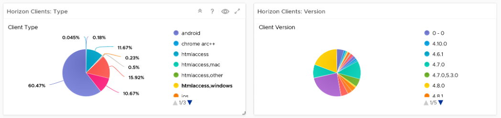
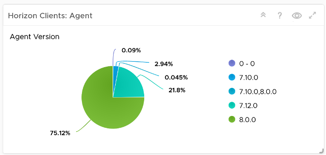
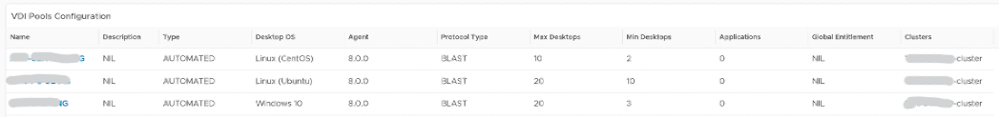
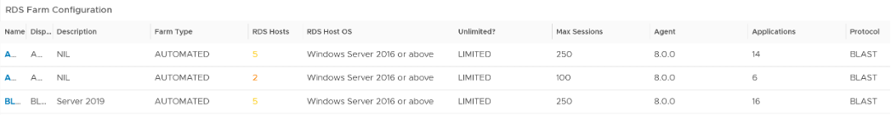
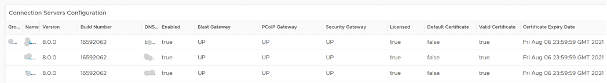

Consistent configuration is important in DaaS, which is made of many softwares (Horizon, vSphere, NSX, vSAN, physical network, client, etc.). We’re following the configuration dashboard best practices set in [Part 3 Chapter 1 Design Consideration](#design-consideration).

| **Incorrect Configuration**   | Address settings that are incorrect, insecure, not following your corporate standards or against Horizon best practice.                                                                   |
|-------------------------------|-------------------------------------------------------------------------------------------------------------------------------------------------------------------------------------------|
| **Outdated Configuration**    | The settings are correct, but on older version. It’s hard to keep up with all the vendors releases, so you should prioritize those oldest versions, especially those no longer supported. |
| **Complex Configuration**     | The settings are correct and up to date, but they complicates your DaaS operations.                                                                                                       |
| **Inefficient Configuration** | The last step is about cost and capacity, as there is nothing wrong already. You want to maximize the usage of your resources while minimizing your cost.                                 |

While the server-side is under your control as Horizon administrator, the client-side depends on users cooperation. Using a pie chart, you can see what are the most common type of client, and their version of Horizon client software.

At the server-side, ensure your Horizon agents software are up to date.

The agents reporting version 0 – 0 could be test agent. Don’t worry about them.

The simplest form of configuration widget is a table that lists the settings you’re interested. The following shows an example for VDI Pool.

And here is the example for RDS Farm

For Connection Servers, consider checking the following. Group them by the Pod, as the servers within a pod should be consistent.

If performance matters, check the power management of ESXi Host. For the clusters hosting the actual sessions, set it to high performance, and not balanced.