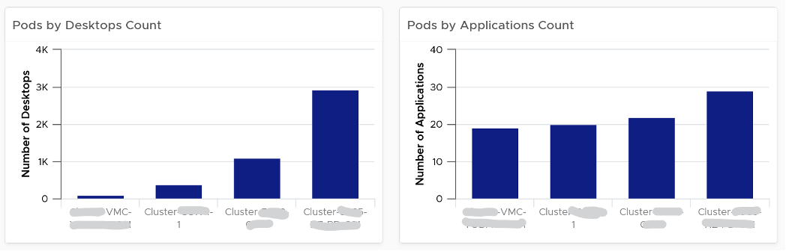

{}
This page is still in draft.
{}

You can check the distribution of desktops and applications among the pods. In the following examples, the last pod is much larger than the first pod, but has similar number of applications available. Compare this against your plan and design documentation.

You can do the same thing for RDS Farm

