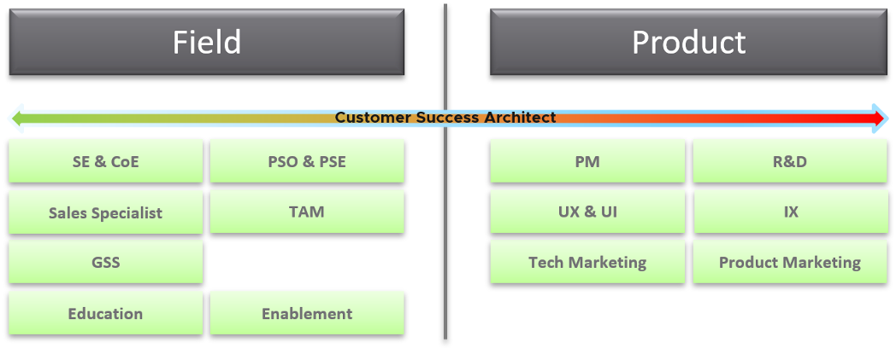

I made a career move from a local role to a global role in 2016. The actual transition started a few years earlier, where I volunteered in global calls for help. By the time I officially transfered in 1 Aug 2016, I was already a part of the global specialists team.

Many years have passed since 2016, so I'd like to share the pros and cons of both roles. Hopefully it helps you in your career, and keeping the fun in work!

It's common for a global corporation to have 4 levels of geographic coverage:

-   Local: cover a city or a small country. In my case, it's just Singapore.

-   Regional: cover a region or large country. In my case, it's ASEAN.

-   Continent: Asia Pacific, Europe, Africa, America

-   Global.

In a vendor environment (as opposed to end-user), there are 2 large primary teams:

-   Product team: develop the product.

    -   The sub-teams are: Product Management, R&D, QA, Sustaining, UX (focus on the UI), IX (focus on documentation).

    -   They focus on releasing the next big thing.

-   Field team: sell, implement, support the product.

    -   Sales, SE, Consulting, Technical Account Managers, Support, Education, Customer Success

    -   They focus on the quarterly target, closing large deals.

Of course, they are supported by many smaller & supporting teams, such as marketing, pricing, and CTO Office.

I've never worked in Product Team, so when an opportunity arose, I took the leap of faith.

-   From Local to Global, bypassing ASEAN and Asia Pacific.

-   From Field to R&D. My boss no longer in Singapore, ASEAN and Pacific, but directly at our HQ in Palo Alto.

-   From generalist to specialist. I now do vR Ops full time. If this is not my passion, I'd have quit long time ago!

I can say with confidence that it was generally a good decision, although it comes at a price. We all work for 3 reasons. I call them the 3M's of work:

-   Money. It pays the bills

-   Meaning. It has to fill your spirit, not just your pocket.

-   Merriment. It's gotta be fun, and you love your work.

The job at the global level is harder, much harder. Instead of thinking for just 1 customer (my job was Account SE), or a few customers, I have to think of the world. While working on future versions, I have to think of current and previous versions that customers are still running. Brownfield is much harder than greenfield. I learned from the R&D team that there were many things to be considered before adding or removing a feature. The complexity makes the job meaningful. Life is short, and the journey is as important as the destination. I've never done product development before. Luckily, folks are kind and we got along well. I work with the R&D team in Armenia, Bangalore and Palo Alto. They have never, never asked me to accommodate their time zone. I'm truly grateful for that. Folks like [Monica](https://www.linkedin.com/in/msmonica/), [Chandra](https://www.linkedin.com/in/chandra-prathuri-a00167/), [Kameswaran](https://www.linkedin.com/in/ksubramz/) and of course my trusted partner-in-crime Sunny Dua provide a lot of coaching and guidance. I know the fact that their mentorship is critical.

My perspective was widened. Before, I was just working with a few customers in Singapore, and a bit of ASEAN. Now I work with customers from Europe to US. What I accepted as the best before, has been reset. I've seen other regions and customers achieved something better, tackled something harder, and delivered something bigger.

I didn't know there was so much work! The demand for the role I took was apparently untapped. I had no idea since I was not busy when doing local role! There was so much request for help outside Singapore. I do zoom sessions regularly with customers, helping them remotely. They would login to their production environment, and we troubleshoot issue together. I get to see live environments, and gain insight into their operations.

The downside is people expectation. I receive regular escalation and work closely with R&D. I have to produce a solution instead of relying on others. My work starts where the documentation ends. Now you know why I have to write 3 books. [Sunny](https://www.linkedin.com/in/duasunny/) has been a godsend for me. After intense discussion, we often come up with a solution that neither of us had originally considered.

Another downside is global travel 🙁 It impacts my family, and certainly myself. The jet lag and long flight in economy is not good for my health, since I have autoimmune disease and low back pain. Controlling the schedule is important, else I could travel non-stop and only spend weekends at home. My travel schedule is practically full 3 months in advance. Again, folks are generally accommodating. I learn when we explain to folks openly why we can't be there (they are sponsoring my trip), they are willing to accommodate.

I travel alone most of the time. After doing the requested work by the hosting country, I'd go back to the hotel, eat a quick dinner alone then do my day job. If I have dinner with the local team, that means that day I can't do my day job. Coupled with being apart from my kids and family, loneliness is my friend.

Travel can be sudden. I got a call to help a large customer on Thursday morning, and on Sunday I was already in the plane to see them. If you have young kids, this can be deal breaker. My 2 kids are big already, but my Mama at 81 needed care. When she passed away, I was overseas…

Speaking of travel, gluten free is a challenge. I am allergic to both dairy and gluten, so keeping these 2 away is almost impossible when abroad. There is no easy solution today. Singapore Airlines changes the menu only every 3 months, so I know in advance exactly what I'm getting 🙂

I hope the sharing is useful for those who are thinking of taking a global role.