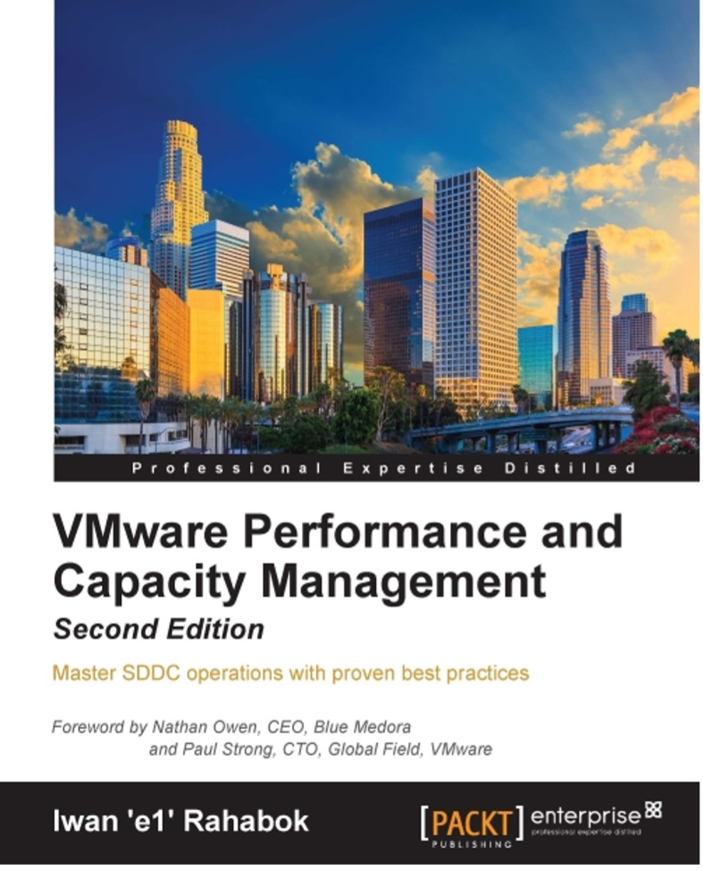

Wow, you made it to the end of the book. If you have read this far I certainly want to know more about you. So here is a bit about me.

I was born in the beautiful island of [Lombok](http://www.lonelyplanet.com/indonesia/lombok)(Indonesia), grew up in Surabaya (Indonesia), studied in Australia, and since 1994 I live in Singapore.

I graduated from [Bond University](https://bond.edu.au/) in 1994, then migrated to Singapore and started working in IT. I still remember that I carried [Apple Mac LC](https://en.wikipedia.org/wiki/Macintosh_LC) (yup, with the 12″ monitor) to Singapore in June 1994.

First 9 years of my career was at the Application layer, doing business process innovation and application development. Lettuce Node, I mean Lotus Notus, was and is still dear to my heart.

I moved to infrastructure world in 2003, focusing on UNIX by joining Sun Microsystems. I joined without knowing what UNIX was and basically zero knowledge of infrastructure. I came to join as SE with no presales experience. My previous manager Seet Pheng Kue recommended me, together with the headhunter FA Mok, and Kim Boo Png made the hiring decision. I’m always grateful for what they have done as that forever changed my career. From high level programming to low level hard code infrastructure!

In 2008 I applied to VMware as I wanted to follow my sales Chan Seng Chye. Poh Wah Lee convinced me to join VMware as part his team, and until today I still see him as my elder and leader.

My email is e1@vmware.com and mobile is +65.9119.9226.

You can see more of my works on the Internet. Google has somehow tracks it

## Operationalize Your World

The transformation toward multi-cloud operations is a journey. The same journey happened that resulted in this book on your screen. It took years for it to reach the level of maturity.

<table><colgroup><col style="width: 12%" /><col style="width: 37%" /><col style="width: 50%" /></colgroup><thead><tr class="header"><th><strong>2021</strong></th><th colspan="2">
Retire Virtual Red Dot as it has served its purpose. It’s always to prepare the material for a book. With blog, it’s impossible to keep contents up to date and structured.

3rd Edition published. It’s made available as free and open source book.

Horizon adapter released. As you can see in the Horizon chapter, it took the concept of KPI further. This is a great collaboration with EUC specialists Cameron Fore and Fahad Khan.
</th></tr></thead><tbody><tr class="odd"><td><strong>2020</strong></td><td colspan="2">vRealize Operations 8.2 was released, sporting a brand new content taken from Operationalize Your World. The last major refresh was 6.4 release, and the gap between the 2 version shows how far the content and product have improved.</td></tr><tr class="even"><td><strong>2019</strong></td><td colspan="2">
Started working on the 3rd edition. Exploring if I should make it free, editable and living document. Grappling with how to make it easy out of the box while allowing flexibility.

vRealize Operations 8.0 was released. Compared with the early days of version 5.8, the ease of use and power on dashboards and super metrics have had numorous enhancements.
</td></tr><tr class="odd"><td><strong>2018</strong></td><td colspan="2">Officially joined vRealize team as Product Manager.</td></tr><tr class="even"><td><strong>2017</strong></td><td colspan="2">
Heavy travelling as part of global role and delivering workshops.

Started working with Varghese Philipose, Shiv Diddee and team. The Middle East and North Africa team would eventually a close partner as we improve the product and content.
</td></tr><tr class="odd"><td><strong>2016</strong></td><td colspan="2">
vRealize Operations 6.4 was released, sporting a brand new content taken from Operationalize Your World.

Jumped from local role to global role.

Kenon Owens created a program called Operationalize Your World. We did many tours around Asia Pacific, delivering 1-2 day workshop.

2nd Edition published. It was ~550 pages, and scope broadened to include vSphere and vRealize Operations metrics. Tested the idea of contributing authors.
</td></tr><tr class="even"><td><strong>2015</strong></td><td colspan="2">VMworld debut of the solution. Sunny and I presented in 2 sessions to ~600 audience.</td></tr><tr class="odd"><td><strong>2014</strong></td><td colspan="2">
1st Edition published. It was ~250 pages, and scope was performance and capacity

Became a member of ambassadors of the CTO Office.
</td></tr><tr class="even"><td><strong>2013</strong></td><td colspan="2">
The idea of converting blogs and slides into a book was born. Tried to make it work with 2 other authors to split the load. Tried to make it work with VMware Education.

Virtual Red Dot was born.
</td></tr><tr class="odd"><td><strong>2012</strong></td><td colspan="2">Started blogging, using free domain and hosting. Sunny helped me.</td></tr><tr class="even"><td><strong>2011</strong></td><td colspan="2">
vCenter Operations 1.0 released. I got the training in Sydney, by David Lavigna. That was the light bulb moment as I’d been troubleshooting manually using vCenter and esxtop.

Got VCAP DCD. I was one of the first to pass the VCAP DCD exam globally as I participated in the beta. My number is 89. That knowledge proved to be critical for 1+ decade as you can see in this book.
</td></tr><tr class="odd"><td><strong>2009</strong></td><td colspan="2">Set up VCP Club, a subset of User Group that has got VCP.</td></tr><tr class="even"><td><strong>2008</strong></td><td colspan="2">
I joined VMware as SE for global accounts. A fair bit of my time was helping them troubleshoot performance problem, do capacity planning and review configuration best practice. I tried making sure what I sold is operationalized.

Got my VCP.
</td></tr><tr class="odd"><td colspan="2"></td><td></td></tr></tbody></table>