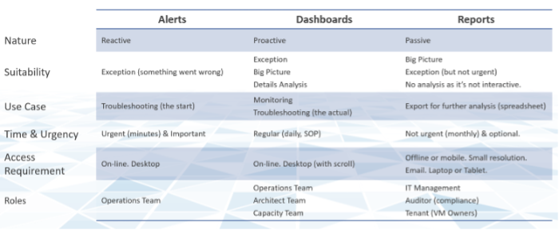

It is easy to think that dashboards, alerts and reports are separate and should be designed independently. If we take a step back and look at the big picture, there is actually minimal overlap, as they form a **continuum**. They serve the same purpose, which is the way for System to "communicate" with user.

If you apply this thinking, you will vrealize that you can reduce alert storm, because many alerts are better served as parts of a dashboard. Reports will also become minimal and kept for personas with no online access and use cases where no interactivity is needed.

The nature of alert means its use case is very narrow. You do not want to run your operations based on alerts. Too many and you're overwhelmed. Too few and you lack the big picture visibility. Alert is only applicable in the following situation:

- Urgent. If time is not an essence, then a regular SOP with dashboard is more effective as you can see the big picture. Avoid sending alerts to personas that do not deal with day to day operations. Long term actions such as capacity management is best served with dashboard.
- Problem. If there is nothing wrong, there is no need to trigger an alert. That's why in general you do not set up an alert on inventory changes, as inventory is merely an account of something.
- Remediation. If there is nothing you can do immediately to address the issue, why trigger an alert? Use dashboard for such cases.
- Few. Alert focuses on exception, not the big picture. As a result, you want this to be minimal. If the whole house is on fire, it's too late for an alert.

At the other end of the spectrum lies Report. The nature of report means its use case is also very narrow. Modern operations require a richer interaction that report lacks. Report is only applicable in the following situation:

- No interactivity (e.g. users needs it delivered to their email inbox)
- Offline (e.g. users are in a plane)
- No access to vRealize
- Printed document
- Time bound (e.g. calendar month)
- Further processing (e.g. integration with other systems that has data not in vRealize)
- Further analysis & reporting (e.g. Finance team wants the data as part of their spreadsheet report)

Dashboards cover the broadest use cases as it's the most versatile.

The following table details how the 3 ways of engaging are complementary.

If user has access to the online via their desktop, consider a self-service dashboard as they require no login and it's much easier to use. You can develop a portal with links to these dashboards and custom guide.

The last few releases of vRealize Operations introduces many new capabilities that change the way your dashboards can look. vRealize Operations 8.2 sports an enhanced dashboard to dashboard navigation, so you can create flow among dashboards. Your dashboards are no longer confined to be standalone dashboard.

Version 8.2 ships with a revamped set of dashboards. They are kept simple and meant to be customized for your specific environment. The dashboards were refined in vRealize Operations 8.4.
