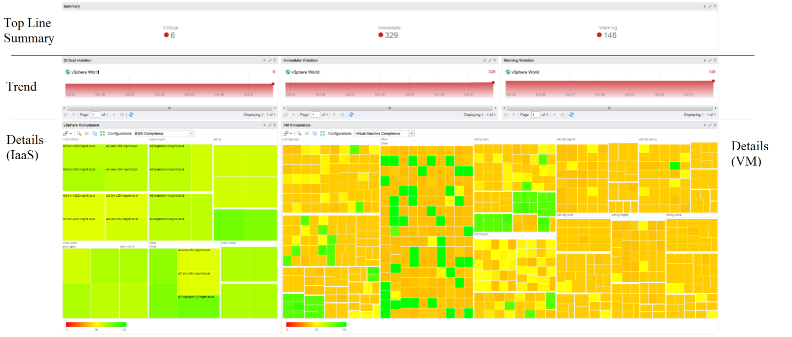

It's easier to see **color** than read numbers, if the color has meaning. There are many occasions in operations that you just need to know if things are good or bad first, before diving into the actual raw value. Color is also easier at a glance, especially if you have read hundreds of numbers inside a large table.

Here is the color I recommend:

#### Green -> Yellow -> Orange -> Red

Green means good, and gradually getting worse as it moves toward red.

Typically used in performance monitoring and compliance.

#### Dark Grey -> Green -> Red

We use dark grey in Capacity as wastage (unused) is a bigger issue than over utilization. It's critical to show wastage as it can also impact performance.

For performance dashboard, you should consider using red to convey that oversized is bad for performance.

#### Blue

Neutral color. Used when it does not have any meaning.

#### Grey

Typically happens in heat map. We use a color instead of white as white is hard to read.

In the Compliance dashboard below, color is used to quickly show the various level of compliance. If all you see is Green, there is no need to look at the numbers & texts!

Last but not least, think of users who may not be able to distinguish all the colors. Provide alternative way for them so the functionality is not lost.
