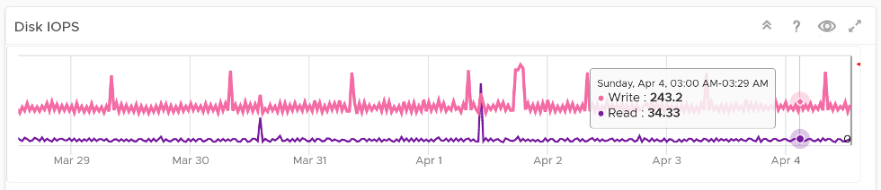

The **ESXi Utilization** dashboard complements the **ESXi Contention** dashboard. Together, their goal is to help VMware Administrator in performance management.

Use this dashboard to identify vSphere clusters with high utilization in a selected data center. When utilization exceeds 100%, performance can be negatively impacted especially when VM experience contention. By default, vRealize Operations has a 5-minute collection interval. For 5 minutes, there may be 300 seconds worth of data points. If a spike is experienced for a few seconds, it may not be visible if the remaining of the 300 seconds is low utilization.

The dashboard is designed to complement the Cluster Utilization dashboard, by providing the next level of details. Hence it has a very similar layout.

See the [Performance Dashboard](/dashboards/chapter-2-performance-dashboards/) page for common design consideration among all the dashboards for performance management.

## How to Use

Review the ESXi Hosts Utilization table

- It lists all the ESXi hosts, sorted by the highest utilization in the last 1 week. If the table is all showing green, then there is no need to analyze further.
- You can change the time period to the period of your interest. The maximum number will be reflected accordingly.

Select an ESXi Host from the table

- All the utilization charts will automatically show the key utilization metrics of selected cluster.
- For memory, the high utilization counters are explicitly shown. Balloon, Compressed, Swapped. Notice they exist even though utilization is not even 90%, indicating high pressure in the past. If you look at only utilization, you'd think You are safe!
- For memory, both Consumed and Active are shown. If active is low, no need to upgrade RAM as Consumed contains disk cache. For me, it's fine for Consumed to be 95% so long RAM Contention is 0.

- The disk IOPS and the disk throughput are split into read & write to gain insight into the behaviour. Some workload is read oriented, while others are write oriented.

- The network throughput is split into sent (transmit) and received to gain insight into the behaviour. Plus, the total usage can be misleading because it sums send and received traffic. In reality the network pipe is 1x for each direction (due to the full duplex nature of ethernet), not 2x shared by both.

## Points to Note

- If your operations team have some forms of standard that utilization should not exceed certain threshold, you can add the threshold into the line chart. The threshold line will help less technical team as they can see how the real value compares with the threshold.
- See the [Points to Note](/dashboards/chapter-2-performance-dashboards/3.2.4-esxi-contention/#points-to-note) section of [ESXi Contention](/dashboards/chapter-2-performance-dashboards/3.2.4-esxi-contention) dashboard as this dashboard is designed to complement it.
