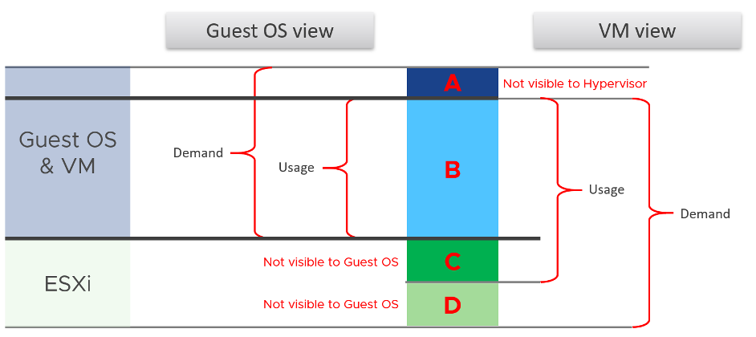

來賓 OS 和 VM 是兩個密切相關但不同的實體。它們是 SDDC 堆棧中的相鄰層。這兩層是不同的，每一層都提供了另​​​​一層可能無法提供的獨特可見性。來賓操作系統消耗的資源與底層 VM 消耗的資源不同。電源管理和 CPU SMT 等其他因素也會導致差異。

下圖使用_英語_單詞“需求”和“使用”來解釋這個概念，其中需求包括使用和未滿足的需求。這並不意味著 vSphere 和 vRealize Operations 中的需求和使用計數器，這意味著不要假設這些計數器實際上意味著這個。它們是為不同的目的而創建的。

我嘗試將應用程序添加到上圖中，但是我刪除了它使整個圖片變得複雜。所以請注意一些應用程序，如 Java VM 和數據庫管理自己的資源。另一個虛擬化層（例如 Container）無疑將復雜性提升到另一個層次。

我們可以從上面看到區域 A 對虛擬機管理程序不可見。

#### A層

來賓操作系統內部的隊列（CPU 運行隊列、RAM 頁面文件、磁盤隊列長度、驅動程序隊列、網卡環形緩衝區）。這些隊列對底層管理程序不可見，因為它們尚未發送到內核。例如，如果 Oracle 向 Windows 發送 IO 請求，並且 Windows 存儲子系統已滿，則不會將此 IO 發送到管理程序。因此，VM 級別的磁盤 IOPS 計數器將報告，因為它尚未收到此 IO 請求。

#### B層

來賓實際使用的內容。這對虛擬機管理程序是可見的，因為 VM 基本上是一個多進程應用程序。來賓操作系統 CPU 利用率以某種方式轉化為 VM CPU 運行。我添加了“以某種方式”這個詞，因為這兩個計數器是相互獨立計算的，並且可能在不同的採樣時間和匯總技術下進行。

#### C層

管理程序開銷（CPU 系統、CPU MKS、CPU VMX、RAM 開銷、磁盤快照）。這種開銷顯然對來賓操作系統不可見。您可以通過安裝工具獲得一些可見性，因為它將向 Windows/Linux 添加新計數器。工具不會修改現有的 Windows/Linux 計數器，這意味著它們仍然不知道虛擬化。

從 VMkernel 的角度來看，VM 是在 VMkernel 中運行的一組進程或用戶世界。有3種主要類型的組：

- VM Executable (VMX) 進程負責處理對性能不重要的設備的 I/O。 VMX 還負責與用戶界面、快照管理器和遠程控制台通信。
- VM Monitor (VMM) 進程負責虛擬化客戶操作系統指令，並管理內存映射。 VMM 將存儲和網絡 I/O 請求傳遞給 VMkernel，並將所有其他請求傳遞給 VMX 進程。分配給 VM 的每個虛擬 CPU 都有一個 VMM。
- 鼠標鍵盤屏幕 (MKS) 進程負責呈現訪客視頻並處理訪客操作系統用戶輸入。當您通過 vCenter 客戶端控制台進入 VM 時，已完成的工作將計入此過程。這反過來又由 VM 收費，而不是特定的 vCPU。

如果您想查看上述過程中的錯誤示例，請查看此知識庫文章 [知識庫](https://kb.vmware.com/s/article/1019471).

#### D層

未滿足的需求（CPU 就緒、CPU 同步停止、CPU 重疊、CPU VM 等待、RAM 爭用、VM 未完成 IO）。

來賓操作系統遇到時間凍結或緩慢。它不知道它是什麼，這意味著它無法解釋它。

----

我已經用簡單的術語介紹了差異，並沒有對全部差異做出公正的判斷。如果你想讀一篇科學論文，我推薦這篇論文[這篇報告](https://link.springer.com/chapter/10.1007%2F978-3-642-29737-3_26) 寫的Benjamin Serebrin 和[ Daniel Hecht](https://dblp.org/pid/73/11144.html).

由於我們在本書後面的相應章節中介紹了 CPU、內存、磁盤和網絡指標，因此我們將更詳細地解釋它們之間的差異。現在，我們將提供一些示例來說明這一點。