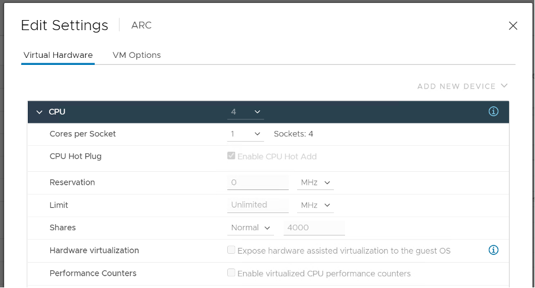

您需要了解 vSphere 用於管理共享資源的以下概念：

- 資源預留
- 資源限制
- 資源共享
- 使用權

資源預留代表一種保證。它會影響提供程序（例如 ESXi），因為這是進行預留的地方。但是，它在 CPU 和 RAM 上的工作方式不同。

#### CPU

如果 VM 不使用該資源，那麼就 VM 而言，它不會發揮作用。它僅在 VM 實際使用它的期間強制執行。

#### RAM

如果尚未使用，則不會生效。這意味著 ESXi 主機不會為 VM 分配任何物理 RAM。但是，一旦 VM 請求內存並為其提供服務，就會保留物理 RAM。從那時起，即使虛擬機不再使用物理 RAM，ESXi 也會繼續保留物理 RAM。從某種意義上說，儘管虛擬機閒置了好幾天，頁面還是被鎖定了。消耗的測量指標包括這個以反映這種行為。即使它沒有被使用，也沒有其他虛擬機可以觸及它。

---

不應使用限制，因為它對來賓操作系統不可見。結果是不可預測的，並且可能造成比減少 VM 配置更糟糕的性能問題。對於 CPU，它會影響 CPU Ready 計數器。對於 RAM，在 VMX 文件中，這是 `sched.mem.max`.

與靜態配置的預留和共享不同，使用權是*動態*計算的。它考慮了限制、保留和份額。對於 Shares，它當然必須考慮在同一主機上運行的其他 VM 的 Shares。虛擬機不能使用超過 ESXi 授權的內容。

Reservation, Share 和 Limit 是相對靜態的。除非手動更改，否則它們不會波動。因此，它們的行為更像是一種財產，而不是一種衡量指標。