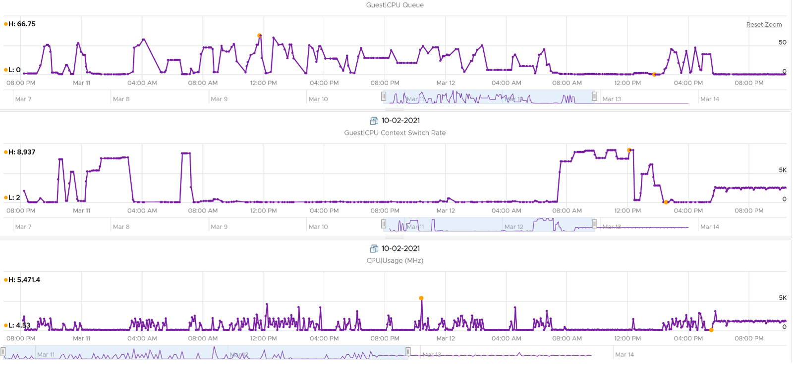
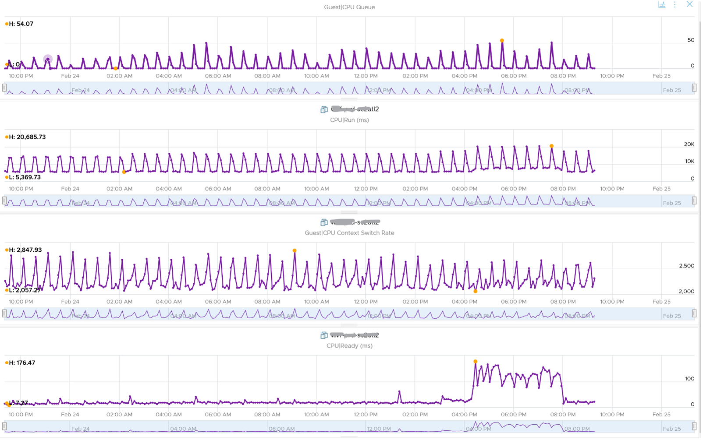
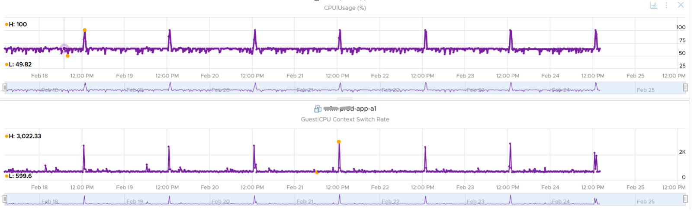
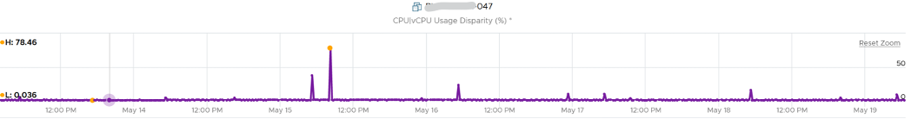
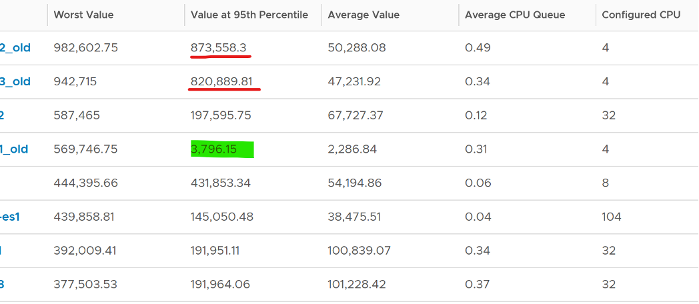

我们从 [要衡量的竞争类型](/zh/operations-management/chapter-2-performance-management/1.2.4-contention-vs-utilization/) 因为这是衡量性能的主要衡量指标，其次是衡量指标的利用类型。

ESXi 无法看到来宾操作系统如何调度其进程，因此无法监控来宾操作系统。 ESXi 只能看到来宾发送的内容。在客户操作系统内部运行的 VMware Tools 能够查看客户操作系统内部。为此，需要 VMware Tools 10.3.5 或更高版本以及至少 vSphere 6.0 P08、6.5 P03 和 6.7 U1。

## 来宾操作系统 CPU 运行队列

处理器队列中的线程数。对于 Windows，此计数器不包括正在运行（正在执行）的线程。对于 Linux，它包括 CPU 管道中的线程。

让我们以配置有 8 个 vCPU 的 VM 为例。来宾操作系统有 8 个线程，因此最多可以调度 8 个并行进程。如果有更多的需求，它将不得不排队。这意味着需要在来宾操作系统大小调整中考虑队列。

因为它报告队列，所以这是衡量客户操作系统性能的主要计数器。它告诉您 CPU 是否正在努力满足需求。

什么是健康价值？

Windows 性能监视器 UI 描述与 MSDN 文档（基于 Windows Server 2016 文档）不一致。一份文件指出，超过 2 个线程的持续处理器队列通常表示处理器拥塞。但是，另一个声明“每个处理器少于 10 个线程的持续处理器队列通常是可以接受的，这取决于工作负载”。 SQL Server 文档将 3 作为阈值。如果您看到 Microsoft 或 Linux 的其他推荐，请告诉我。

Windows 或 Linux 利用率可能为 100%，但只要队列较少，工作负载就会尽可能快地运行。添加更多 vCPU 实际上会降低性能，因为您有更高的上下文切换机会 [上下文切换](/zh/metrics/chapter-2-cpu-metrics/2.2.1-guest-os/#来宾操作系统-cpu-上下文切换).

即使在具有多个处理器的计算机上，处理器时间也只有一个队列。因此，如果计算机有多个处理器，则需要将此值除以服务于工作负载的处理器数量。这就是工具报告队列总数的原因。此计数器应在客户机操作系统 CPU 大小调整中发挥作用。 [来宾操作系统 CPU 大小调整](/zh/operations-management/chapter-3-capacity-management/1.3.12-rightsizing/#来宾操作系统-cpu-大小调整).

您应该分析您的环境，因为某些 VM 的数量可能很高。看看我在下面得到的数字，其中一些 VM 每个 vCPU 有超过 10 个队列。与 VM Owner 共享发现，因为减少队列的补救措施可能意味着更改应用程序设置。

让我们深入查看第一个 VM。

CPU 运行队列多次出现峰值。它与模式中的 CPU 使用率和 CPU 上下文切换率不匹配。我不确定如何解释这一点，所以如果你知道给我留言。我注意到数据收集不稳定，所以让我们看看另一个虚拟机。

以下是运行 Photon OS 的 2 vCPU VM。 CPU 队列很高，即使 Photon 仅以 50% 运行。会不会是应用程序配置了太多线程导致 CPU 忙于进行上下文切换？请注意 CPU 队列映射 CPU 上下文切换率和 CPU 运行。在这种情况下，您应该提请应用程序团队注意，因为它可能会导致性能问题，解决方案是向内查看。为了证明这不是因为底层争用，我添加了 CPU Ready。

此属性仅显示最后观察到的值；这不是平均值。 Windows 和 Linux 也不提供最高和最低的变体。

对于 Linux，我们使用 /proc/stat（内核/系统统计信息）中的 procs_running 值。它显示处于可运行状态的进程数。它与 /proc/loadavg 中的值相同。它是所有 CPU 线程运行队列的总和。 nr_running 字段包括当前正在运行的任务和就绪但未运行的任务。

参考: [Windows](https://msdn.microsoft.com/en-us/library/aa394272(v=vs.85).aspx) 和 [Linux](http://man7.org/linux/man-pages/man5/proc.5.html).

## 来宾操作系统 CPU 上下文切换

[CPU 上下文切换](https://en.wikipedia.org/wiki/Context_switch) 成本性能“由于运行 [任务调度程序](https://en.wikipedia.org/wiki/Scheduling_(computing)), TLB 刷新，间接由于共享 CPU 缓存 [CPU 缓存](https://en.wikipedia.org/wiki/CPU_cache) 在多个任务之间”。 跟踪此计数器并至少了解该特定应用程序可接受的行为是很重要的。

根据 Windows 10 性能监视器文档，上下文切换/秒是计算机上所有处理器从一个线程切换到另一个线程的组合速率。在其他条件相同的情况下，处理器越多，上下文切换就越高。

{}
线程切换可以发生在单个多线程进程内部或跨进程。线程切换可能是由一个线程向另一个线程请求信息引起的，或者是由一个线程被另一个更高优先级的线程抢占而准备运行引起的。
{}

System 和 Thread 对象上有上下文切换计数器。 vRealize Operations 仅报告总数。

Windows 或 Linux 每秒切换 CPU 上下文的速率范围很广。以下内容取自具有 8 个物理线程的 Windows 10 桌面，它运行大约 10% 的 CPU。我观察到该值在 10K 到 50K 之间徘徊。

该值应该与 CPU “利用率”相关，因为理论上利用率越高，CPU 上下文切换的机会就越大。下图显示了近乎完美的相关性。每次 CPU 使用率上升时，CPU 上下文切换也会发生。

即使在单线程应用程序中也可能发生 CPU 上下文切换。下面显示了具有 4 个 vCPU 的 VDI VM。我绘制了 CPU 使用差异与 CPU 上下文切换的关系图。您可以看到使用差异高达 78%，这意味着最繁忙的 vCPU 和最空闲的 vCPU 之间的差距为 78%。这是运行一个安全代理，它不太可能被设计为占用多个 vCPU。

让我们绘制同一时期的上下文切换。同时出现一个尖峰，表示代理正忙于上下文切换。请注意，它并不总是必须如此。红点表示即使 vCPU 使用差异上升，上下文切换也没有峰值。

CPU 上下文切换 的值变化很大。它可以远远超过 50 万，如下表所示，因此为该特定应用程序分析和建立正常基线非常重要。对 1 个 VM 健康的内容可能对另一个 VM 不健康。

从表中可以看出，有些虚拟机经历了长时间的 CPU 上下文切换，而其他虚拟机则没有。 VM #4 只有短暂的爆发，因为第 95 个百分位数的值下降到 3796。上下文切换的瞬时峰值可能不会导致性能问题，因此通常将值取在第 95 个和第 99 个百分位数之间的某个位置更为明智。

让我们深入查看第一个 VM。这个只有 4 个 vCPU 的 CentOS VM 不断地达到近 100 万次上下文切换。模式匹配 CPU 使用率。

另一方面，大多数客户操作系统的花费远低于 10K。我分析了大约 2200 个生产虚拟机，这里是它们的 CPU 上下文切换的分布。可以看到0-12000之间的值占了80%。

在您的环境中，您可以进一步分析它。在以下示例中，我通过将 10K 以上的所有值分组为一个存储桶，并将 0 - 10K 存储桶拆分为多个存储桶来调整存储桶阈值。您可以看到超过一半的 CPU 上下文切换率低于 1K。

## Linux窃取时间

根据 Red Hat 文档, [Steal Time](https://access.redhat.com/documentation/en-us/red_hat_enterprise_linux/7/html/virtualization_deployment_and_administration_guide/sect-kvm_guest_timing_management-steal_time_accounting) 是虚拟机管理程序未提供的 VM 所需的 CPU 时间量。它发生在主机为其自己的进程或另一个来宾分配 CPU 资源时。

虽然 Linux 有此计数器，但它在 ESXi 上运行时为 0，因为默认情况下未启用它。即使启用，它也只考虑就绪时间。它不考虑其他时间，例如 CoStop、VM Wait 和内存等待。

CPU 就绪包括限制。我还没有验证 Linux Steal Time 是否考虑到了它。

## 其他客户操作系统衡量指标

当 CPU 频率高于标称速度时，Windows 8 及更高版本将在任务管理器和性能监视器中报告 CPU 使用率 >100%。更改的原因与我们迄今为止所涵盖的相同，即需要区分正在完成的工作量。 更多在这里 [这里](https://docs.microsoft.com/en-us/troubleshoot/windows-client/performance/cpu-usage-exceeds-100).

参考: [Windows](https://msdn.microsoft.com/en-us/library/aa394279(v=vs.85).aspx) 和 [Linux](http://man7.org/linux/man-pages/man5/proc.5.html).