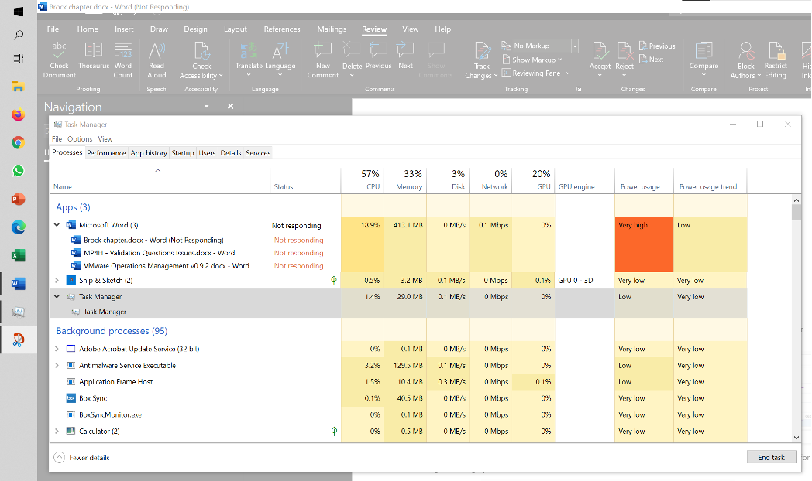
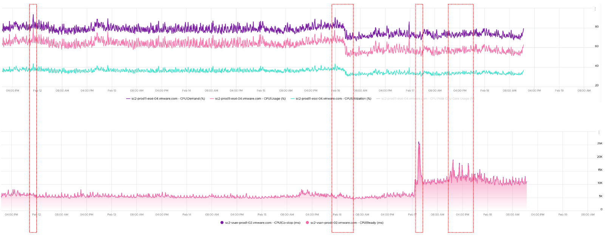

到现在为止，我希望您意识到 4 个关键对象（来宾操作系统、ESXi 和集群）中的各种“利用率”衡量指标各不相同。每个人都有自己独特的行为。因此，您可以正确地假设它们不能很好地跨堆栈映射。让我们用一个例子来测试你的知识。

## 来宾操作系统

仔细查看以下图表。这是我运行 Windows 10 的物理桌面。 CPU 有 1 个插槽 4 核 8 线程，因此 Windows 可以看到 8 个逻辑处理器。您可以看到 Microsoft Word 没有响应，因为其窗口变灰。任务管理器通过显示 3 个文档都没有响应来确认这一点。 Word 也消耗非常高的功率，如功率使用列中所示。

它变得无响应，因为我在 400 页的文档上打开了更改跟踪并删除了数百页。它必须做很多处理，它不喜欢那样。不幸的是，在那之后我无法重现该问题。

在操作系统方面，Windows 反应良好。我能够关闭所有其他应用程序，并启动任务管理器和 Snip 程序。我怀疑是因为 Word 不会消耗所有 CPU。因此，如果我们在 Windows 级别进行跟踪，我们将 **不会** 意识到存在问题。这就是为什么如果要监视应用程序，进程级监视很重要的原因。具体到挂起状态，我们应该监控状态而不是简单的CPU消耗。

在 Windows 任务栏中，除了 Microsoft Word 和任务管理器之外，没有其他应用程序在运行。你能猜出为什么 Windows 级别的 CPU 利用率高于其进程的总和吗？我对为什么 Windows 显示 57% 而 Word 显示 18.9% 的猜测是 Turbo Boost。单个进程级别的 CPU 计数器不会考虑它，而操作系统级别的计数器会考虑。

我把它放了 15 分钟，什么都没有改变。所以并不是说它需要更多时间来处理更改。我怀疑它遇到了 CPU 锁定，因此运行 Microsft Word 的 CPU 正在 100% 运行。由于 Windows 总体上仅报告 57%，因此跟踪 Windows CPU 中的峰值很重要。这就是 vRealize Operations 在 VM vCPU 中提供峰值的原因。

## 虚拟机与 ESXi

仔细查看以下图表。必要时放大。

上面的 vCenter 图表 [^1] 显示了 VM 利用率计数器。这是一个带有 24 个 vCPU 运行受控 CPU 测试的大型 VM。电源管理是固定的，因此它以标称时钟速度运行。这消除了 CPU 频率缩放因子。

它从 50% 的“利用率”开始，每个 vCPU 固定到不同的物理核心。然后它会随着时间缓慢上升，直到达到 100%。

你能弄清楚为什么三个计数器的上升方式不同吗？他们测量什么？

现在让我们看看对父 ESXi 的影响。它只有一个 VM，但 VM vCPU 与 ESXi 物理内核匹配。 ESXi 以 50% 的“利用率”开始，然后随着时间的推移缓慢上升，直到达到 100%。

你能弄清楚为什么 3 个计数器的上升方式不同吗？他们测量什么？像往常一样，答案可以在 [部分 4](/zh/miscellaneous/chapter-1-quiz-answers/).

## ESXi 利用率与争用

ESXi“利用率”与 ESXi“争用”无关。 4 个突出显示的区域是衡量指标不相关的例子，其中一些甚至相反。你能猜到为什么吗？

像往常一样，回答 [部分 4](/zh/miscellaneous/chapter-1-quiz-answers/).

[^1]: 由...提供 Valentin Bondzio