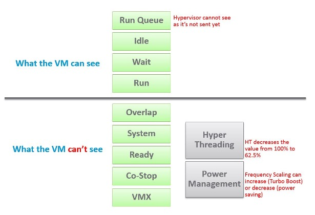

### Chapter 2

# CPU Metrics

The [nuance](/metrics/chapter-1-overview/2.1.1-nuances-in-metrics/) you saw earlier was due to the nature of additional layer. The following infographic shows there are multiple elements as a result of virtualization. It helps me to understand the metrics, hence the sharing.

CPU counters for a VM differ from those in the Guest OS. For example, vCenter provides 5 counters to account for the utilization of VM CPU, yet none directly maps to Windows/Linux CPU utilization. The CPU counters in ESXi are also more than the summation of its running VM and VMkernel.

The following screenshot shows the CPU counters of a VM. Compared with Guest OS such as Windows, can you notice what's missing and what's added? Go ahead and open Windows PerfMon or SysInternal and compare, and you will quickly notice major differences.

Right off the bat, you will notice that popular counters such as Ready, CoStop, and Overlap do not exist in Windows. The reason is VM and Guest OS have different vantage points.

When the VMkernel de-schedules a VM to process something else (e.g. other VM, kernel interrupt) on the same physical thread or core, the Guest OS does not know why it is interrupted. In fact, it experiences frozen time for that particular vCPU running on the physical core. Time jumps when it's scheduled again. Because of this unique visibility, it's important to use the correct metrics at the correct layers. Here is what the Guest OS can and cannot see:

The different vantage points result in different counters. This creates complexity as you size based on what happens inside the VM, but reclaim based on what happens outside the VM footprint on the ESXi. In other words, you size the Guest OS and you reclaim the VM.

Both layers need to be monitored, as each measure different performance problems. Hence it's imperative to install VMware Tools as VMkernel will not provide visibility into the Guest OS. VMware Tools report the statistics about guest to the ESXi host every 20 seconds by default.

{}
