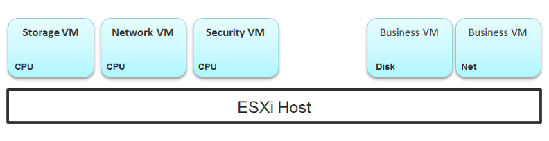
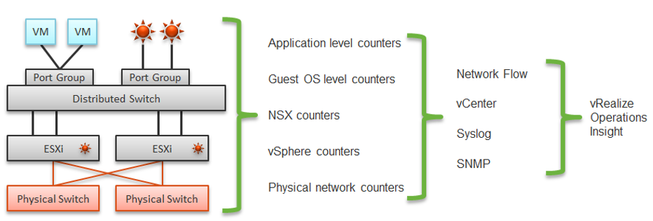
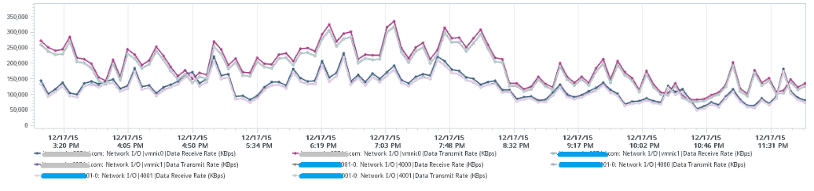

The arrival of software-defined infrastructure services also changes the way you monitor your network. The following diagram shows a simplified setup of an ESXi host.

In a single ESXi host, there are 4 areas that need to be monitored for a complete network monitoring:

- VM network
- VMkernel network
- ESXi kernel modules
- Agent VMs

In the preceding example, we have 3 VMs running in the host. VM 1 and VM 2 are connected to the same VXLAN (or VLAN). VM 3 is on a different VXLAN (or VLAN), hence it is on a different port group. Monitoring at port group level complements monitoring at VM level and ESXi level.

Traffic at Distributed Switch level carries more than VM traffic. It also carries VMkernel traffic, such as vMotion and VSAN. Both VMkernel network and VM network tend to share the same physical uplinks (ESXi vmnic). As a result, it's easier to monitor at port group level.

Sounds good so far. What is the limitation of monitoring at distributed port group level?

The hint is at the word **distributed**.

Yes, the data is the aggregate of all the ESXi hosts using that distributed port group!

By default, VM 1 and VM 2 can talk to each other. The traffic will not leave the ESXi. Network monitoring tools that are not aware of this will miss it. Traffic from VM 3 can also reach VM 1 or VM 2 if NSX Distributed Logical Router is in place. It is a VMkernel module, just like the NSX Distributed Firewall. As a result, monitoring these kernel modules, and the host overall performance, becomes an integral part of network monitoring.

The 4th area we need to monitor is Agent VM. An Agent VM is mapped to 1 ESXi Host. It does not need HA protection as every ESXi host has one, hence it typically resides on the host local datastore.

The above example shows an ESXi host with 3 agent VMs. The first VM provides a storage service (an example is Nutanix CVM), the second VM provides Network service, and the 3rd VM provides a Security VM.

Let's use the Security service as an example. A popular example here is Trend Micro Deep Security virtual appliance. It is in the data path. If the Business VMs are accessing files on a fileserver on another network, the files have to be checked by the security virtual appliance first. If the agent VM is slow (and it could be due to factor that is not network related), it will look like a network or storage issue as far as the business VMs are concerned. The Business VMs do not know that their files have been intercepted for security clearance, as it is not done at the network level. It is done at the hypervisor level.

## Source of Data

A complete network monitoring requires you to get the data from 5 different sources, not just from vSphere. In SDDC, you should also get data from the application, Guest OS, NSX and NetFlow/sFlow/IPFIX from VDS and physical network devices. For VDI, you need to get data at application level. We have seen packet loss at application-layer (Horizon Blast protocol) when Windows sees no dropped packet. The reason was the packet arrives out of order and hence unusable from protocol viewpoint.

The following shows a simplified stack. It shows the five sources of data and the 4 tools to get the data. It includes a physical switch as we can no longer ignore physical network once you move from just vSphere to complete SDDC.

The network packet analysis comes in 2 main approaches: Header analysis and full packet analysis. The header analysis is certainly much lighter but lack the depth of full analysis. You use this to provide overall visibility as it does not impose heavy load on your environment.

The impact of virtualization on network monitoring goes beyond what we have covered. Let's add NSX Edge into the above, so you can see the traffic flow when the edge services are also virtualized. You will see that a network problem experienced by a VM on one ESXi could be caused by another VM running on another ESXi. The following diagram is a simplified setup, showing a single NSX Edge residing on another cluster.

In the above example, let's say VM 1 needs to talk to outside world. An NSX Edge VM provides that connectivity, so every TCP/IP packet has to go through it. The Edge VM has 2 virtual NICs, one for each network. If the NSX Edge VM has CPU issue, or the underlying ESXi has RAM issue, it can impact the network performance of VM 1.

## NSX Edge

You may be wondering if an Edge VM does a lot of processing. Let's look at a real example. How much traffic do you think this Edge VM is doing? The number is kilobytes not kilobit, so don't forget to multiply by 8.

At near 1 million KBps, the application VM is processing a total of 8 Gbps worth of data on both network cards, 4 Gbps incoming from one vNIC and 4 Gbps outgoing on another vNIC at the same time. This number is the sum of Receive and Transmit, so the theoretical limit is 20 Gbps as this VM uses a 10 Gbps NIC. Notice the pattern for both Receive and Transmit is identical, as NSX Edge is practically a gateway.

This NSX Edge happens to be the only VM on a host. This means we can expect the data at the Host level to mimic that. The host does not run distributed storage (e.g. VSAN) so there is no other traffic other than this VM. The following chart below confirms that.

There are practically 2 lines, even though we actually plot 8 line charts. What do the 2 lines map to?

Yes, they map to North-South traffic and South-North traffic. An end user requesting data from a web server would be South to North, while the web server response would be North to South.

"Wait!" you might say. There should only 4 lines. Why do we have 8 lines?

Can you figure it out from the following diagram?

The above 8 arrows map to the 8 lines. There is 1 line chart for every arrow. There are 4 NICs, and each has Receive and Transmit.

If you use NSX, there is a good chance that you will have multiple NSX Edge VMs. We have a customer with >100 VMs. On the same host, you may also run distributed storage (e.g. VSAN) as an Edge cluster is typically isolated. We have customers with multiple Edge VMs, and monitoring the health of these Edge VMs becomes an integral part of network monitoring.

Good network management is about understanding the application. In a way, we should treat vCloud Suite as an application. There are now two layers of applications in SDDC:

- Infrastructure applications (e.g. Virtual SAN, NSX, F5, Trend Micro)
- Business Applications (e.g. your company intranet or website)

This is consistent with the fact that you will have two layers of network, when the network is virtualized. You will use VXLAN for your VM and VLAN for your infrastructure.
