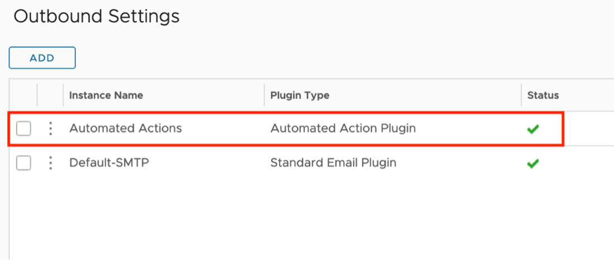
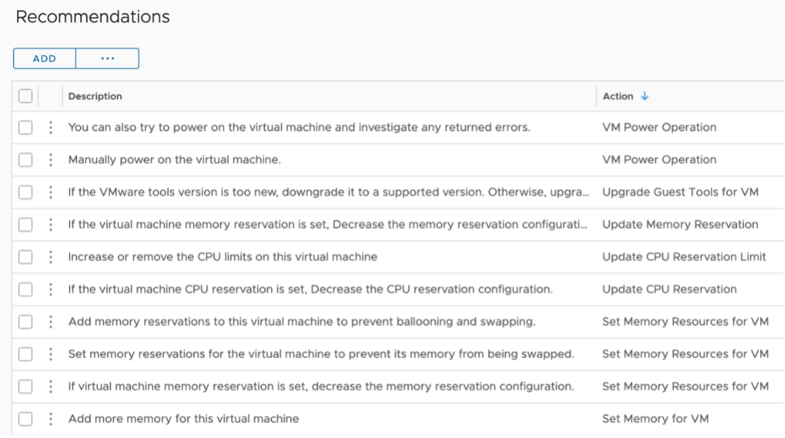
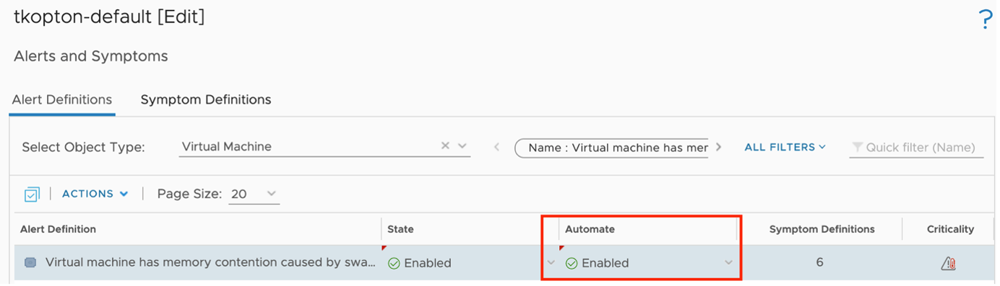
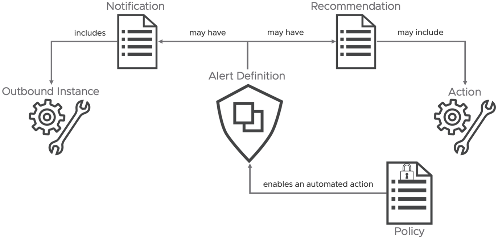

This chapter describes the available options to send information from vRealize Operations to another, so called north-bound, systems.

When speaking about north-bound systems we usually refer to services like mail servers or SNMP trap receivers. Since the advent of 8.x versions of vRealize Operations, the product supports more and more REST services like ServiceNow and Slack natively. Starting with the version 8.4, vRealize Operations provides a Webhook plugin as a generic way to integrate any REST API endpoints.

## Outbound Plugins

Out of the box vRealize Operations provides a set of Outbound Plugins. These plugins are used to create Outbound Instances. Every Outbound Instance is basically a connection to an external endpoint. The next picture shows the available plugins.

The configured Outbound Instances provide a one-way communication towards other systems. The first plugin type in this list is the Automated Actions Plugin. After initial installation and configuration of vRealize Operations, an Outbound Instance based on this plugin is automatically available for consumption. With *actions* in context of this particular plugin, we refer to actions run in the managed vCenter instances. A pre-requisite to enable such automated actions is enabling Operational Actions in the configuration of a Cloud Account adapter instance and sufficient permissions granted to the account used for the vCenter connection.

Automated Actions, as the name implies, can be used to automate execution of task as part of a Recommendation within an Alert Definition. Out-of-the-box vRealize Operations provides several *Recommendations* containing a vCenter actions, like shown in the following picture.

The first step towards a Self-Healing SDDC is to automate such actions. Of course, in a SDDC it needs more than just enabling automation. For example, we need to be compliant with change management processes, involve owners of the managed VMs or get approval. How to be compliant with such requirements is not part of this chapter but you will learn what options you have to get there.

Before I give you a short recipe how to enable action automation based on an easy example, let's quickly recall the Alert Definition concept in a simplified form.

The following picture shows the relationships between the involved objects. An Alert Definition may have one or multiple Recommendations. A Recommendation may include an Action. This Action will be available within the Recommendation and can be executed manually from the details view on an alert.

Now, there is only one step missing to introduce automation: enabling automated execution of the Action within the Policy controlling the behavior of any given object.

The next picture shows the corresponding part of a sample policy.

Next time this specific Alert will be triggered, vRealize Operations will try to execute the configured Action automatically. I say "try" because some actions need appropriate inputs und simply cannot run without interaction with the administrator.

The Automated Action Plugin is a great and easy to use option to start automating tasks triggered by vRealize Operations alerts, but it has its limits. The available actions are pre-configured and cannot be customized to cover more complex scenarios.

Another plugin that may be used to automate tasks triggered by vRealize Operations is the SNMP Trap Plugin. Yes, you are right, SNMP traps are usually configured to trigger alerts or open tickets via systems running a SNMP receiver. With the help of vRealize Orchestrator you can utilize SNMP traps as part of automation workflow. In the next picture you can see how I have configured my SNMP Outbound Instance to send SNMP traps to my vRealize Automation integrated vRealize Operations instance.

The following [link](https://docs.vmware.com/en/vRealize-Orchestrator/8.2/com.vmware.vrealize.orchestrator-use-plugins.doc/GUID-AE78D7CE-E2CE-4522-A9D4-ADE2601132DE.html) describes how to configure a SNMP trap receiver policy to start scripts or workflows anytime a SNMP trap has been received.

On the vRealize Operations site, the Notification element provides the required functionality to connect the "sensors" with the "actors". As part of a Notification, we specify the Outbound Instance, like the SNMP-Plugin based one depicted in the next figure. This way we can utilize vRealize Orchestrator workflows as part of our automation setup.

With this information we can extend the model I have introduced earlier to also include Notifications and Outbound Instances as possible building blocks of automated operations.

These methods of automation, Automated Actions as well as Notifications utilizing Outbound Instances both represent the fire-and-forget or as described at the beginning, the open-loop variant of running automation tasks. If your use cases require more than that, like for example gathering additional data from vRealize Operations to make a more educated decisions, keep reading, you will learn how to master such challenges.

## Webhook

The new Webhook Outbound Plugin provides a generic way to integrate any REST API endpoint and deserves its own chapter. Using notifications and the new Payload Templates, you can configure the desired outbound payload granularly down to single metric level. Following picture shows an example of the payload configuration which may be used with a webhook outbound connection.

John Dias, one of our great Tech Marketing Architects, created a sample Webhook for MS Teams integration. To integrate MS Teams as target for vRealize Operations Notifications, first you need to create an incoming Webhook connector for your Teams channel. The configuration of the Webhook in MS Teams is not part of this chapter, but it is very well described in John's post. To use the MS Teams connector in vRealize Operations, simply create an outbound plugin instance in vRealize Operations with the complete URL of the MS Teams incoming webhook as parameter as shown in the next picture:

The provided payload sample makes the creation of a Notification an easy task. The payload template describes the information vRealize Operations will send out to the target as soon as the specified notification rules apply. The next figure shows the template created by John for the MS Teams integration.

The new Webhook capabilities makes it possible to integrate vRealize Operations with systems we probably have not even considered until now, such as message queues.

With an instance of the Webhook plugin pointing to a RabbitMQ endpoint and an appropriate payload template vRealize Operations allows now to create notifications which will send data to RabbitMQ queues on certain events. Like in this example showing RabbitMQ queues for opened and canceled alerts.

## vRealize Operations Management Pack for vRealize Orchestrator

The first version of the vRealize Operations Management Pack for vRealize Orchestrator was introduced back in 2018. It has undergone many enhancements and is available for free. It opens up possibilities to automate your SDDC by providing the following features:

- Insights into vRealize Orchestrator including various metrics, properties and predefined dashboards and alert definitions
- vRealize Orchestrator workflows as Actions within Recommendations

The ingredients for self-driving SDDC are:

- vRealize Orchestrator instance. You can use a stand-alone vRealize Orchestrator or the instance deployed as part of the vRealize Automation installation.
- vRealize Operations.
- vRealize Operations Management Pack for vRealize Orchestrator.

To describe the details let us focus on a simple use case: "If a VM (the OS) crashes, this VM should be hard-reset."

As "seems to be crashed" or the exact description how to determine if a VM really crashed is not object of this chapter, we assume we have appropriate symptom and alert definitions in place.

The generic **recipe** from use case to auto-remediation is almost always applicable:

1. Create a vRealize Orchestrator workflow for your use case.
1. Create or modify a vRealize Orchestrator package.
1. Discover or re-discover vRealize Orchestrator package that includes our workflows in vRealize Operations.
1. Optional - Configure workflow in vRealize Operations - in our case it is mandatory.
1. Create or edit vRealize Operations recommendation.
1. Add vRealize Operations recommendation to an alert definition.
1. Optional - Manual remediation.
1. Optional - Enable automatic remediation.

I am not going to describe the content of the workflow itself or how to code in vRealize Orchestrator. The focus is how to integrate any given workflow in vRealize Operations and let it execute automatically as part of the alert remediation.

For our use case the vRealize Orchestrator workflow needs at least one input parameter to pass the vCenter VM object reference from vRealize Operations to vRealize Orchestrator. In the following picture you see a second input string parameter, `vRealize Operations_alert_id`. If this parameter is available, vRealize Operations will pass the internal alert ID to vRealize Orchestrator. This ID can be used for callbacks to retrieve more information from vRealize Operations. How to accomplish this will be part of the next subsection of this chapter.

The workflow inputs, as for the current version of the solution, are:

- vm as `VC:<Datatype>`, it will be populated with the object which triggered the alert.
- 1vRealize Operations_alert_id` as **String**, it will be populated with the actual vRealize Operations alert ID for further callbacks.

To make the workflows which you would like to use be available in vRealize Operations you need to follow a certain process. You can easily find the details on [my blog](http://thomas-kopton.de/vblog/).

The following picture shows two custom vRealize Orchestrator workflows available in vRealize Operations. After the initial integration of the Management Pack there are pre-configured packages available which include a variety of workflows available in vRealize Orchestrator out-of-the-box.

If the use case requires the workflow to be executed on a specific vCenter object, like the VM in this example, it needs to be configured properly in vRealize Operations.

vRealize Operations driven automation needs to know for what resource types within an alert definition as the type this specific alert will be triggered on and on what resource type in vRealize Orchestrator the configured workflow can be executed. The corresponding configuration process is to run "Create/Modify Workflow Action on vCenter Resources" in context of the specific workflow.

The alert specified in the example use case will be triggered on VM resource type and will be executed on a VM resource in vCenter. To accomplish this VM is exactly the type to configure as highlighted in the following picture. The last step is the "Add" Operation to actually configure the workflow as usable action.

With this configuration vRealize Operations has everything it needs to automate tasks using vRealize Orchestrator workflows. The very last step is to configure such workflow-based actions in the according Recommendation definition and enable the automation withing the respective policy.

On execution the properly configured vRealize Orchestrator workflow receives the vRealize Operations alert ID as depicted in the next figure. This ID can be used for further improvements of the automated actions.

