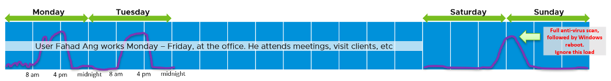

{}
This page is still in draft.
{}

Horizon consists of different components, each having their own capacity model. Not all components have capacity need, meaning you do not need to do capacity planning and adjustment.

| Capacity |
| --- | --- | --- |
| **User** | **Requirements:** How much resources do the users need? Focus on CPU and Memory. Disk Space is simple. Network is done at RDS Farm or VDI Pool level. A user can have >1 sessions. He uses 2 desktops due to application licensing or security policy. He could be oversized on Pool 1 and oversized on Pool 2. This means the sizing has to be done per pool or farm. We do not size the sessions. We size the users instead.| **Outputs** CPU (GHz), RAM (GB) per pool or farm. |
| **RDS Farm** | **Requirements** There are 2 main requirements: internal and external. Internally, we need to know utilization of the RDS hosts and decide if the RDS Farm is full. Your initial sizing is only a guide. If you undersize then this calculation will prevent you from supporting more than what the farm can actuall support. If you oversize, then this calculation will give you confidence to push beyond your plan. Regardless, you then need to update your plan. Externally, the RDS Farm runs on a vSphere cluster. To add more hosts, you need to know if the underlying cluster is able to support it. This cluster could be a shared cluster, so there are other pools or farms there.| **Outputs** No. of RDS Sessions remaining within the farm. No. of RDS Hosts that can be added in the parent cluster.|
| **VDI Pool** | **Requirements** Internally, there is no requirement as it’s a simple allocation model. The data provided by Horizon is good enough. Externally, it’s similar to RDS Farm.|**Output** No. of VDI VM that can be added in the parent cluster. |
| **Application** | **Requirements** How much resources do the application need? Focus on CPU and Memory. Disk Space is simple. Network is covered by the Horizon protocol.|**Output** CPU (GHz) and RAM (GB)|

There is no capacity required for the following objects:

| No capacity required |
| --- | --- |
| **Pod**	| It’s just a folder or container of farms and pools. The pools/farms may not be interchangeable so you can’t roll them up. In a large environment with hundreds of farms and pools, you can use distribution chart to quickly show the farms and pools that are running low on capacity.|
| **Site** | See Pod.|
| **Cloud Pod** | See Pod.|
| **RDS Host** | Capacity is done at RDS Farm. If the host runs out of capacity, you don’t increase the size of the host, rather you add more hosts. The host size is a design decision.|
|**Horizon Servers** | Connection Servers, UAG, App Vol. They are designed with fixed size. If not enough, add more instance.|

## Users

Sizing what a user needs is challenging as each users work differently. Corporate office hours do not apply as users may even work on the weekends.

## RDS Farm

| Number of Sessions Remaining |     |
|------------------------------|-----|

VDI Pool has Utilization (GHz), which is the total utilization not average.

Total - Unavailable - Bad State = Usable Capacity

- Unavailable (nothing wrong. Intentional or will fix by itself)  
  - = Provisioned + In progress + Provisioning + Customizing + Deleting + Waiting for Agent + Maintenance mode + Startup + Agent needs reboot
- Bad state (something wrong. Need manual intervention)  
  - = Configuration error + Provisioning error + Error + Unknown + Protocol failure + Domain failure + Agent disabled + Agent unreachable + Invalid IP

Usable Capacity consists of

- Used = Already Used + Connected + Disconnected + Unassigned user connected + Unassigned user disconnected
- Available = Available

RDS host [status](https://docs.vmware.com/en/Site-Recovery-Manager/8.4/com.vmware.srm.admin.doc/GUID-AF6BF11B-4FB7-4543-A873-329FDF1524A4.html).
