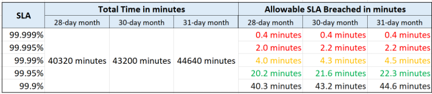
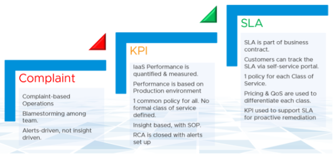
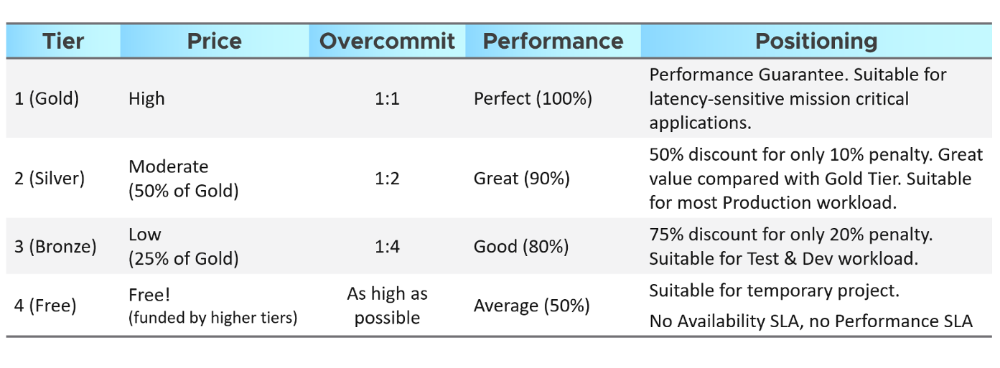

企业级云和非企业级云之间的区别在于 SLA。云提供商可以声明他们拥有最好的技术、最有经验的专业人员、最具创新性的流程、行业认证等，以证明他们是最好的。如果他们害怕在他们的合同中用 SLA 来支持它，那么所有这些都将无济于事。 SLA 使客户能够追究云提供商的责任，因为它会带来经济损失。

一旦定义了 SLA，客户就想知道它将如何交付。这就是流程、架构、认证等的用武之地。什么总是在如何之前。

## IaaS 的 4 个 SLA

IaaS 企业应提供三个 SLA，因为客户需要全面覆盖。

| SLA | 描述 |
| ------ | ----- |
| 可用性 | 这是最基本的SLA。它是最古老和最知名的。事实上，这在很大程度上是给定的。事实上，商定的数字是多少并不重要。如果这该死的事情失败了，你最好在有人抱怨或事情变得更糟之前迅速提出来！ |
| 性能 SLA | 仅仅因为发生了一些事情并不意味着它会很快。虚拟机是可以启动的，但是如果服务太慢，那就关掉就好了。 性能 SLA 涵盖了这一点并解决了基于投诉的操作 [CBO](/zh/operations-management/chapter-1-overview/1.1.1-complaint-based-operations/) 通过定义什么是快速的。 它涵盖了CPU、内存、磁盘和网络，因此使用了四个指标。 |
| 遵守 | 这为行业法规或认证提供了安全合规性。 |
| 服务 | 以上三个SLA是由技术提供的。它们需要得到人类提供的服务的补充。这应该涵盖主动和被动服务。两个流行的例子是响应时间和解决时间。 |

## KPI vs. SLA

KPI 和 SLA 齐头并进。

| 首字母缩略词 | 描述 |
| :-------: | ----------- |
| SLA | 您与客户签订的正式商业合同。通常，这是在 IaaS 提供商（基础架构团队）和 IaaS 消费者（应用程序团队或业务部门）之间进行的。 正式的 SLA 需要运营转型 [OT](https://blogs.vmware.com/services-education-insights/services/operations-transformation-services). 它需要的不仅仅是技术更改，因为您需要查看合同、价格（不仅仅是成本）流程、人员等。如果违反 SLA，它往往会受到经济处罚，例如下一个计费周期的信用。|
| KPI | 这包括 SLA 指标，以及在违反 SLA 指标之前提供预警的相关附加指标。一个给定的 SLA 有很多 KPI，而 KPI 是 SLA 的先决条件。如果您没有适当的 SLA，那么在提交 SLA 之前先从内部 KPI 开始。 首先了解并[分析](/zh/operations-management/chapter-2-performance-management/1.2.10-baseline-profiling/) 你的IaaS的实际性能。 使用 [此处](/zh/operations-management/chapter-2-performance-management/1.2.10-baseline-profiling/) 中描述的分析技术，我分析了超过一百万个数据点。 | 

SLA 是 **每月** 计数器，而不是每天或每年。您使用整个月的数据来计算它。

时间线很重要。在下表中，请注意一年中的 99.999% 实际上比一周中的 99.95% 容易。您的客户不会接受年度柜台，因为他们可能面临长时间停机。你不会接受每日柜台，因为没有错误的余地。月度计数器在服务质量和提供服务的成本之间提供平衡。它还使报告更容易，因为您只需要跟踪日历月。

每添加一个“9”，您的停机时间窗口就会减少 10 倍。这就是为什么每个小数会花费更多的钱，因为可能需要不同的结构。

即使您每月测量一次 SLA，仍然难以满足。看看下表。为简单起见，我们将使用可用性 SLA 而不是性能 SLA，因为 up 或 down 是一个简单的二进制文件。

如果您承诺 99.99%，那么您每个日历月只有 4.0 分钟到 4.5 分钟的停机时间。这意味着您的架构必须能够检测到问题，然后在短短几分钟内完成相应的修复。这是一个狭窄的操作空间。

适用于可用性但不适用于性能的独特节省宽限期是计划停机时间。没有计划的性能停机时间这样的事情。特定于 IaaS，您可以建议计划停机时间不包括在 SLA 中，只要它快速且很少完成即可。 VM 硬件升级、工具升级和 Windows 升级等计划活动可以包含在计划停机活动中。客户造成的停机时间不包括在内，无论是否有意。这就是为什么您需要两个计数器：一个用于 SLA，一个用于实际。实际上，每次停机都会被记录下来，无论它是否属于 SLA 的一部分。

影响可用性但不影响性能的挑战是恢复时间。您的系统可能会在 1 分钟内检测到 VM 已关闭，但是整个操作系统启动并正常运行之前的重启过程需要 5 分钟，因为它需要执行文件系统一致性检查。

KPI 是对 SLA 的补充，因为它跟踪的强度更大，涵盖更多的计数器和事件。使用 vRealize Log Insight 处理更多时间敏感事件，因为 vRealize Operations 每 5 分钟测量一次。

从上表中，请注意不包括来宾操作系统计数器，因为它是“应用程序 KPI”或 VM KPI 的一部分，而不是 IaaS KPI。它们会影响 VM 性能，但 IaaS 无能为力，这意味着修复是在来宾 OS 层完成的。

KPI 还通过为您的运营转型提供垫脚石来补充 SLA。这是真正的业务 SLA 操作的必要步骤。

你从你站的地方走。首先使用 KPI。随着时间的推移，确定您的实际可用性

## 服务水平

下表显示了服务级别的基本和一般准则。考虑到技术和业务需求，您将实施的实际模型肯定会有所不同。 在 [容量管理部分](/zh/operations-management/chapter-3-capacity-management/1.3.3-capacity-planning/), 让我们回顾一个实际的例子。

上表由他们的 SLA 进一步定义，因为您需要量化 10% 惩罚的确切含义。

金子 级别的 SLA 高于 银 级别。为此，这意味着它们是根据相同的基准进行衡量的。

- 对于可用性，您可以根据理想情况衡量所有课程，即没有停机时间。
- 对于性能，您可以根据相同的阈值来衡量它们，这是一个严格的（读取：快速）数字。
- 对于合规性，您可以根据理想情况来衡量它们，即完美的合规性。
- 对于服务，您根据理想来衡量它们，这是最好的服务。

### 性能 SLA

让我们详细说明性能 SLA，因为它比其他两个更复杂。

根据上图，您提供 99.9% 金子 和 99% 银 作为相应的 SLA。

对于黄金高于白银，这意味着两者都是根据_相同的原始阈值_来衡量的。换句话说，银色环境中的虚拟机期望它不会像黄金环境中的虚拟机那样频繁地得到它需要的东西。如果 VM Owner 在性能方面想要更多 _可靠的_ 服务，那么只需支付更多费用并升级到 金子 集群。

这种方法比为每一层设置不同的性能阈值更容易。假设您设置了以下内容：

- **金子**: 虚拟机内存争用： 0.5%
- **银**: 虚拟机内存争用： 1.5%

你已经注意到问题了吗？

很难解释服务类别之间的增量或差距。为什么银价只有一半，价值却是原来的三倍？不应该是成比例的吗？

还有第二个问题。如果你设置_不同的_标准，白银的表现可能会比黄金好，因为它的标准较低。这会造成混乱。

在操作上，设置单一阈值更容易。无需使用 vRealize Operations 策略。由于 SLA 阈值相同，您还可以在同一集群或数据存储中使用混合类 VM。

我们将详细介绍性能 SLA 中使用的计数器 [这里](/zh/operations-management/chapter-2-performance-management/1.2.6-performance-sla/).

### 差异化服务

IaaS 建立在商品硬件上，并作为实用程序提供。话虽如此，有很多方法可以让您的服务与竞争对手区分开来。使用服务级别来区分高质量的服务。下表列出了一些示例。

| 服务 | 描述 |
| ------- | ----------- |
|备份 | 黄金级 提供应用程序级别的备份。它还提供更频繁的完整备份，并为客户提供自助式个人文件恢复。 |
|高可用性 | 黄金级 提供应用程序级别的监控。客户还可以要求他们的 VM 的特定启动顺序，并要求 VM-Host 关联规则以最小化风险。 |
|灾难恢复 |黄金级提供较低的 [RPO 和 RTO](https://en.wikipedia.org/wiki/Disaster_recovery)。客户还有权进行年度实际测试，其中生产工作负载从 DR 站点运行。 |
|快照 | 黄金级 提供更长的快照和更大的快照。 |
|操作系统管理 | 黄金级 提供了打补丁的灵活性。客户可以指定补丁延迟和自定义补丁包请求，其中并非所有来自 Microsoft 或 Red Hat 的补丁都适用。 |
|虚拟机管理 | 黄金级 提供更新工具和 VM 硬件的灵活性。允许客户推迟更新 |
|监控服务 |黄金级虚拟机将受到主动监控，而不仅仅是依靠警报。黄金层提供对运行客户虚拟机的底层物理基础架构的更深入的可见性。客户有权获得较低的内部指标，例如 vMotion 眩晕时间和 VMkernel 延迟。黄金层提供自助服务监控。客户可以自己登录到一个门户网站，在那里他们可以监控自己的虚拟机。他们可以启动预定的停机时间。客户将通过电子邮件和消息网络收到警报。 |
|支持 |黄金级提供更快的响应时间、更长的工作时间和更快的解决时间。 |
|网络| 黄金级 提供优先网络。客户可以选择定期 ping 服务，以确保其应用程序之间的网络延迟保持在商定的阈值内。 |
|谭 | 黄金级 配备一名技术客户经理，作为客户的单点联系方式 |