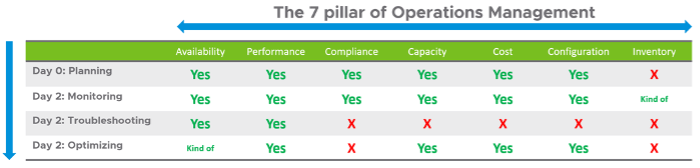
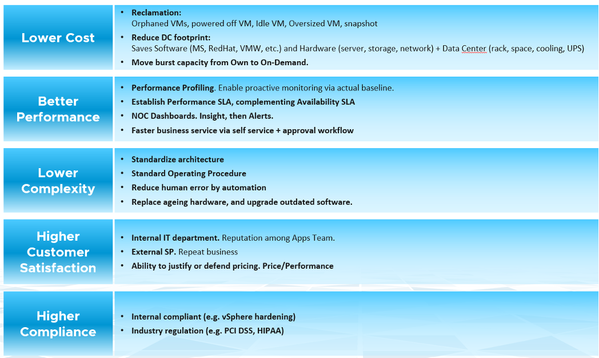

你管理什么，实际上？你的客户希望你照顾什么？你如何管理你需要管理的东西？

最基本的是您需要了解环境。有数以千计的对象（例如 VM、应用程序、防火墙）具有复杂的关系和相互依赖关系。库存给你这个。这就是为什么它是下图中的第一个框的原因。我有一家大型电信公司告诉我，他们的整个 DC 可能会宕机（比如计划的 DR 练习），但 vRealize Operations 不会，因为这就是他们监控宕机时间的方式。

一旦你知道你在管理什么，你就可以继续确保他们健康。如果没有问题，那么您将着手解决潜在的问题。如果没有风险，那么您会寻求优化。

#### 健康

健康实际上很难定义，因为它取决于上下文和对象。 英语中的“健康”这个词本身就需要解释一下。 因此，最好定义并映射到操作的支柱。 系统健康是当前的运行状态。 它涵盖了已经发生和/或仍在进行中的实际问题。

有两个问题会影响健康：

- 可用性
- 性能

可用性和性能可以相互排斥，但两者都会影响健康。如果没有其他问题，您可能会遇到 1 个问题。

#### 风险

风险就是未来。它涵盖了潜在的问题。目前没有问题，但如果你不采取行动，就会增加它成为问题的风险。

有 3 个问题会在运营中产生风险：

- 遵守
- 配置
- 容量

在上述所有问题中，由于不存在实际性能、可用​​性或安全问题，因此健康不会受到影响。您面临的是风险，因为您的应用程序和操作会继续进行，就好像什么都没发生一样。您的客户可能不会注意到，您的业务也不会受到影响。

#### 效率

效率就是优化。目前没有问题，也不存在将来出现问题的风险。您希望进行优化，因为它可以降低成本并提高性能。

- 浪费（超大、未使用的 EC2、空闲、未映射的磁盘空间、孤立文件等）
- 成本。将您的成本与其他云提供商进行比较，因为 IaaS 本质上是一种商品。
- 绿色运营符合效率，因为可持续运营需要精益运营。

## 运营支柱

运营管理的最佳实践要求您区分支柱和流程。支柱是您需要管理的，而流程是您管理它们的方式。

每个支柱都是一个单独的管理单元。它们代表单独的学科并且彼此兼容。每个支柱的复杂性取决于技术，例如，vSAN 容量比中央阵列更具动态性。在 vSAN 中，更改存储策略可能会导致突然激增。
流程是每个支柱内的活动。它需要角色和职责，这些都记录在政策中。

第 0 天是您计划和定义预期结果的阶段。一些公司执行压力测试和负载测试，因此他们知道实际负载实际发生时会发生什么。没有计划和测试，你不知道现实会是什么，因为你没有定义“好”。

第 1 天是您构建系统和启动服务的阶段。这包括配置各种操作输入，例如成本驱动因素（例如应用许可证成本、电费）。由于本书的重点是第 2 天，因此上表中不包括第 1 天。

监控和故障排除是活动。 他们不是你管理的东西。 在监控中，您有标准操作程序 [SOP](https://en.wikipedia.org/wiki/Standard_operating_procedure) (SOP), 它定义了哪些角色执行哪些检查。 你首先专注于洞察力，然后才是警觉。故障排除不仅仅是简单的“发现”，也不仅仅是收集事实。它侧重于原因，然后制定解决方案以防止未来发生事故。事件意味着某些东西已经死亡、缓慢或被破坏。您对可用性、性能和安全性进行故障排除。

库存是你拥有的东西，而不是你计划的东西。您计划具有特定配置的容量。库存仅说明您拥有的东西。无需进行故障排除或优化。

优化带来了许多实际的好处和真正的业务成果。这里是其中的一些：

我敢肯定还有更多。用你的真实世界经验给我留言！

## 相互依存

运营管理的支柱是相互依存的。了解关系与了解每个支柱一样重要。关系很重要，因为症状和根本原因通常是两个不同的事情。性能问题可能是由配置问题引起的，例如配置过时或版本不兼容。

以上图为参考，让我们详细说明每个支柱。

#### 可用性

运营管理中最基本的部分，因为如果整个环境出现故障，其余的 7 个运营支柱实际上都无关紧要。

有一系列可用性解决方案，从快照、备份、HA、FT 和 SRM。每个都会对容量和性能产生影响。

可用性考虑 HA（高可用性）设置。因此，计划内停机（例如 ESXi 处于维护模式）不会影响可用性值。

可用性如果做得好，不会影响容量和性能，因为它已经作为设计的一部分考虑在内。是的，这意味着您需要包括由 DR 事件引起的潜在工作负载。

可用性 SLA 越高，服务的价格就越高。每增加 9 个可用性就会有很大的增加。五个 9 的可用性比四个 9 的成本高得多。

#### 性能 & 容量

性能和能力是密切相关、相互依存的，但又不完全相同，因此经常被另一个误认为。

在较大的组织中，它们通常由两个不同的团队管理。容量团队不参与日常运营，因为他们专注于更长期的资源可用性。容量 _规划_ 是在不影响性能的情况下最大化利用率。它还考虑了潜在的工作负载和未来的需求，这是性能 **未** 考虑的。

容量团队可能不具备对性能进行故障排除的技术技能。另一方面，日常运营处理数据中心的“地板上的东西”。他们的主要重点是满足应用程序的需求。它是消费者驱动的，而容量是提供者驱动的。

性能受能力影响，因为能力不足往往是性能不佳的原因。

容量受性能影响，因为它需要先考虑争用计数器，然后再考虑利用率。如果您不能满足现有需求，那么您将不会配置新的工作负载，因此容量实际上已满。利用率计数器可能还不高，但这是次要考虑因素，因为您在弄清楚原因之前停止添加新工作负载。

性能比容量更具有时间敏感性和重要性。管理性能第一，容量第二。 使用[餐厅类比](/zh/operations-management/chapter-1-overview/1.1.6-the-restaurant-analogy/), 您首先关注用餐区，然后是厨房。

性能和容量是相反的关系。在最低容量下实现最高的整体性能，因为此时 VM 或 Infra 交付的工作量最大。

#### 成本 & 价格

随着硬件成为商品，基础设施变得无形，价格自然成为所有 IaaS 供应商的共同标准。普遍的预期是每个虚拟机的价格在不同的云提供商中是相似的。提供差异化​​定价的一种方法是 SLA。

虽然价格应该高于成本，但它可以独立于成本设置。使用折扣和累进定价为正确的条款和条件设置正确的价格。渐进式定价也将阻止首先配置大型未使用的虚拟机。与这些 VM 已经投入生产相比，它更容易处理。

成本与容量密切相关。 IaaS 的利用率越高，每个 VM 的成本就越低。成本与容量是分开的，因为它可以在不减少容量的情况下进行优化。

成本和容量也可以相互独立。您可以通过技术更新在不增加成本的情况下增加容量。您可以通过降低非容量成本（例如您为服务支付的费用）来降低成本而不减少容量。

性能 SLA 越好，客户愿意支付的价格就越高，因此术语价格/性能。

#### 合规与网络安全

网络安全是相关的，但与合规性不同。网络安全涵盖攻击等问题（无论是内部员工还是外部威胁）。合规性处理可能暴露安全漏洞或符合特定标准集的配置设置或值。

根据内部和行业标准衡量合规性。它也是连续测量的。

#### 配置 & 清单

清单与配置相关，但不完全相同。配置会影响性能、成本、容量和合规性。 因此，它是关键点之一 [优化评估](https://www.vmware.com/professional-services/technical-account-management-services.html). 需要在整个堆栈中检查设置，尤其是较低的堆栈，因为堆栈中的问题会影响其上方的堆栈。

清单是对你所拥有的东西的记录。配置是你所拥有的属性。清单使用一小部分设置，因为重点是计算对象的数量。大多数属性/设置与库存无关。

清单一般会问我们在哪儿有什么？因此，它专注于数量，而不是规格。例子：

- 集群中的虚拟机数量是清单的一部分。它不是配置的一部分。
- 群集中的 ESXi 主机数是清单的一部分。但它也是配置的一部分，因为这是该集群的设计。集群配置了 8 个 ESXi 主机是有原因的，偏差可能需要在文档中解释。

清单具有库存盘点等概念，通常涉及实物。配置没有。

## 角色和职责

保持运营良好运行需要许多角色。有些直接参与日常运营，而另一些则专注于大局。在小型组织中，角色由相同的少数人扮演，相互支持。你可以让 3 人做任何没有结构的事情，或者 300 人有明确的界限。无论如何，工作仍然需要完成，因此记录所有角色和职责。

#### 1 级操作

处理生产环境。定期检查整体环境。使用洞察力和警报。通常不需要读取日志。

负责关闭警报。只有在知道根本原因时才应关闭警报，而不是在症状消失时关闭。在不知道发生原因的情况下关闭警报会阻止吸取教训，并可能适得其反。

按照 SOP 执行简单的故障排除。 SOP 理想情况下是自动化的，采用输入参数，因此如果手动步骤的数量或频率很高，人为错误的可能性就会降到最低。

关注健康，即可用性和性能。

#### 2 级操作

当级别 1 无法解决问题时激活。对于解决的每个问题，此角色应更新故障排除指南，以便可以授权级别 1。
专注于洞察力，而不是警觉。放眼大局，尽量避免发生警报。

比 1 级更高级。可能专注于某些领域（例如 vSAN、网络）。

执行高级故障排除，这通常需要进行日志分析。

领导或参与运营管理工具的评估。设计和维护 vRealize 仪表板和警示。

关注健康、风险和效率。

#### 建筑学

看看未来。评估新技术并评估是否需要技术更新。

#### 容量

规划产能的供应方，与架构师一起工作。

计划产能的需求方，与业务线或销售团队合作。

不参与日常工作。 ESXi 主机进入维护模式是一个操作问题，而不是容量管理问题。

#### 遵守

将合规性设置设置为商定的内部和行业标准。

验证运营团队是否及时、正确地处理了不合规警报。向上级管理层报告和讨论合规状态。

关注风险（配置、合规性）。

#### 信息技术管理

这里可以有多个级别，一直到 CIO。

看大局，尤其是价格和成本。

一般不参与故障排除和架构。

主要关注点是合规性和成本。作为设计的一部分，性能并不像建筑师承诺的那样好。

## 运营管理的输入

有两种类型的计数器会影响您的日常操作。竞争是性能的主要计数器，而利用率是容量的主要计数器。第三种类型只是提供信息，例如说明您拥有的东西。

虽然争用是您关心的问题，但利用更受关注，因为它更易于监控且更易于解释。有一种趋势是监控利用率，就好像这是运营的支柱一样。 相同争用, **利用率不是您管理的事情**. 是的，您监控利用率，但出于某种原因进行监控。这只是衡量您关心的事物的一种方式。就其本身而言，它没有任何意义。意义取决于目的。不同的目标会导致不同的解释和利用指标。利用率对性能和容量的影响不同。对于性能，您应该查看实际和真实的利用率。对于容量，根据可用容量（在 HA 和缓冲区之后）衡量利用率。

虽然它们具有负相关性，但在低利用率时仍会发生争用。当 ESXi 主机未以高利用率运行时，集群中的虚拟机可能会争用资源。不平衡和不正确的集群配置是导致低利用率争用的两个典型原因。
在性能管理一章中进一步解释了利用和争用。 [性能 管理](/zh/operations-management/chapter-2-performance-management/).

分配补充了需求，因为新配置的 VM 往往处于空闲状态（可能长达数月）。此外，需求模型无法检测到未来的负载，因为它尚不存在。分配模型应该用来补充需求模型。这将在此处进一步解释。 [这里](/zh/operations-management/chapter-3-capacity-management/1.3.6-usable-capacity/).