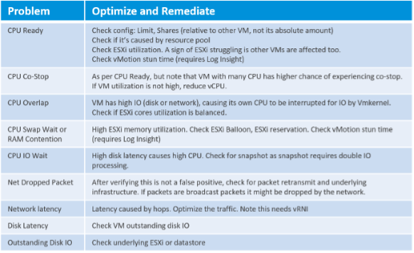
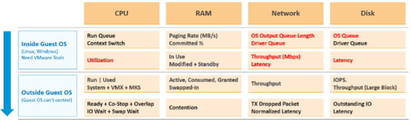
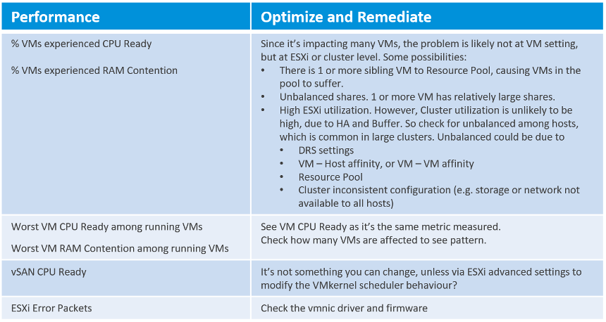

優化性能很困難，因為當利用率/吞吐量為 100% 時才能實現最佳性能。由於相互依賴的許多方面，在該級別上運行需要完美的掌握水平。

#### 垂直依賴

堆棧中有層，下層的問題會影響上層。

#### 水平依賴

IaaS 的四個要素不是獨立的。當 CPU 暫停時，就來賓操作系統而言，RAM 和磁盤會隨著時間的推移而出現延遲。

#### 流依賴

由於流量，NSX Edge 群集上的 NSX Edge 虛擬機中的問題可能會影響位於另一個群集上的業務虛擬機。如果您不了解流程，則可能會浪費時間在錯誤的集群上進行故障排除。

#### 版本依賴

“什麼與什麼一起工作”背後有正當的理由。並非所有組件的所有版本都能很好地協同工作，這是一個已知問題。驅動程序、固件等可能會導致互操作性問題，這可以表現為性能。

## 消費者層

消費者層由虛擬機和容器（通常在虛擬機內運行）組成。客戶操作系統存在於其中，反過來又為進程運行提供了一個平台。因此，如果您正在運行容器，則會添加一個新層進行監控。如您所見 [此處](/zh-tw/metrics/chapter-1-overview/)，添加新層會改變相鄰層中的指標。如果您有容器監控方面的專業知識，請給我發電子郵件！

在流程級別，用於故障排除的有用信息似乎有限。下面展示了 [Windows Sysinternal](https://docs.microsoft.com/en-us/sysinternals/)，一個很好的 Windows 故障排除工具。如您所見，它們只是利用率計數器。

更多關於[CPU 上下文切換](https://en.wikipedia.org/wiki/Context_switch) 被覆蓋[這裡](/zh-tw/metrics/chapter-2-cpu-metrics/2.2.1-guest-os/#guest-os-cpu-context-switch).

由於提供了各種計數器，我們在 vSphere 虛擬機級別具有更好的可見性。下表列出了您可以為解決問題而執行的指標和相關操作。

我沒有將 AWS EC2 或 Azure VM 放在這裡，因為可見性相當有限。

現在讓我們把來自客戶操作系統和虛擬機的所有計數器放在一起。為了完整起見，我也添加了利用率計數器，因為 5 分鐘的平均值可能太長了。

KPI 計數器對於某些用戶來說可能過於技術化，因此 vRealize Operations 8.2 包含一個讓他們入門的起點。它帶有彩色編碼儀表板。如果您認為儀表板小部件不符合您的要求，您可以調整它們的閾值。只有在您分析您的環境之後才這樣做，而不僅僅是基於理論。

## 提供者層

在任何給定時刻，正在運行的 VM 始終駐留在 ESXi 主機上。由於 DRS 和 HA，更容易在集群級別進行監控。由於一個集群可以有數百個 VM，因此您需要能夠代表集群中所有正在運行的 VM 的體驗的綜合指標。 vRealize Operations 8.2 提供以下衡量指標：

正在運行的VM 還使用數據存儲服務或具有[原始設備映射(RDM)](https://docs.vmware.com/en/VMware-vSphere/7.0/com.vmware.vsphere.storage.doc/GUID-9E206B41-4B2D-48F0-85A3-B8715D78E846.html) 磁盤.

以下是提供者層的潛在問題列表：

