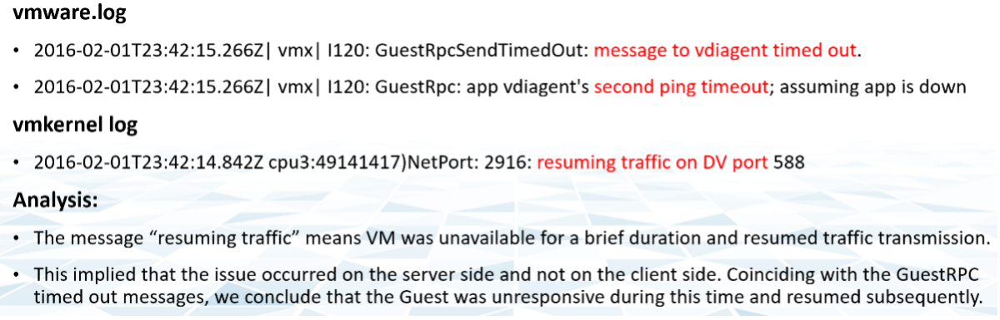

有很多事情可能會出錯，尤其是在製作過程中和休假前夕。另一方面，您可以更改的設置相對有限。

我假設您已經遵循了配置最佳實踐，因為這本身就是一個很大的話題。您需要查看並應用 Windows、Linux、vSphere、NSX、vSAN、服務器硬件和網絡硬件性能最佳實踐。如果您使用 Horizo​​​​n，那麼您還需要應用其最佳實踐，以及您的 VDI 架構中使用的第 3 方技術。在具有多個版本和供應商的大型環境中，可能很難確保整個堆棧兼容。這是一項永無止境的工作，因為您需要跟上版本和產品的生命週期。

假設你已經完成了所有的配置檢查，那麼你能做的剩下的事情就相當有限了。對於性能問題，它基本上歸結為容量，虛擬機容量或基礎設施容量。

vMotion 作為一個主題不斷出現。如果您的應用程序團隊有顧慮，[這篇](https://blogs.vmware.com/vsphere/2019/07/the-vmotion-process-under-the-hood.html) 文章深入探討了它的工作原理和 [這](https://blogs.vmware.com/vsphere/2020/03/vsphere-7-vmotion-enhancements.html) 介紹了 vSphere 7 中的增強功能。

[根本原因分析](https://en.wikipedia.org/wiki/Root_cause_analysis) 報告因客戶而異，即使他們解決的問題本質上是相同的。報告中排名第一的內容應該是什麼？

報告的主要內容應該是設置為跟踪以防再次出現問題的警報。如果不設置此警報，您將無法檢測到問題，並且可能會浪費寶貴的時間。

根本原因很可能與症狀不同。它可能完全發生在不同的對像上，並且錯誤消息可能看似無關。根本原因通常以日誌消息開始，這意味著它沒有作為正式警報冒泡到屏幕 (UI) 中。當供應商支持團隊向您推薦要捕獲的特定日誌消息時，您如何驗證它是正確的？

您需要確保警報有效。這意味著它不應導致誤報。

讓我們舉個例子。這是一個[VDI](https://www.vmware.com/topics/glossary/content/virtual-desktop-infrastructure-vdi) 大規模斷開連接問題，其中 >100 個用戶的會話同時斷開連接。分析認為問題出在“正在恢復DV端口的流量”，所以當它再次出現時我們需要捕獲這個消息。

您需要做的第一件事是驗證上述警報。使用 Log Insight 之類的工具，您可以針對整個環境交叉檢查消息，尤其是健康環境（在本例中為未受影響的用戶）。理想情況下，您可以交叉檢查整個星期，而不僅僅是在事件發生期間。

以下是我在過去五個工作日內對所有用戶進行交叉檢查的結果。它發生了 1000 多次，這意味著“恢復 DV 端口上的流量”不是我應該基於警報的消息。他們太多了，並且在辦公時間之後有一個明確的模式。

