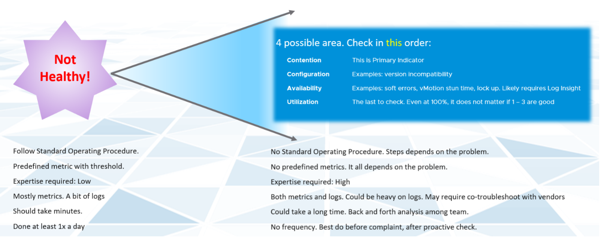

绩效管理有四个不同的过程：

#### 计划

这是您设定绩效目标的地方。确保目标与业务可交付成果一致。

当您设计该 vSAN 时，您考虑过多少毫秒的磁盘延迟？例如，您将目标设置为在 VM 级别（不是 vSAN 级别和单个虚拟磁盘级别）测量的 10 毫秒。

#### 监视器

这是您比较计划与实际的地方。这就是为什么必须明确定义目标的原因。现实是否与您的架构应该提供的内容相匹配？如果没有，那么你需要修复它。

#### 故障排除

当现实比计划更糟或出现问题时，您会这样做，而不是在有投诉时。您想花时间进行故障排除，因此最好主动进行。并且悄悄地，没有人催促你获得结果。

#### 优化

作为监控的一部分，您可能不会发现问题，但您会发现使性能更好的机会。新版本提供性能改进是很常见的。同样，您要主动这样做，而不是等待投诉发生。

------

监视器 是 **什么**，故障排除 是 **为什么**。监视器是 [标准操作程序](https://en.wikipedia.org/wiki/Standard_operating_procedure) (SOP) 的一部分，故障排除是一个临时的、按需的过程。借助预定义的仪表板和警报，可以由 1 级团队执行监控，而故障排除则需要专家团队。专家组也是设定Level 1 团队使用门槛的团队。故障排除涉及日志分析，因为许多系统不会生成完整的指标，并且一个常见问题背后可能有许多不同的原因。最后，实际的根本原因甚至可能与问题没有密切关系。

当您区分监控和故障排除时，日常操作就会变得更加系统化。下表显示了差异：

|       | 监视器 | 故障排除 |
|-------|---------|--------------|
| **问题** |问题是什么？ |为什么会发生？问题的真正原因是什么？ |
| **自然** |主动 |反应式 |
| **柜台** |一般1个柜台。而这个计数器也是SLA。这是您或您的客户检查的第一个柜台。 |总是有很多柜台。有多层计数器，一个影响另一个。
| **SLA** |是的，这意味着 SLA 适用 |是的。如果违反 SLA，事情就变得很紧急。 |
| **关键绩效指标** |是的，这意味着您在监控中使用 KPI 而不是单个指标。 |是的，但作为起点。然后深入研究支持指标，这些指标通常是原始指标。 |
| **指标** |初级计数器。作为 SOP 的一部分，您主动检查它 |二级计数器。您只检查主要是否达到阈值。 |
| **频率** |每天执行。作为 SLA 的一部分，黄金级将比青铜级具有更高的定期监控频率。 |一经请求。 |
| **时间线** |现在和未来。您考虑未来的负载并进行预测。 |现在。未来无关紧要。你的重点是扑灭火灾或潜在的火灾。 |

在大多数情况下，最好使用 5 分钟的间隔进行监控，因为 1 分钟的不良指标可能不会对业务产生影响。另一方面，故障排除可能需要每秒粒度。但是，如果您的补救措施相同，这并不总是意味着您需要查看每个计数器。