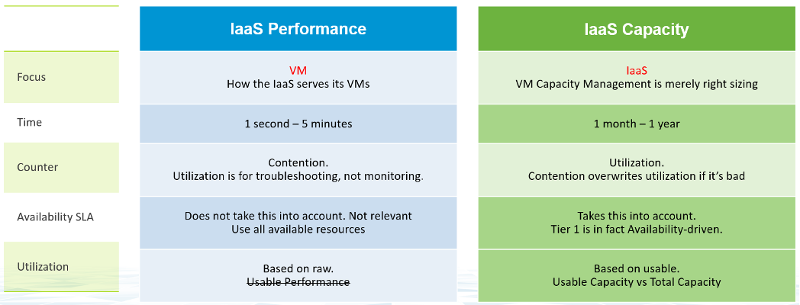
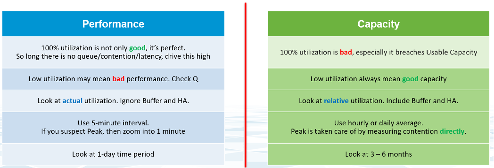
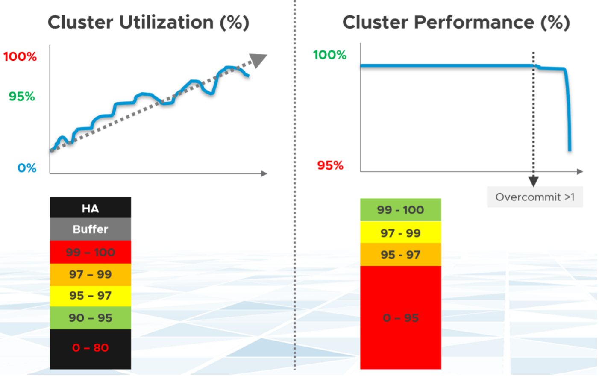
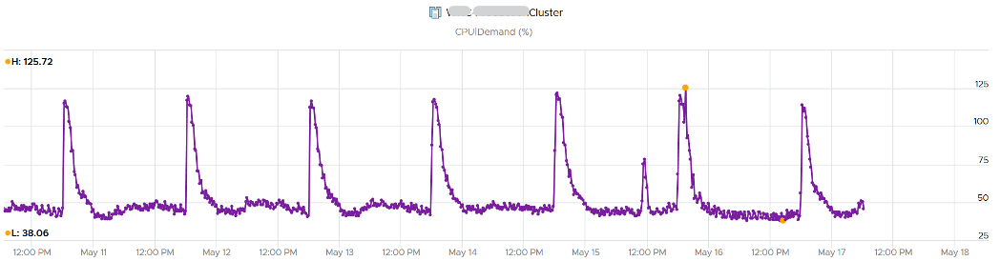
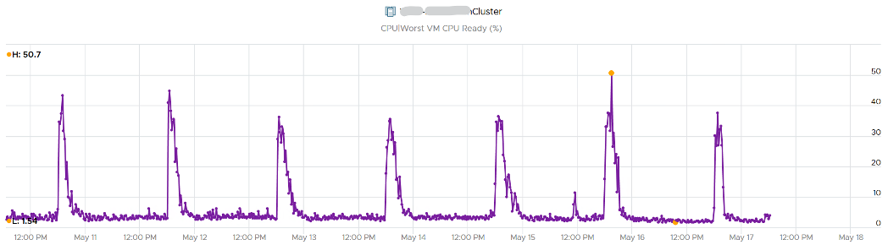

容量和性能之间的关系因对象而异。消费者对象（例如 VM、K8S Pod）与提供者对象（例如 vSphere 集群、vSAN 集群）具有不同的性质。对于提供者对象，性能始终是自下而上的。您从在提供程序对象中运行的 VM 开始，然后聚合指标。容量总是自上而下的。你先看大局，然后再深入。例如，您从 vSphere 集群开始，然后深入到 ESXi。

对于 IaaS 提供商，下表说明了性能和容量的差异。

容量有 HA、Buffer、Overhead 和 Reservation。这些都与性能监控无关。在性能中，您不关心它们，因为性能与现实有关（实际发生的情况）。它们可能会导致性能问题，但不会在性能指标中考虑。

性能和容量的混淆在于利用率。它们共享相同的原始计数器，但使用方式不同。性能是绝对的（实际值），容量是相对的（取决于设置）。下表显示了如何不同地使用利用率。

以 ESXi Memory Consumed 为例，它是 ESXi 的主要利用率计数器。

- 从性能监控来看，100% 消耗不仅好，而且完美。您正在最大化缓存。只要没有膨胀和争用，这正是您想要的。
- 从容量监控来看，100% 消耗并不好，因为这意味着没有更多剩余容量。您需要停止供应新负载并开始购买新硬件的过程。此外，100% 是在扣除 HA 和缓冲区后测得的可用容量。它不是根据绝对体能来衡量的。

让我们举一个例子来看看争用和利用率有何不同。下面以集群对象为例。有两个计数器，每个计数器都以百分比表示。

您希望利用率尽可能高，因为您已经为硬件付费了。因此，您从 0% 开始，但希望尽可能向上移动。

你希望你的表现保持在 100%。你不希望它向下移动很远。事实上，10% 的降级可能很重要，因为这可能意味着 10% 的 VM 群体受到影响。在具有 2000 个虚拟机的大型集群中，这可能意味着 200 个虚拟机。

性能取决于服务等级。 Gold 集群可能与 Bronze 集群具有相同的硬件，但在 Gold 集群上运行的 VM 面临的争用较少，因此它们的性能更好。

让我们在现实生活中看看上面的内容。这是一个在过去 7 天内经常出现高利用率的集群。您可以清楚地看到峰值。集群有 14 个 ESXi 主机。

这里的一个合乎逻辑的问题是对 VM 性能的影响是什么？他们得到了他们要求的 CPU 吗？该集群有 550 个正在运行的 VM。

这就是争用计数器的用武之地。一个跟踪问题的深度，另一个跟踪问题的广度。

CPU Ready > 1% 的虚拟机计数器百分比显示出几乎相同的模式。我们可以看到很大比例的 VM 人口受到影响。

第二个计数器跟踪深度，给出集群中任何 VM 经历的绝对最差 CPU 就绪值。

