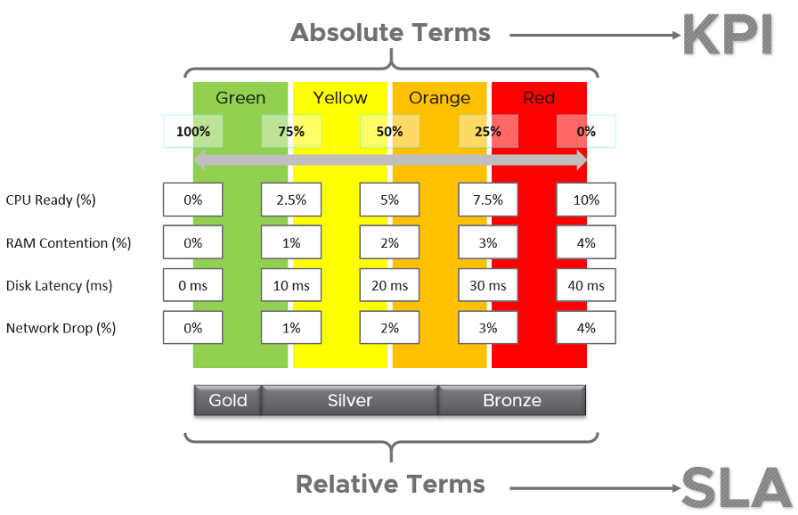
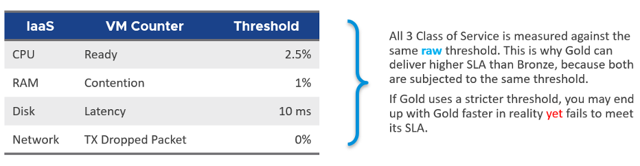
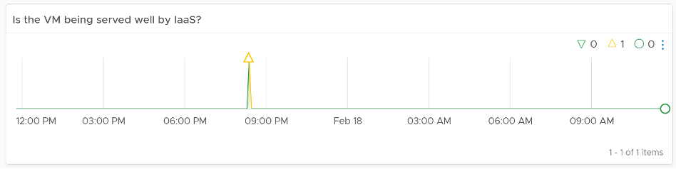
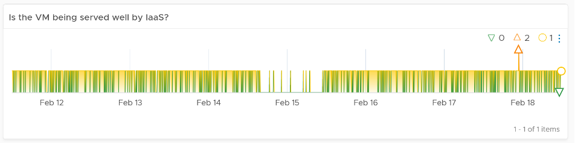
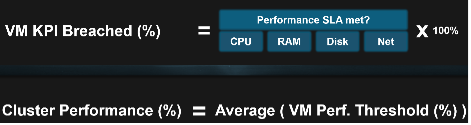

我同意一组确定复杂对象（例如 VM 或应用程序）运行状况的指标在 100% 的情况下永远不会准确。这很正常，就像在现实生活中一样。我们进行年度健康检查，进行各种测试，结果将是一系列指标（例如您的坏胆固醇水平）。从年轻到年老，它们对您来说是否 100% 准确？结果是否对您所在城市的每个人都 100% 准确？不，但它们已经足够好了，而且肯定比没有好得多。除了绝对值之外，值随时间的相对变动也能让您洞察力。例如，如果 KPI 在一个安静的星期天早上下降，而环境不应该有已知活动，那么可能有不好的事情发生？

在这本书中，我对 KPI 的定义严格按照**性能**，因为性能这个词有特定的含义。对我来说，KPI 作为一个术语不适用于可用性管理和容量管理。我们应该将决定可用性的关键指标称为**KAI**，将决定容量的关键指标称为**KCI**[^1]。这将防止混淆，因为实现级解决方案要求我们明确术语。

本书没有使用包括非绩效在内的更广泛的 KPI 定义，因此我们可以在实现中精确。对于整体业务 KPI, [Norman Dee](https://blogs.vmware.com/services-education-insights/author/ndee) 写了一系列的博客文章 [这里](https://blogs.vmware.com/services-education-insights/2020/05/getting-started-with-kpis-and-metrics-part-1-their-importance-and-value.html).

要使 KPI 支持 SLA，它使用的阈值必须与 SLA 使用的阈值相同。

假设您有三类服务，其中 Gold 是最高和最贵的。

黄金级应该比青铜级表现更好。这是期望，所以我们需要在实际生产中反映这一点。 Gold _absolute_ 性能应该更好，因为它被设计得更好。一开始它的价格更高是有原因的。

#### KPI

这种绝对性能的测量范围是 0 - 100%，因此很容易理解，100% 是最好的。从数学上讲，KPI 实际上是无单位的。我可以选择另一个范围，例如 0 - 4，它不会有任何区别。使用百分比和 0 - 100 只会更容易记住。

**KPI** 按原样报告原始性能。

大多数 KPI 是内部的。它们用作故障排除的起点。

对于每种类型的对象，旨在将所有绩效指标整合到一个 KPI 中。假设您有 1000 个要监控的 AWS EC2。您有一堆指标，并将它们考虑为 2 个 KPI。您如何知道哪个 EC2 有问题？您需要显示 2 组热图或表。这意味着您需要手动将第一个表与第二个表相关联。它不可扩展。

当您滚动到更高级别的对象时，上述内容也带来了挑战。

#### SLA

虽然 Gold 的表现应该比 Silver 好，但对于 Gold SLA 来说可能还不够好。尽管黄金在绝对意义上比青铜快，但它自己的 SLA 也可能会失败。相对以二进制来衡量。通过或失败。因为它是一个二进制文件，它无法衡量它通过的好坏或失败的坏。这是 KPI 对其进行补充的一个领域。

**SLA** 通常在一个日历月内进行衡量，这意味着 5 分钟的一次故障不构成正式的 SLA 故障。

SLA 是外部的，因为它写在合同中。

-----

下表显示了 KPI 和 SLA 之间的关系。两者都采用相同的指标和阈值作为输入，但由于目的不同，它们的分析方式不同。

所有三个服务类别共享相同的 KPI 集，这些 KPI 是绝对的。快就是快。这是事实，无论您贴上什么商业标签。

- 要定义您的 KPI，请获取每个 KPI 指标并准确定义速度，并将其分为四个区域。为简单起见，每个区域都给出了 100% 的四分之一。
- 理想情况下，将 Gold SLA 设置在最高范围，即 KPI 的绿色范围。
- 理想情况下，将 Silver SLA 设置在绿色以下的范围内，即 KPI 的黄色范围。如果它们在绿色范围内，则您已经超额交付（或正在超额交付）。您应该通过销售更多 VM 或购买更便宜的硬件来优化成本。
- 期望青铜在橙色范围内。如果它们在绿色到黄色范围内，则您交付过多。
- 没有应该在红色范围内。这是您的关键警报被触发的地方。由于 KPI 的真正目的是启用主动运营，因此您希望尽量减少处于红色区域的情况。

在前面的例子中，白银范围被赋予了一个宽带。虽然这在数学上是可能的，但在操作上它会产生不必要的复杂性。将一种颜色映射到每个服务类别要容易得多。此外，拥有 3 级以上的服务会使您的操作复杂化并增加您的成本。

让我们看一个例子来说明：

- VM 磁盘延迟的金牌 SLA 为 8 毫秒，铜牌为 26 毫秒。
- Gold VM 007 的磁盘延迟为 9 毫秒。青铜级 VM 747 的磁盘延迟为 25 毫秒。黄金级的绝对值表现更好。但是，相对而言，Gold 级未通过 SLA，而 Bronze 级通过其 SLA。

如果您有一个没有 SLA 的免费层级，那么它们位于红色区域中是可以的。商业云提供商提供免费层。它们被有意设计为更慢且更不可靠，因为它们希望您升级和付费。

## 内部的 SLA

对于每个 SLA，可以有_许多_个关联的 KPI，因为并非所有指标都应在合同中，而几乎所有性能指标都需要监控。

vRealize Operations 对 vSphere IaaS 内部 SLA 使用以下阈值。这些数字在产品中是固定的。

以上是严格的门槛。使用了高标准的性能，因为它是基础设施团队消费的内部 KPI。它不是外部的、正式的 SLA。内部和外部之间需要有一个缓冲，给运营团队反应的空间。缓冲区是您的误差范围。

高标准的另一个原因是它必须适用于关键任务环境。如果阈值对于此类环境不够好，您将不会得到早期警告。

单个阈值用于保持操作简单。这意味着生产环境中的性能预计会比开发环境中的得分更高。开发环境的性能显然会比生产环境差。单个阈值有助于区分不同服务类别提供的 QoS（服务质量）差异。你付出的少，你的表现就会变差。您支付半价；你得到了一半的性能。

IaaS 的上述四个要素（CPU、内存、磁盘、网络）在每个收集周期都进行评估。默认收集周期为 5 分钟，这是 SLA 监控的适当平衡。基于 1 分钟收集周期的 SLA 将过于紧张，会导致成本增加或阈值降低。

以下示例采用 vRealize Operations 8.2，表明 IaaS 为该虚拟机提供了良好的服务。它获得了过去 24 小时内要求的四种 IaaS 资源，只有一个例外。每次 VM 未获取资源时，图表都会计数。未在所有四个上提供服务的 VM 将在图表中注册值 4。

下面的例子显示了相反的情况。在许多实例中，VM 没有获得至少四种 IaaS 资源中的一种，而在一个实例中没有获得两种。该图表还显示了 7 天，因此可以看到模式或峰值。

既然我们可以测量每个虚拟机，我们可以在 ESXi 主机或集群级别汇总指标。以下公式对集群中所有正在运行的 VM 求平均值。您希望看到接近 100% 的数字，因为预期集群可以很好地为所有 VM 提供服务，而不仅仅是其中的 99%。在具有 1000 个虚拟机的集群中，99% 可能意味着 10 个虚拟机没有得到很好的服务。只需一台虚拟机即可投诉！

以下示例显示集群正在努力为其所有 VM 提供服务。

## KPI

我们之前分享过 SLA 只考虑通过或失败。它不衡量你通过的有多好或你失败的有多糟糕。这就是 KPI 补充 SLA 的地方。 KPI是在VMware Horizo​​n监控中实现的，所以我就以它为例。

KPI 定义为 0 - 100%。当我们使用 4 种颜色时，我们将它们平均分配。所以绿色只是 75% - 100%，红色只是 0% - 25%。如果您创建了不均等的分布，则某些波段将必须比其他波段更窄。对于不均匀的波段，在为构成 KPI 的每个指标定义阈值时，您还需要格外小心。

以下 KPI 使用 4 个指标作为其输入。每个指标都有一组绿色、黄色、橙色和红色的阈值。

现在我们有了每个指标的阈值，我们可以将每个指标转换为绿色 - 红色。当整个范围由单个数字定义时，Horizo​​n 适配器也能够处理。当您想要定义 green = 0 时，这很有用。这意味着单个数据包丢失会将指标置于黄色范围内。

我们如何翻译？

让我们举一个例子。以磁盘延迟 (%) 指标为例。它的范围从 0 到 40 毫秒，使用以下映射表映射到 0 - 100%。

通过上面的映射，我们可以精确地分配值。举些例子：

- 9 毫秒的磁盘延迟转化为 77.5% 的 KPI 值，这是绿色的。原因是绿色范围从 75% 到 100%，其中 0 ms 等于 100%，10 ms 等于 75%。所以每毫秒大约是 2.5%。
- 42 毫秒的磁盘延迟转化为 0%。它高于 40 毫秒的上限阈值。由于我们不显示负数，任何高于限制的都显示为 0%

我们对每个指标重复计算。 KPI 只是指标的平均值。

将来，我们可以添加_加权平均值_，以便您获得更好的领先指标。简单平均的问题是单个红色可以超过许多绿色，KPI 不会显示问题。

[^1]：你看，我并不反对行话。只要它们实际用于现场操作。如果它只是一个目标，那么就不需要用术语来标记，否则我们必须为每一种类型的目标创建术语。