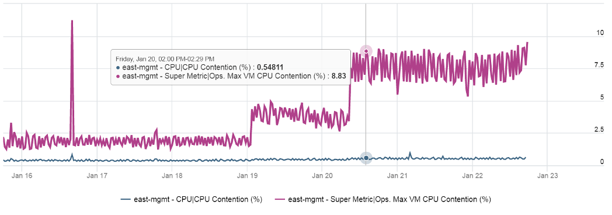
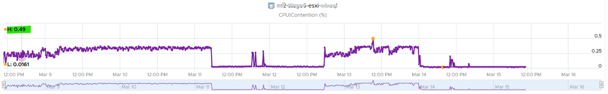
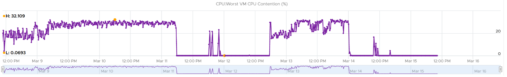
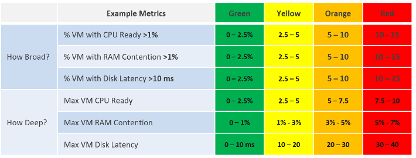

What do you notice from the following screenshot?

Notice the Maximum is >10x higher than the average. The average is also very stable relative to the maximum. It did not move even though the maximum became worse. Once the Cluster is unable to cope, you'd see a pattern like this. Almost all VMs can be served, but 1-2 were not served well. The maximum is high because there is always one VM that wasn't served.

***Be careful*** when you look at counters at parent object such as cluster and datastore, as average is the default counter used in aggregation. Review the following cluster level chart. Do you notice a problem?

That's right. No performance issue at all in the last 7 days. The cluster is doing well.

This cluster runs more than 100 VMs. What you see above is the average experience of all these VMs, aggregated at cluster level. If there is only a few VMs having a problem, but the majority are not, the above fails to show it.

What you need is a cluster-level metric that tracks if any of the VMs is having contention. We have that, and the result is telling.

Same pattern, but the scale is 6000%!

The following diagram explains how such thing can happen.

The above charts show 6 objects that have varying disk latency. The thick red line shows that the worst latency among the 6 objects varies over time.

Plotting the maximum among all the 6 objects, and taking the average, give us two different results as shown below:

The chart shows that it is possible that the average is still well below threshold, but one or more objects was affected. The average number is stable.
Only when the cluster is unable to serve ~50% of its VMs, will the average number become high. Therefore, the average is a poor roll up technique. It's a lagging indicator.

Proactive monitoring requires insights from more than one angle. When you hear that a VM is hit by a performance problem, your next questions are naturally:

- How bad is it? You want to gauge the depth of the problem. The severity also may provide a clue to the root cause.
- How long did the problem last? Is there any pattern?
- How many VMs are affected? Who else are affected? You want to gauge the breadth of the problem.

Notice you did not ask "What's the _average_ performance?". Obviously, average is too late in this case. By the time the average performance is bad, likely half the population is affected.

The answer to the 3rd question impacts the course of troubleshooting. Is the incident isolated or widespread? If it's isolated, then you will look at the affected object more closely. If it's a widespread problem then you'll look at common areas (e.g. cluster, datastore, resource pool, host) that are shared among the affected VMs.

When calculating the breadth of the problem, you need to use a stringent threshold. Without this, you will not be able to catch values that are just below the threshold. On the other hand, if you set it too low, you will get a lot of early warning.

