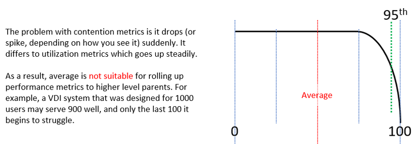
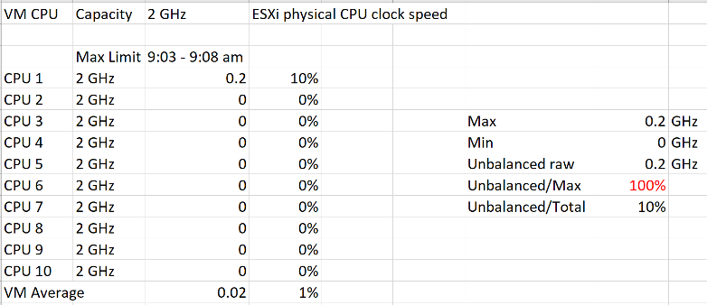

You want to be able to see performance problem while it's still early, when only a small percentage of users or applications are affected. For that, you need a leading indicator. Leading indicators complement the lagging indicator by giving the early warning, so you have more time to react.

Average is a lagging indicator. The average of a large group tends to be low, so you need to complement it with the peak. On the other hand, the absolute peak can be too extreme, containing outliers.

The following table shows where Max() picks up the extreme (outlier) while average fails to detect the problem. This is where 95th percentile or 99th percentile makes more sense.

These are the technique to complement average() and maximum(). Depending on the situation, you apply the appropriate technique.

#### Worst()

This returns the worst value of a group. It's suitable when the number of members are low, such as ESXi hosts in a cluster.

If you want to ignore outlier, then use Percentile function.

In some situations, you may need both Worst and Percentile for better visibility.

#### Percentile()

It is similar to the Worst() function, but it returns the number after eliminating a percentage of the worst. For example, if you take the 99th percentile, then you eliminate the worst 1st percentile and take the highest value.

The number of members must support the percentile function. If there are only 20 members, then each member corresponds to 5 percentile. You can't do 99th percentile as that needs at least 100 members.

You need to adjust the percentile() band accordingly, taking into account the number of members in the array. For example, if you take the 99th percentile of 1 month worth of data, you're eliminating the worst 7.4 hours. On the other hand, if you take 95th percentile of 1 day worth of data, you're eliminating the worst 1.2 hours.

#### Count()

This is different to the Worst() or Percentile(), as you need to define the threshold first. For example, if you do Count of VM that suffers from bad performance, you need to define what bad is. That's why Count() requires you to define the band for Red, Orange, Yellow and Green. You can then track the number of objects on the Red band, as you expect this number to be 0 at all times. Waiting until an object reaches the red band can be too late in some cases, so consider complimenting it with a count of the members in orange band.

Count() works better than average() when the number of members is very large. For example, in a VDI environment with 100K users, 5 users affected is 0.005%. It's easier to monitor using count as you can see how it translates into real life.

#### Disparity()

When members are uniformed and meant to share the load equally, you can also track the disparity among them. This reveals when part of the group is suffering when the average is still good.

## Usage Disparity

Examples where you expect balance are:

- Usage among VM vCPU. If a VM has 32 vCPU, you don't want the first 8 suffers while the last 16 are not used.
- Usage among ESXi in a cluster
- Usage among RDS Hosts in a farm
- Usage among Horizon Connection Server in a pod
- Usage among disk in a vSAN disk group

There are 2 options to calculate unbalanced:

- Divide over total. This is a fixed number, as the total is a constant number.
- Divide over max (highest). This is a dynamic number, as the max is fluctuating. The unbalance is relative, as it depends on the value of the Max metric.

Both use cases have their purpose. We are taking the first use for these reasons:

1. That's the most common one. The second use case is used in low level application profiling or tuning, not general IaaS operations.
1. It's also easier to understand.
1. It does not result in high number when unbalanced is low in absolute terms. See the charts below

The following calculation shows that using the relatively unbalance results in a high number, which can be misleading as the actual unbalance is only 10%

