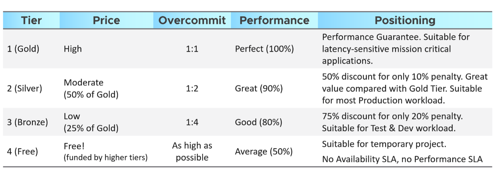
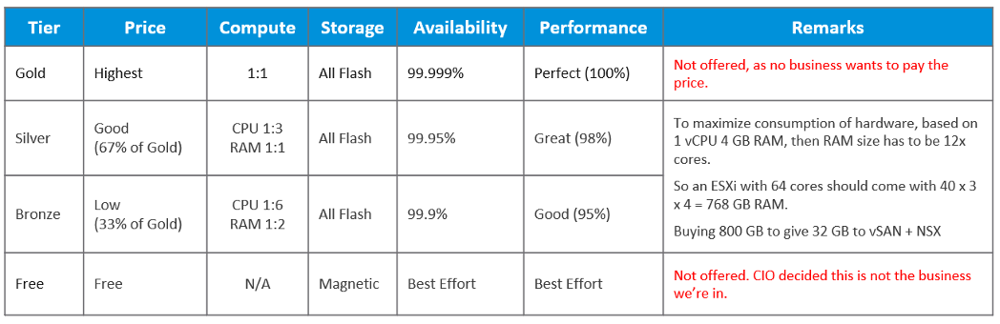

For IaaS or DaaS, capacity management begins long before hardware is deployed. It begins with a business plan, which decides on what class of service will be provided. Each class of service (e.g. gold, silver, bronze) is differentiated by the quality of service. This typically covers availability (e.g. 99.99% uptime for Gold, 99.95% uptime for Silver), performance, and security/compliance. This was covered earlier in [SLA](/operations-management/chapter-1-overview/1.1.7-service-level-agreement/).

The preceding table is a generic guideline. As part of your planning with IT Management, you help them define and decide on each Class of Service. This planning session requires vendors input as you want to optimize cost. Use vendors discounting and licensing model to complement the plan, not dictate the plan.

At the end of the planning session, you may end up with something like this.

In this example, IT Management decides to only provide two business offering:

- **Silver**: 33% discount at 2% performance penalty
- **Bronze**: 67% discount at 5% performance penalty

[Kim Ramirez](https://www.linkedin.com/in/kimkiser1/) advises that from a pricing psychology standpoint it might make sense to offer Gold, with the expectation that nobody will buy it, and it only serves to make Silver look like a good deal. This also addresses a potential confusion where customers wonder where Gold is, if they only see Silver and Bronze offers.

Quality incurs cost which in turn impacts price. Gold VM is priced higher per vCPU and per GB of memory because it has a higher quality of service. A proper pricing model needs to be planned. A 16 vCPU VM on Silver Tier does cost more than 1 vCPU VM on Gold Tier. This is the behaviour you want to drive. Right tier, right size.

If you want your customers to right size in advance, then a 64 vCPU VM needs to be more than 64x the price of 1 vCPU VM. If the pricing model is a simple straight line, there is no incentive to go small and no penalty to over provision. You will end up forcing rightsizing in production, which is a costly and time-consuming process.

Refer to [Cost Management](/operations-management/chapter-5-cost-management/) for pricing example as Cost and Price go hand in hand.

Because you overcommit, you run the risk of contention. To minimize it, one way is to control the size of the VM. You want to avoid monster VMs dominating your overcommitted ESXi host. The following table provides an example of the size limit you associate with each class of service.

For comparison, [AWS free tier](https://aws.amazon.com/free/) for EC2 VM is only 1-2 vCPU, 1 GB RAM as it's based on t2.micro and t3.micro.
