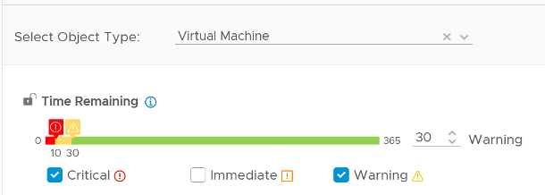

預測的準確性取決於數據量和周期長短。具有季度末高峰的工作負載自然至少需要 6 個月才能準確。如果有足夠的數據，vRealize Operations 將考慮 6 個月以上的數據。雖然它對最近的數據給予了額外的重視，但如果出現突然但持續時間短的變化，它可能不足以影響預測。

短期和一次性的瞬態峰值不應影響容量規劃，因此在預測中影響可能並不明顯。

持續的峰值將持續更長時間並影響預測。如果峰值不是周期性的，由於指數衰減，對投影的影響將隨著時間的推移而減少。

週期性峰值表現出週期性模式或波。例如，每小時、每天、每週、每月、每月的最後一天等。可以有多個重疊的循環模式，它們也會被檢測到。雖然您不應僅根據幾天的數據做出容量決策，但您確實需要 5 分鐘的粒度作為輸入。應考慮每小時重複一次的 5 分鐘高峰。

如果您沒有 3 個月而只需要總體尺寸，請考慮使用第 97 個百分位值。為什麼是第 97 個百分位？它基於標準差原理。距離中點的兩個 [標準差](https://en.wikipedia.org/wiki/Standard_deviation) 等於 95%，3 個標準差 = 99.7%。因此，第 97 個百分位數在 2 SD 和 3 SD 之間提供了良好的平衡。通常，它會捕獲適量的峰值和異常值。

**剩餘容量（%）** 使用的是未來 3 天的預測值，因此它可能與當前使用的容量不同。由於是未來值，所以存在置信區間。您可以在激進（基於帶的上限）和保守（基於實際軌跡）之間進行選擇。另一方面，如果當前利用率超過可用容量，vRealize Operations 會將剩餘容量的值設置為 0%。

請注意，CPU 剩餘容量 (%) 和剩餘內存容量 (%) 在策略中顯示為已啟用，但無法使用。這是一個應該隱藏的內部指標。

**剩餘時間** 衡量容量耗盡前的天數。最長預測為1年，超過1年的時間只顯示為1年。保守值基於剩餘容量預測的上限。

**剩餘虛擬機** 衡量可以裝入集群的平均大小的 VM 數量。平均 VM 大小是自動計算的，因此它會隨著時間和集群而變化。 vSphere 數據中心和 vCenter 級別的其餘 VM 只是子集群的總和。未計算這些級別的平均 VM 大小，因此您喜歡混合大小。此外，VM Remaining 值不會低於 0。數據中心可能會顯示正的 VM Remaining 值，即使其成員集群之一短暫下降。

**推薦大小** 基於規劃窗口中的最高投影值，而不是窗口末尾的投影值。默認情況下，VM 的規劃窗口為 60 天。這來自於30天配置緩衝+30天（剩餘時間的默認閾值在綠色區域，如截圖所示）。

如果 VM 使用量隨著時間的推移而增加，預測可能會隨之而來，您將獲得一個在未來 60 天內存在的數字。

如果您的操作可以經常調整，請將剩餘時間窗口更改為 0。這將提供 30 天的調整期。

請注意，推薦的內存大小四捨五入到最接近的 GB。

