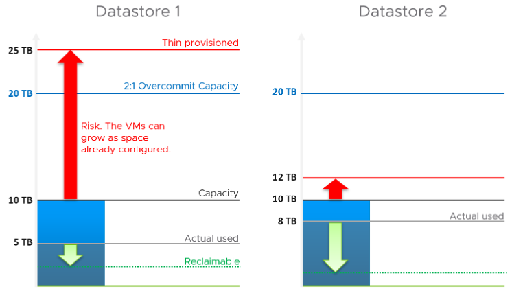
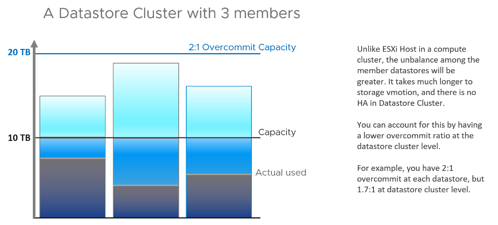

存储容量不同于计算容量，这本身就是一个挑战。与 vSphere 集群的基本计算能力不同，存储的形状各不相同。两个主要是数据存储和 vSAN，因为很少使用本地数据存储和 RDM。我们将单独讨论 vSAN 容量，因为它有其独特的因素，例如 FTT，需要考虑计算。

## 数据存储容量

与计算能力类似，存储能力由两个因素驱动：

#### 争用

如果数据存储无法为现有虚拟机提供服务，这意味着它们的延迟越来越严重，您是否要添加更多虚拟机？你是对的，不管剩余空间如何，数据存储都已满。

这里的关键计数器是延迟和未完成的 IO。

#### 利用率

还剩多少磁盘空间？精简配置使这具有挑战性。它要求我们同时使用需求模型和分配模型来正确回答数据存储的剩余容量。

-----

看看下面的两个数据存储。

哪个剩余容量较低？您会选择哪一个来部署额外的 VM？

两者都具有相同的 10 TB 可用物理容量，如黑线所示。两者都有相同的分配模型，基于 2:1 的过量使用。但它们有不同的使用率和实际过度使用率。数据存储 1 使用了 5 TB，但已使用 25 TB 进行精简配置。数据存储 2 实际使用了 8 TB，但使用 12 TB 进行了精简配置。红色箭头表示风险。

|       | 总容量 | 已用容量 |
| ------ | ----------| ----------| ------|
| **需求模型** | 10 TB | 数据存储 1 = 5 TB 数据存储 2 = 8 TB | 数据存储 1 = 50% 数据存储 2 = **80%**|
| **分配模型** | 20 TB | 数据存储 1 = 25TB 数据存储 2 = 12 TB | 数据存储 1 = **125%** 数据存储 2 = 60% |

数据存储 1 的实际使用率较低，但风险较高，因为它的空间多于可回收和过度使用的空间。您应该使用两个容量模型中较低的一个。在这种情况下，您应该选择 Datastore 2。

精简配置以新配置的 VM 的形式带来了另一种复杂性，因为它们的增长是不可预测的。它们可能会闲置数月并突然增加其存储消耗。随着它们的成熟，它们的增长变得相对更可预测，具体取决于业务应用程序。

最后是复垦。我添加了一个绿色箭头来表示您可以拥有不同的可恢复值。在上面的示例中，数据存储 1 恰好具有更多可回收空间。

## 容量汇总

现在我们知道了如何计算单个数据存储的容量，我们可以解决聚合问题。

数据存储可能属于一个数据存储集群。由于数据存储集群将数据存储分组到一个更大的池中，我们可以将它们视为一个逻辑池。这简化了容量计算。

它还可以在具有许多数据存储的大型环境中简化容量管理，因为您可以将集群视为一个整体。它使信息和可视化更紧凑，更易于管理。从数据存储集群，构建一个向下钻取。

对于过度使用率，我们应该在数据存储集群级别允许较低的过度使用率，以说明数据存储之间的分布不是粒度的事实。下图说明了原因。

将其汇总到数据中心或 vSphere 怎么样？

这是不可取的。 vCenter 中的不同数据存储可能有不同的用途，例如 NSX Edge 和业务工作负载。它们的容量不可互换。是的，这意味着我们甚至不应该计算总容量。如果您在全球拥有 1,000 个数据存储，并且每个数据存储有 1 TB 的可用空间，那么您没有 1 PB 的空间。

那么你可以卷起什么？

您可以总结 VM Remaining。这只是每个数据存储上剩余的虚拟机总数。