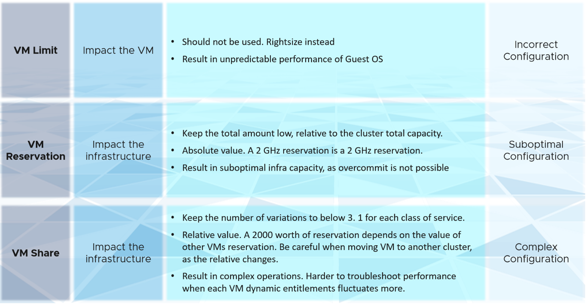

作為一款運營管理軟件，vRealize Operations 關注產品對日常運營的影響，而不是產品本身的功能。被監控的產品（如vSphere、vSAN）可能有相關的功能，但對操作的影響不同。例如，vSphere 為虛擬機提供限制、預留和共享。作為函數，它們密切相關，出現在 vCenter 客戶端 UI 的同一個對話框中，並且都應該是一個。但是，它們對操作的影響是不同的。下表更詳細地描述了這一點。

vRealize Operations 採用對操作有不同影響的原則，並應用一種方法來查看配置。它不按功能或對像對設置進行分組。相反，它從影響開始，並優先考慮可以做的事情。