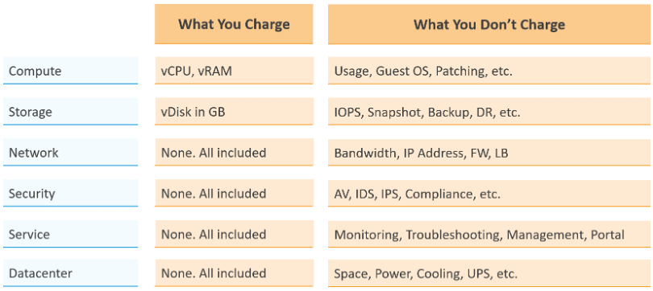

价格只是调整保证金、折扣和罚款的成本。使用价格来推动正确的行为并鼓励采用。

作为内部云提供商，您希望通过定价解决哪些业务问题？

非常大的 VM 是在 VM 投入生产之前解决的最佳问题。因此，设计您的定价模型以从一开始就鼓励正确的尺寸。大小是正确的，从一开始就是正确的。创建累进定价并为较小的 VM 大小应用折扣。下图显示了分层定价的示例。具有 16 个以上 vCPU 的虚拟机定价为高价，而少于 8 个 vCPU 的虚拟机定价为折扣价。

您如何将上述累进定价应用于不同的服务级别？您应该在大型 VM 上投资多少溢价？你应该给小型虚拟机多少折扣？乘数效应（累进税）不能太高，因为公有云没有这样的税。他们遵循线性定价。如果你使用高倍数，你的价格就会太高，否则你会吸收深度损失。

下表提供了乘法器的示例。

我们将相同的原则应用于 RAM。

保持您的定价模型简单。你的账单越复杂，你就越需要解释。下表提供了收费和捆绑的建议。捆绑意味着您将其包含在总成本中，但您不会明确收取费用。您肯定是在权衡准确性和简单性。

过度简化的定价可能对客户不公平，但这在其他行业很常见。以航空业为例。我最喜欢的航空公司是新加坡航空公司。我注意到他们至少有 4 代飞机。新飞机效率更高，运营成本更低，更受客户欢迎。另一方面，如果考虑折旧，则旧飞机已经完全折旧。但是，所有世代的价格都相同。

## 收支平衡

在规划定价时，请考虑达到盈亏平衡点所需的时间。在此期间，您应该有足够的时间来收回您的费用。它应该在折旧结束之前。

盈亏平衡点取决于盈亏平衡水平。您可能无法在最后完全出售所有资源。因此，如果您的计划是基于 80% 的销售额，那么这个 80% 的价格必须能够覆盖所有成本。

