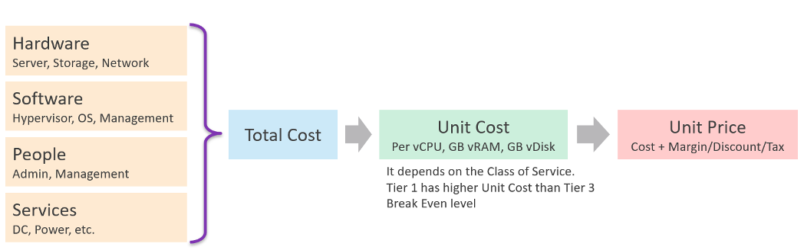
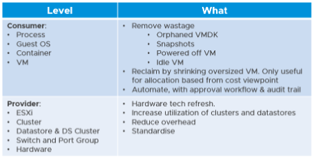

It's important to calculate unit cost, despite the fact it does not actually exist. When you bought that cluster, you did not pay $1 per GHz of CPU. You paid $100,000 for the entire thing, including installation. The $1 is just for ease of calculation so you do not end up with a loss.

The Unit cost per VM depends on Overcommitment Ratio, since the hardware cost is identical. If cluster A has 2x overcommitment ratio, then the cost per VM is 2x cheaper, all else being equal.

Overcommitment Ratio is the way you justify a higher price, hence it's imperative to disclose upfront to your customers.

Unit Cost has to be associated with VM, not ESXi. It is expressed in vCPU, not per physical core or GHz. How many vCPU you plan to pack determines the cost per vCPU.

Unit Cost depends on hardware and software. New cluster should cost less due to bigger hardware.

Unit Price should remain the same within the same class of service. Back to the airline industry example, the price does not depend on the aircraft generation.

## Cost Savings

From finance point of view, real cost savings is only realized when new purchase is deferred. You can't save on what you've already spent, accounting wise. Cost Savings is actually Cost Avoidance.

Let's take a simple example:

- You spend $2 million on a hyper-converged infrastructure (HCI) solution 3 years ago.
- It has been used well, and capacity remaining is now 0%, so you need to buy a new HCI. This will cost you only $1 million as the cost of HCI solution has gone down by half in the last 3 years.
- Via a diligent and arduous reclamation process, you manage to free up capacity. As a result, you do not need to spend the $1 million. You can defer this purchase to the next fiscal year.
- What's your cost savings from this reclamation: $2 million or $1 million?

Accounting wise, it's $1 million only. While that HCI cost you $2 million three years ago, a brand new set with equivalent capacity will only cost you $1 million. In accounting rules, you should not mix numbers from different date, let alone from different fiscal years. Depreciation is not relevant here as the cost is based on replacement cost.

The $1 million is certainly an ***estimation***. The actual cost avoided or to be spent depends on vendor quotation, and your negotiation skills. Take note that the actual is much more than the HCI cost. Additional costs can exceed the hardware cost. You need to include the full loaded cost, such as data center facility, implementation service, back up storage, administration service, software licence, management, etc.

Reclamation alone does ***not*** reduce cost. How much do you save when you delete files in your notebook?

Right. Zero.

Only when it helps you defer buying a new drive that the reclamation becomes a real cost saving.

How about service? We like to cite productivity improvement as a cost saving. While this delivers business value, it is not a hard cost savings. It is a soft benefit with no accounting value. The hard savings only happen when the need to buy additional resource/headcount is deferred, or reduction in Managed Services contract value.

You might be able to save from power & cooling by powering off hardware.

For large organization with a large infrastructure footprint, tech refresh is a great way to reduce cost. Going down from 100 racks to 50 racks will certainly reduce both capital and operating cost.

IT needs to be ahead of business. When calculating the cost savings, includes committed projects and future growth. You should also take into account undersized VMs, as the application team may demand that they are upsized.

Calculate CPU, RAM and Disk. If possible, include network too. It is harder to calculate, as by nature it's just interconnect. For each of these three IaaS resources, calculate both the demand and the reclamation. For the demand, don't forget to include the full cost. When a VM needs 100 GB, it translates into a lot more as you factor is DR, back up, snapshot, etc.

The following table provides an example.

You need to prepare the above table per physical location. Just because you have 10 TB RAM in Singapore does not mean the VMs in Armenia can use it.

## Optimized Cost

The above exercise will help in optimizing cost. There are certainly other avenues to optimize cost, as cost covers more than just capacity. It covers People, Process, Architecture. You can reduce cost by improving process effectiveness, typically achieved by business process reengineering exercise. You can reduce cost by improving process efficiency by automation. E.g. deletion of powered off VM with approval workflow.

The following table summarizes the activities you can do to optimize cost.

Small clusters have higher HA overhead, hence you can optimize cost by consolidating them.

Complexity has cost, but it is hard to quantify. For example, human error can be costly but how do you quantify that?

Take note that standardization will reduce complexity. But this also means less flexible configuration, which can increase cost.

Simplifying operations, such as not mixing VMs with different class of services in the same cluster, will reduce complexity. But it also comes at a cost of larger infrastructure. The same thing goes with t-shirt sizing.
