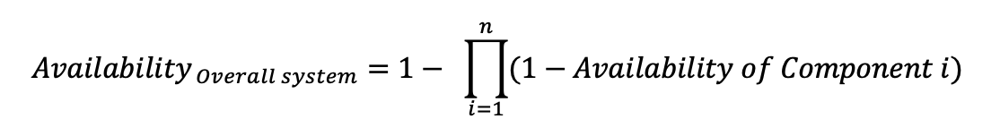

Nowadays we rarely deal with a standalone solution. Even the solutions we think are standalone consists of multiple smaller components. For example, a physical server consists of multiple smaller parts, such as power supply and disks. To calculate the availability of servers we need to consider the availability of each component and the impact it has on the overall availability.

## Components in Series

A series is a serial connection. Think of web server -> application server -> database server.

The availability of the overall system with multiple subcomponents in series is calculated as per the following formula:

Let's consider an example, in this scenario, we have three individual components in series with each other and has 99.9% availability each. The availability of overall system = `99.9 * 99.9 * 99.9 = ~99.7 %`

In conclusion, we can see that for components in series, the overall availability reduces.

## Components in Parallel

The availability of the overall system with multiple subcomponents in parallel is calculated as per the following formula:

where `1 - Availability of Component i` gives us the unavailability of the component.

Let's consider an example, in this scenario, we have three individual components in parallel with each other and has 99.9% availability each.

Availability of the overall system:

## Mixed Components

Let us consider a more practical system which has both serial and parallel components. For this example, let's take a three tier application with 4 web servers, 2 application servers and 1 database servers. Let's consider availability of all of them to be 99.9% and see what the overall availability will be.

First, we need to calculate the overall availability of the parallel components first. Using the above-mentioned formulas we see the overall availability of Application servers are 99.99% and Web Servers are 99.9999%.

Next, we need to calculate the overall availability of the components in series. Applying the above-mentioned formula we get the overall availability of ~99.89%.

This is the reason we avoid a single point of failure in series with other systems as such components reduces the overall availability.
