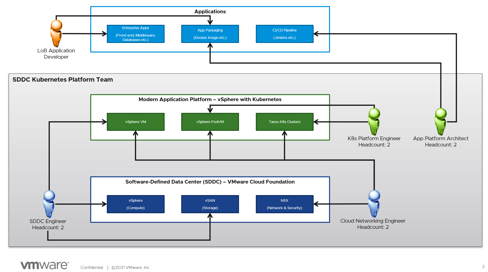

This chapter gave a sample of how the authors think the organization structure would be like. 

As the organization tranform their DC to SDDC as well as modernizing their enterprise applications to micro-services, the IT teams need to be transform as well. Existing team need to learn new skills such as Automation, Software Defined Storage, Software Defined Networking and Kubernetes to be able to support this new Cloud / SDDC / Kubernetes environment. 

This document serves as a reference on what we think will work in a medium to large enterprise. We also believe that the people working in the organization are motivated and willing to learn new skills. 

Below are some job titles, roles and responsibilities and training plans for them.
## SDDC Engineer
# Job Description
Responsible for the design and availability of the SDDC
Manage and Operate
- vSphere and Virtual Machines(VMs)
- HCI and Storage Policy Management
- Lifecycle of the components in the SDDC
Provisioning of server and storage hardware

# Certifications
Certified Kubernetes Administrator (CKA)

## Cloud Networking Engineer
# Job Description
Responsible for the network design for VMware Cloud Foundation and vSphere K8s platforms
Manage NSX’s network virtualization and distributed firewalls for workloads (VM and Containers)
- Virtualized network services such as distributed routing, logical switches, NAT and load balancers for workloads
- Security services such as distributed firewalling and network ACL for workloads
Integrate NSX with physical networking and network security solutions

# Certifications
VMware Certified Implementation Expert - Network Virtualizaing (VCIX-NV)
Certified Kubernetes Administrator (CKA)
Certified Kubernetes Security Specialist (CKS)

## Kubernetes Platform Engineer
# Job Description
Manage and operate vSphere with Kubernetes platform
 - Provide support for vSphere PodVM
 - Manage Tanzu Kubernetes Cluster (TKC) and its lifecycle
Ensure availability of vSphere Kubernetes platform
Creation of K8s objects (such as namespaces) for developers to utilize
Work with VI Systems Engineer on the storage classes and policies for containerized workloads
Work with Network & Security Engineer on the networking and firewalling requirements

# Certifications
Certified Kubernetes Administrator (CKA)
Certified Kubernetes Security Specialist (CKS)
Tanzu Specialist 

## Application Platform Architect

## Application Developer