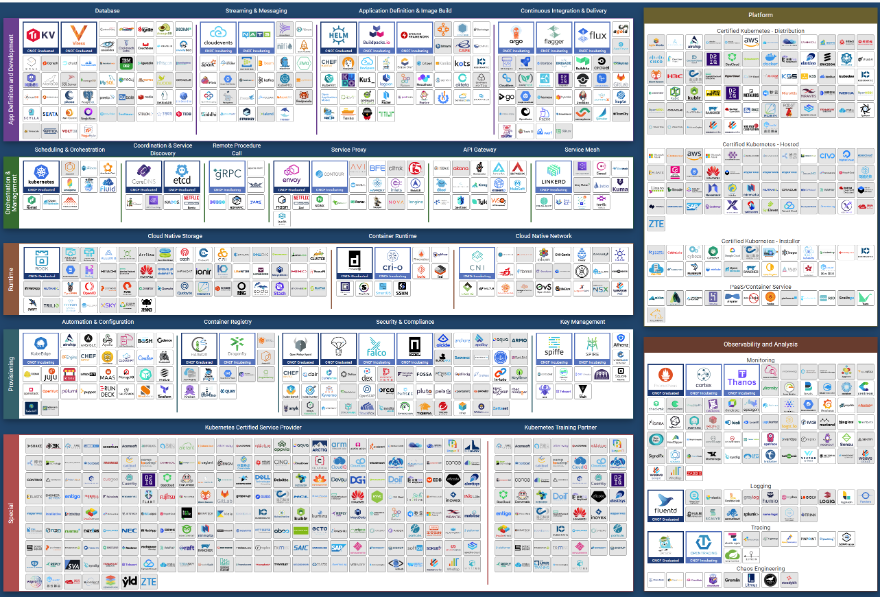

如果您的组织正在努力运行多云操作，请不要气馁。单个私有云（您可以完全控制）已经很难运行，更不用说运行多个不兼容的基础架构了。复杂性是由于架构缺乏成熟度。 涉及的组件太多了，如图 [图表](https://landscape.cncf.io/) 由云原生计算基金会提供。

但最终，结构会慢慢成熟并成为商品。 CIO 将开始关注运营，因为业务将需要使用 SLA 进行适当的治理。

无论底层系统架构如何，CIO 仍然需要管理成本、容量、合规性、性能和可用性。 运营支柱不会因为你改变管道而改变。 我们将涵盖更多这些支柱 [这里](/operations-management/chapter-1-overview/1.1.8-pillar-vs-process/).