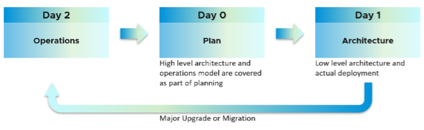

对我来说，架构是第一天，运营是第二天。第 1 天发生在第 2 天之前。架构是指详细的工作，包括构建和调试系统。虽然高级市场结构 [^1] 是在第 0 天（规划）定义的，但真正的架构工作是在第 1 天完成的。

但是，如果我们深入思考，第 2 天会影响第 0 天，这就是计划。原因是最终状态驱动您的计划。您的计划驱动您的架构。所以它是 2 -> 0 -> 1，而不是 0 -> 1 -> 2。

让我们用一个例子来说明第 2 天如何影响第 0 天，进而影响第 1 天。

假设您是内部云提供商并计划按 VM 收费。您计划提供两种类型的产品：

- **金牌**：适用于生产工作负载。性能优化。
- **银**：适用于非生产工作负载。成本优化。

对于 金子，您计划不过度使用 CPU 和 RAM。如果 1 个 CPU 通常使用 4 GB RAM，那么 40 核 ESXi 主机将只需要 160 GB。如果您购买具有 1 TB RAM 的主机，那么您最终可能无法出售剩余的 864 GB，因为您没有可出售的 vCPU。这意味着您的硬件规格会受到影响。这是第 2 天如何影响第 0 天的示例。

对于 银，您计划为 CPU 过量使用 4:1，为内存过量使用 2:1。

- 您假设 1 个 vCPU 通常使用 4 GB RAM。您的客户可以购买更多或更少的内存，因此 CPU 和 RAM 之间的 4:1 比率只是您的规划指南。
- 您计划使用重复数据删除 + NSX + vSphere Replication 来运行 vSAN。您还需要大量 IO VM，这需要内核处理。对于所有这些支持的非业务工作负载，您分配了 8 个内核和 64 GB RAM。
-如果您购买 64 核 ESXi，剩余 56 核，您将能够销售 224 个 vCPU。
- 这 224 个 vCPU 将需要 896 GB RAM。由于您过量使用 2:1，因此 VM 需要 448 GB。您需要的总 RAM 为 448 + 64 = 512 GB。
- 这意味着您需要的硬件规格是 64 核和 512 GB RAM。如果您购买的 RAM 超过此数量，您可能无法出售这些额外的 RAM，因为您可能没有 vCPU 伴随它们。

以上 2 个示例展示了如何在不考虑平均 VM 配置文件和计划的过载率的情况下确定硬件规格。

您还在研究黄金可用区的概念，因为它们托管关键任务业务服务。 您公司的 [业务连续性](https://en.wikipedia.org/wiki/Business_continuity_planning) 政策规定，如果整个集群发生故障，您计划限制受影响的 VM 数量。 如果您限制为 300 个生产虚拟机，那么您的集群大小不应太大，因为您将无法充分利用资源。我见过许多运行 1000-2000 个虚拟机的 32 节点生产集群。

在您的服务产品中，您可以让客户检查自己的 VM 运行状况，以及底层平台如何为他们的 VM 提供服务。这意味着您的架构需要知道如何将租户与其虚拟机相关联。您需要有一个标记标准，例如业务单位、部门、联系人姓名。

您的 CIO 希望向他的同事提供实时信息，以了解 IT 如何为业务服务。这需要您考虑关键绩效指标 [KPI](/operations-management/chapter-1-overview/1.1.8-pillar-vs-process/) (KPI)[^2]. 您如何知道 IaaS 对其消费者而言执行得足够快？您如何证明您符合服务水平协议 [SLA](/operations-management/chapter-1-overview/1.1.7-service-level-agreement/) (SLA) 你承诺了？

从性能管理的角度来看，vSphere 集群是资源的最小逻辑构建块。虽然资源池和 VM 主机关联可以提供更小的切片，但它们操作复杂，无法提供承诺的 IaaS 服务质量。资源池无法提供差异化​​的服务类别。例如，您的 SLA 规定黄金的速度是白银的两倍，因为它的收费高 200%。资源池可以给Gold两倍的份额。无法提前确定这些额外的份额是否会转化为一半的 CPU 就绪状态。

在您的运营中反映您的业务非常重要。创建一个层次结构，运营团队和租户可以在其中轻松找到相关的 VM。这些用户将由业务应用程序驱动，因此您的 IaaS 需要围绕此进行设计。以下结构将业务单位显示为顶级文件夹。每个业务单元可以有 1 个或多个部门（业务单元 C 跨越下图中的 3 个部门）。每个部门都有多个业务应用程序。业务应用通常由多层组成（例如，Web 层、应用层、数据库层）。

上述限制为重组。您需要重命名，将文件夹移动到新的父文件夹并删除该文件夹。例如，如果业务单位 B 与业务单位 C 合并，并且合并的实体有一个新名称，则需要重命名并删除另一个名称。

最后但并非最不重要的是，您需要考虑问题。真正的问题发生在第 2 天，因为当时您有一个用于创收交易的业务工作负载。不要设计你不想解决的问题。考虑运行您的架构所需的角色和技能。为每个组件提供必要的可见性 [^3]，并定义构成健康、风险和效率的内容。

我希望上面的例子表明第 2 天是您想要开始的地方。从头到尾，有句名言 [引用](https://www.franklincovey.com/the-7-habits/habit-2/).

您是否注意到上述讨论中遗漏了什么？

是的，我没有涵盖 **自动化**。

这是为什么？

对我来说，那是建筑的一部分。你不应该自动化你无法操作的事情。因此，自动化不是运营的一部分。自动化是您架构的一个特性，这意味着您在设计系统时已经考虑了自动化。例如，它就像一架具有许多自动化功能的飞机。有线飞行。这是飞机的特点。如何操作飞机，让乘客安全、舒适、准时到达目的地，这就是操作。

[^1]：营销结构。对缺乏细节的基于 PowerPoint 的图表的简单参考。
[^2]：我理解SLI、SLO、SLA、KAI和KPI的区别。出于 PCMCIA 的原因（人们无法管理计算机行业首字母缩略词），不使用 SLI 和 SLO。精度很好。但是使用过多的行话会增加复杂性。
[^3]：有些人使用了可观察性这个术语，并导致与监控不必要的混淆。这是 PCMCIA 的另一个例子。如果我们真的要分开头发，那么可调试性这个词就更有价值了，因为可以观察到系统并不意味着它是可调试的。