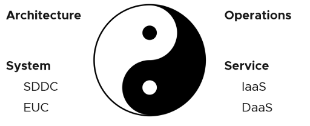
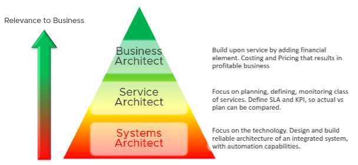

Architecture and Operations are two equally large realms. While we certainly consider Operations when designing a system, it is not a part of Architecture. This book is an example of Operations. Notice it goes deep into metrics as troubleshooting is at the heart of operations. 

Architecture and Operations also differ in other industries. The person who designs the space shuttle is not the person operating it. You need to be an astronaut to be qualified to operate a space shuttle. The person who design an F1 race car is not the person driving it. Different expertise are required. They complete each other and are inter-dependent, like Yin and Yang. 

 
Since Infrastructure is becoming a service, you need to know how to architect a service (e.g., IaaS, Database as a Service, Desktop as a Service).

- What are the services the IaaS is providing? How do you define a service?
- What metrics do you use to quantify its quality?
- How many services? How do you distinguish between higher class service and normal one?

You also need to know what type of services are on demand. Service Architects go out, meet customers and understand their requirements. What Price/Performance are on demand now and in the future? From there, you can architect the corresponding services to anticipate the demand.

As a Business Architect, you not only know the cost of running the service, but you also know how & when to break even. You are not responsible for profit and loss, as you are not the CIO or Cloud Service Provider CEO, but you do play a strategic advisor role to them. You know what to price, how to price and most importantly your price is competitive (at least you can provide the business justification).

From my interactions with customers, I notice that Infrastructure Architects are not leading Day 0 phase. They provide input to the Planning stage, but are not the lead architects driving it. The Infrastructure Architect tends to focus on **technical** bits, something that CFO and CIO value less (hence they spend less time on it). They also do not architect the operations. I see many seasoned VMware Architects not extending their influence beyond architecture. I think that’s a lost opportunity because Day 1 and Day 2 is actually part of the same side. Think of it as [Mobius strip](http://en.wikipedia.org/wiki/M%C3%B6bius_strip).

Inspired by the VCDX program, perhaps the world of multi-cloud operations needs a VCOX program. We need to write the guidebook. That’s why I open source this book, so all the Operations Expert out there can collaborate and produce the best practice of operations. 

Service Architect and Business Architect are the next steps for Infrastructure Architect. I shared a story of a chef and his cooking back in 2014 during one of the VMUG session.