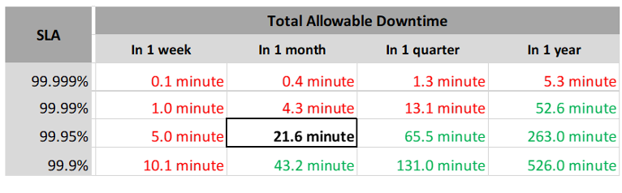
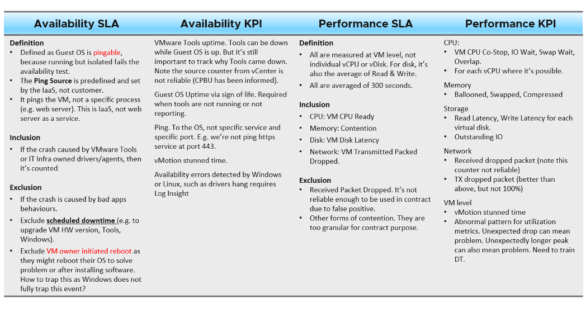
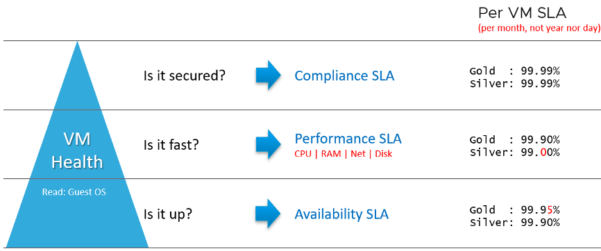

The difference between an enterprise grade Cloud and non-enterprise grade Cloud is the SLA. A cloud provider can state that they have the best technology, the most experienced professionals, the most innovative process, industry certifications, etc. to prove that they are the best. All those will not carry weight if they are afraid to back it up with the SLA in their contract. The SLA enables customers to hold the cloud provider accountable as it carries a financial penalty.

Once the SLA is defined, then customers want to know how it will be delivered. This is where the process, architecture, certification etc. come in. The _what_ always come before the _how_.

## The 4 SLAs of IaaS

The business of IaaS should provide three SLAs, as customers want complete coverage.

| SLA | Description |
| ------ | ----- |
| Availability | This is the most basic SLA. It is the eldest and most well-known. In reality, it is largely a given. It does not matter what the agreed number is in reality. If the darn thing is down, you better hurry to bring it up before there is a complaint or things get worse! |
| Performance | Just because something is up, does not mean it is fast. A VM can be up, but if it is too slow to serve, it is as good as down. Performance SLA covers this and addresses the [complaint-based operations](/operations-management/chapter-1-overview/1.1.1-complaint-based-operations/) by defining what exactly is fast. It covers CPU, Memory, Disk and Network, hence there are four metrics used. |
| Compliance | This provides security compliance to industry regulation or certification. |
| Service | The above three SLA is provided by technology. They need to be complemented by service provided by human. This should cover proactive and reactive services. The two popular examples are response time and resolution time. |

## KPI vs. SLA

KPI and SLA work hand in hand.

| Acronym | Description |
| :-------: | ----------- |
| SLA | The formal business contract you have with your customers. Typically, this is between the IaaS provider (the infrastructure team) and the IaaS consumer (the application team or business unit). The formal SLA needs [Operations Transformation](https://blogs.vmware.com/services-education-insights/services/operations-transformation-services). It requires much more than technical changes, as you need to look at contract, price (not just cost) process, people, etc. It tends to have a financial penalty in the event of SLA breach, such as credit for the next billing cycle. |
| KPI | This covers the SLA metrics, plus relevant additional metrics that provide early warning before the SLA metrics are breached. There are many KPI for a given SLA, and KPI is a pre-requisite to SLA. If you do not have an SLA in place, then start with internal KPIs before committing to an SLA. Understand and [profile](/operations-management/chapter-2-performance-management/1.2.10-baseline-profiling/) the actual performance of your IaaS first. Use the default settings in vRealize Operations if you do not have your own thresholds, as those thresholds have been chosen to support proactive operations. Using the profiling technique described [here](/operations-management/chapter-2-performance-management/1.2.10-baseline-profiling/), I profile well over a million data points. |

SLA is a **monthly** counter, not daily or yearly. You use entire month of data to calculate it.

The timeline matters. In the following table, notice 99.999% in a year is actually easier than 99.95% in a week. Your customers would not accept a yearly counter as they can be exposed to a long downtime. You would not accept a daily counter as there is no room for error. The monthly counter provides a balance between service quality and cost to deliver the service. It also makes reporting easier as you simply follow the calendar month.

Each additional "9" shrinks your downtime window by 10x. That's why each decimal can cost a lot more money, as a different architecture may be required.

Even if you measure the SLA once a month, it can still be very difficult to meet. Take a look at the following table. For simplicity, we will use Availability SLA and not Performance SLA, because up or down is a simple binary.

If you promise 99.99%, you only have 4.0 minutes – 4.5 minutes of downtime per calendar month. That means your architecture must be able to detect the issue and then complete proper remediation in just a few minutes. That's a tight space to manoeuvre.

A unique saving grace that applies to Availability but not Performance is scheduled downtime. There is no such thing as scheduled downtime in performance. Specific to IaaS, you can propose that scheduled downtime is not included in the SLA, so long it's done quickly and rarely. Planned activities such as VM hardware upgrade, Tools upgrade and Windows upgrade can be included in scheduled downtime activities. Downtime caused by customer is not included, be it intentional or not. This is why you need two counters: one for SLA and one for actual. The actual will record every downtime, be it a part of SLA or not.

A challenge that impact Availability but not Performance is recovery time. Your system may detect the VM is down within 1 minute, but the reboot process until the entire OS is properly up and running takes 5 minutes, as it needs to perform filesystem consistency check.

KPI complements SLA as it tracks at much higher intensity and it covers more counters and events. Use vRealize Log Insight for more time sensitive event, as vRealize Operations measures every 5 minutes.

From the preceding table, note that Guest OS counters are not included as that's part of "application KPI" or VM KPI, not IaaS KPI. They impact the VM performance, but nothing the IaaS can do, meaning the remediation is at the Guest OS layer.

KPI also complements SLA by providing the stepping stone in your operations transformation. It is a necessary step towards operations with real business SLA.

You walk from where you stand. Adopt KPI first. Baseline your actual availability, performance, and compliance over time. Remember these counters are VM level, not infrastructure. Therefore, you need to profile all the VMs.

## Class of Service

The following table shows a basic and generic guideline to a class of service. The actual model that you will implement will certainly differ, taking into account technology and business demand. In the [capacity management section](/operations-management/chapter-3-capacity-management/1.3.3-capacity-planning/), we walk through an actual example.

The table above is further defined by their SLA, because you need to quantify what 10% penalty exactly means.

A Gold class has higher SLA than Silver. For that to happens, that means they are measured against the same benchmark.

- For availability, you measure all classes against the ideal, which is no downtime.
- For performance, you measure them against the same threshold, which is a stringent (read: fast) number.
- For compliance, you measure them against the ideal, which is perfect compliance.
- For service, you measure them against the ideal, which is the best possible service.

### Performance SLA

Let's elaborate Performance SLA a bit, as it is more complex than the other two.

Following the above, diagram, you offer 99.9% for Gold, and 99% for Silver as the respective SLA.

For Gold to be higher than Silver, that means both are measured against the _same raw threshold_. In other words, a VM in Silver environment will expect that it does not get what it demands as often as a VM in Gold. If the VM Owner wants to have more _consistent_ service in performance, then simply pay more and upgrade to the Gold cluster.

This approach is easier than setting up a different performance threshold for each tier. Say you set the following:

- **Gold**: VM Memory Contention: 0.5%
- **Silver**: VM Memory Contention: 1.5%

You notice the problem already?

It is hard to explain the delta or gaps between the class of services. Why is Silver 3x the value if it is only half the price? Shouldn't it be proportionate?

There is a 2nd problem. If you set _different_ standards, it is possible that Silver will perform better than Gold, because it has lower standard. This can create confusion.

Operationally, having a single threshold is easier to set up. No need to play with vRealize Operations policy. You can also have mixed classes of VM in the same cluster or datastore, as the SLA threshold is the same.

We will cover the counters used in Performance SLA in more details [here](/operations-management/chapter-2-performance-management/1.2.6-performance-sla/).

### Differentiated Service

IaaS is built on commodity hardware and provided as a utility. Having said that, there are many ways to differentiate your service vs your competitors. Use class of service to distinguish premium service. The following table lists some examples.

| Service | Description |
| ------- | ----------- |
| Backup | Gold Tier provides application-level back up. It also provides more frequent full back up, and customers are provided with self-service individual file restore. |
| High Availability | Gold Tier provides application- level monitoring. Customers can also ask for specific boot up sequence of their VMs, and ask for VM-Host affinity rules to minimize risk. |
| Disaster Recovery | Gold Tier provides lower [RPO and RTO](https://en.wikipedia.org/wiki/Disaster_recovery). Customers are also entitled to annual real test, where the production workload are run from the DR site. |
| Snapshot | Gold Tier provides longer snapshot and larger snapshot. |
| OS Management | Gold Tier provides flexibility in patching. Customers can specify delay in patching and request for custom patch package, where not all patches from Microsoft or Red Hat is applied. |
| VM Management | Gold Tier provides flexibility in updating Tools and VM Hardware. Customers are allowed to defer the update |
| Monitoring Service | Gold Tier VMs will be proactively monitored, not just relying on alerts. Gold Tier provides deeper visibility into the underlying physical infrastructure where customers VM are running. Customers are entitled for lower internal metrics such as vMotion stun time and VMkernel latency. Gold tier provides self-service monitoring. Customers are given their own login to a portal where they can monitor their own VMs. They can initiate scheduled downtime. Customers will be alerted over email and messaging network. |
| Support | Gold Tier provides faster response time, longer business hours, and faster resolution time. |
| Network | Gold Tier provides priority network. Customers can opt for periodic ping service to ensure network latency between their applications remain within the agreed threshold. |
| TAM | Gold Tier comes with a Technical Account Manager, acting as single point of contact for customers |