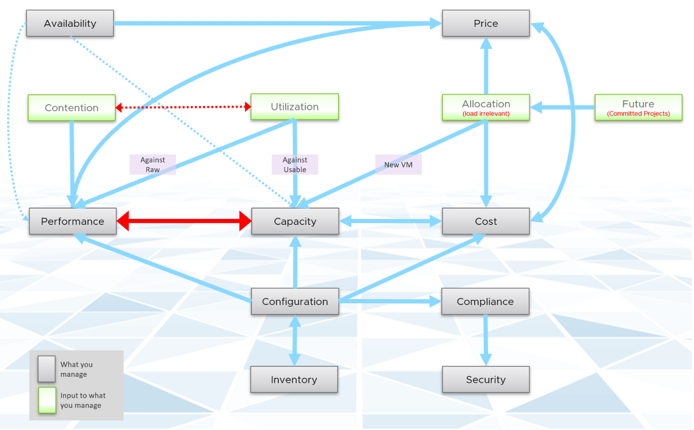

What do you manage, actually? What does your customers want you to take care? How do you manage what you need to manage?

The most basic is you need to have visibility into the environment. There are thousands of objects (e.g. VM, application, firewall) with complex relationships and interdependance. Inventory gives you this. That's why it's the first box in the diagram below. I had a large telco telling me that their entire DC can go down (say for scheduled DR exercise) but not vRealize Operations as that's how they monitor the downtime.

Once you know what you manage, you can then move on towards making sure they are healthy. If there is no problem, then you move to address potential problem. If there is no risk, then you look for optimization.

#### Health

Health is actually hard to define, as it depends on the context and object. The English word health itself is subject to interpretation. So, it's better to define and map to the pillars of operations. Health is the present. It covers real problem that has happened and/or is still ongoing.

There are 2 problems that can impact health:

- Availability
- Performance

Availability and Performance can be mutually exclusive, but both impact health. You can have 1 problem without the other.

#### Risk

Risk is the future. It covers potential problem. There is no problem at this moment, but if you do not act on it, you increase the risk of it becoming a problem.

There are 3 problems that create risk in operations:

- Compliance
- Configuration
- Capacity

In all the above problems, Health is not impacted as there is no actual performance, availability or security issue. What you have is a risk, as your applications and operations continue as if nothing happens. Your customers may not notice and your business is not affected.

#### Efficiency

Efficiency is optimization. There is no problem at present, nor there is a risk for future problem. You want to optimize as it lowers cost and improve performance.

- Wastage (oversized, unused EC2, idle, unmapped disk space, orphaned file, etc.)
- Cost. Compare your cost with other cloud providers as IaaS is essentially a commodity.
- Green Operations fits efficiency as sustainable operations calls for lean operations.

## Pillars of Operation

Best practices of operations management require you to distinguish between pillar and process. Pillar is what you need to manage, while process is how you manage them.

Each pillar is an individual unit of management. They represent individual disciplines and are compatible with one another. The complexity of each pillar depends on the technology, for example, vSAN capacity is more dynamic than a central array. In vSAN, changing the storage policy can create a sudden spike.
Process is the activities within each pillar. It requires roles and responsibilities, which is documented in policies.

Day 0 is the phase where you plan and define the expected result. Some companies perform stress tests and load tests, so they know what to expect when the real load actually occurs. Without planning and testing, you don't know what the reality will be, as you have not defined "well".

Day 1 is the phase where you build the system and launch the service. This includes configuring the various operations input such as cost drivers (e.g. application license cost, electricity rates). As the focus of this book is Day 2, I'm not including Day 1 in the preceding table.

Monitoring and Troubleshooting are activities. They are not something you manage. In monitoring, you have [Standard Operating Procedure](https://en.wikipedia.org/wiki/Standard_operating_procedure) (SOP), which defines what roles performs what checking. You focus on insight first, alert second. Troubleshooting is much more than simply "finding out" and goes beyond just gathering facts. It focuses on why, and then formulates a solution to prevent future incidents. Incidents mean something is dead, slow or breached. You troubleshoot availability, performance, and security.

Inventory is something you have, not something you plan. You plan for capacity, with certain configuration. Inventory merely accounts for what you have. Nothing to troubleshoot nor optimize.

Optimization delivers many practical benefits and real business results. Here are some of them:

I'm sure there are more of them. Drop me a note with your real-world experience!

## Interdependency

The pillars of Operations Management are interdependent. Knowing the relationship is as important as knowing each pillar. Relationship matters as the symptom and the root cause are often two different things. A performance problem could be caused by configuration problem, such as outdated configuration or incompatible versions.

Using the above diagram as reference, let's elaborate each pillar.

#### Availability

The most fundamental part of operations management, because the rest of the 7 Pillars of Operations are practically irrelevant if the whole environment is down.

There is a spectrum of availability solution, from snapshot, back up, HA, FT and SRM. Each can have impact on capacity and performance.

Availability considers HA (high availability) setting. As a result, planned downtime (e.g. ESXi in maintenance mode) does not impact the availability value.

Availability, done right, will not impact Capacity and Performance as it's already accounted for as part of the design. Yes, this means you need to include the potential workload caused by DR events.

The higher the Availability SLA, the higher the price of the service. There is a big increase for each additional 9 of availability. Five 9s of availability costs a lot more than four 9s.

#### Performance & Capacity

Performance and Capacity are closely related and interdependent, but not identical, hence one is often mistaken by the other.

In larger organizations, they are typically managed by two different teams. The capacity team does not get involved in the day-to-day operations as they focus on longer term resource availability. Capacity _planning_ is about maximizing utilization, without compromising performance. It also considers latent workload and future demand, which performance does **not** consider.

The capacity team may not have the technical skills to troubleshoot performance. On the other hand, the day-to-day operations deals with "what's on the floor" of the data center. Their primary focus is meeting the demand from applications. It is consumer driven, while capacity is provider driven.

Performance is affected by capacity as the lack of capacity is often the reason for poor performance.

Capacity is affected by Performance as it needs to consider contention counters first, before it considers utilization. If you can't satisfy existing demands, then you won't provision new workload, hence capacity is practically full. The utilization counters may not be high yet, but that's a secondary consideration as you stop adding new workloads until you figure out why.

Performance is more time sensitive and important than capacity. Manage performance first, capacity second. Using the [restaurant analogy](/operations-management/chapter-1-overview/1.1.6-the-restaurant-analogy/), you focus on the dining area first, then the kitchen.

Performance and Capacity have opposite relationships. Highest overall performance is achieved at lowest capacity, as that's when the VM or Infra is delivering the most amount of work.

#### Cost & Price

With hardware becoming commodity and infrastructure becoming invisible, price has naturally become a common denominator among all IaaS providers. The general expectation is price per VM is similar across cloud providers. One way to provide differentiated pricing is SLA.

While Price should be higher than Cost, it can be set independently of cost. Use discount and progressive pricing to set the correct price for the right terms and conditions. Progressive pricing will also discourage large unused VMs to be provisioned in the first place. It's easier to handle than when these VMs are already in production.

Cost goes hand in hand with capacity. The higher the utilization of the IaaS, the lower the cost per VM. Cost is separate from capacity as it can be optimized without reducing capacity.

Cost and capacity can also go independently of each other. You can increase capacity without increasing cost via technology refresh. You can reduce cost without reducing capacity by lowering non-capacity costs such as the rate you pay for services.

The better the Performance SLA, the higher the price customer is willing to pay, hence the term Price/Performance.

#### Compliance & Security

Security is related, but not the same as Compliance. Security covers issues such as attack (be it by internal employee or by external threat). Compliance deals with configuration settings or values that may expose security loopholes or conform to specific sets of standards.

Compliance is measured against both internal and industry standards. It's also measured continuously.

#### Configuration & Inventory

Inventory is related, but not identical to configuration. Configuration impacts performance, cost, capacity, and compliance. Therefore, it is one of the primary focus of [optimization assessment](https://www.vmware.com/professional-services/technical-account-management-services.html). Settings need to be checked across the entire stack, especially the lower stack as problem in a stack will impact the stack above it.

Inventory is an account of what you have. Configuration is the properties of what you have. Inventory uses a small subset of settings as the focus is on counting the number of objects. The majority of properties/settings are not relevant to inventory.

Inventory generally asks what do we have where? By that, it's focusing on the quantity, not specifications. Examples:

- Number of VMs in a cluster is a part of inventory. It's not a part of configuration.
- Number of ESXi hosts in a cluster is a part of inventory. But it's also part of configuration as that's the design of that cluster. The cluster is configured with 8 ESXi hosts for a reason, and deviation may need to be explained in documentation.

Inventory has concepts such as stock take, which typically involve physical items. Configuration does not.

## Roles & Responsibilities

There are many persona required to keep the operations running well. Some are directly involved on the day to tday operations, while others focus on the big picture. In small organisation, the roles are played by the same few people, backing up each other. You can have 3 people doing everything with no structure, or 300 people with clear demarcation. Regardless, the job still need to be done, so document all the roles and responsibilities.

#### Level 1 Ops

Deal with the production environment. Perform a regular check on the overall environment. Use both insight and alert. Typically does not require reading logs.

Responsible to close alert. Alert should be closed only when root cause is known, not when symptom disappear. Closing alerts without knowing why they happened prevents lesson learned and can potentially back fire.

Perform simple troubleshootng, following SOP. SOP is ideally automated, taking input parameters, so the chance of human error is minimized if the number of manual steps or frequency is high.

Focus on Health, which is Availability and Performance.

#### Level 2 Ops

Activated when Level 1 is unable to solve the problem. For each problem solved, this role should update the troubleshooting guide so Level 1 can be empowered. 
Focus on insight, not alert. Look at the big picture and try to prevent alert from happening.

More senior than Level 1. May specialise in some areas (e.g. vSAN, networking).

Perform advanced troubleshooting, which often requires logs analysis.

Lead or involve in the evaluation of operations management tools. Design and maintain vRealize dashboards and alerts.

Focus on Health, Risk and Efficiency.

#### Architecture

Look at the future. Evaluate new technology and assess if technology refresh is warranted.

#### Capacity

Plan the supply side of capacity, working with architect role.

Plan the demand side of capacity, working with line of business or sales team.

Does not get involve in the day to day capacity. ESXi Host going into maintenance mode is an operational problem, not capacity management matter.

#### Compliance

Set the compliance settings to agreed internal and industry standard.

Verify that non-compliance alert was addressed timely and correctly by the operations team. Report & discuss the compliance status with upper management.

Focus on Risk (Configuration, Compliance).

#### IT Management

There can be multiple levels here, all the way to the CIO.

Look at the big picture, especially price and cost.

Generally does not get involved in troubleshooting and architecture.

Primary focus is Compliance and Cost. Performance is not as that was likely promised to be good by the Architect as part of the design.

## Inputs of Operations Management

There are 2 types of counters that impact your day-to-day operations. Contention is the primary counter for performance, while utilization is the primary counter for capacity. The 3rd type is just informative, such as accounting for what you have.

While contention is what you care about, utilization gets the limelight as it's easier to monitor and simpler to explain. There is a tendency to monitor utilization, as if that's a pillar of operations. Just like contention, **utilization is not something you manage**. Yes, you monitor utilization, but you monitor it for a reason. It's just a way to measure something that you care about. By itself, it has no meaning. The meaning depends on the purpose. Different goals result in different interpretation and utilization metrics. Utilization serves performance and capacity differently. For performance, you should look at actual and real utilization. For capacity, utilization is measured against usable capacity (after HA and buffer).

While they have negative correlation, contention can still develop at low utilization. VMs in the cluster can be competing for resources while the ESXi hosts are not running at high utilization. Unbalanced and incorrect cluster configurations are two typical causes of contention at low utilization.
Utilization and contention are explained further in the [Performance Management](/operations-management/chapter-2-performance-management/) chapter.

Allocation complements Demand as newly provisioned VMs tend to be idle (which can be months). In addition, future load cannot be detected by the demand model, as it does not exist yet. The allocation model should be used to complement the demand model. This is explained further [here](/operations-management/chapter-3-capacity-management/1.3.6-usable-capacity/).