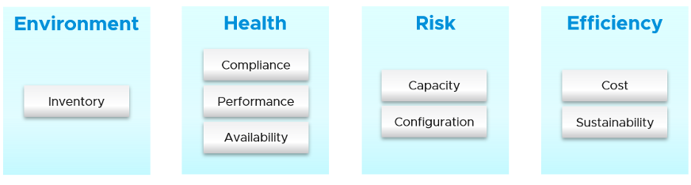

你管理什麼，實際上？你的客戶希望你照顧什麼？你如何管理你需要管理的東西？

最基本的是您需要了解環境。有數以千計的對象（例如 VM、應用程序、防火牆）具有復雜的關係和相互依賴關係。庫存給你這個。這就是為什麼它是下圖中的第一個框的原因。我有一家大型電信公司告訴我，他們的整個 DC 可能會宕機（比如計劃的 DR 練習），但 vRealize Operations 不會，因為這就是他們監控宕機時間的方式。

一旦你知道你在管理什麼，你就可以繼續確保他們健康。如果沒有問題，那麼您將著手解決潛在的問題。如果沒有風險，那麼您會尋求優化。

#### 健康

健康實際上很難定義，因為它取決於上下文和對象。英語中的“健康”這個詞本身就需要解釋一下。因此，最好定義並映射到操作的支柱。系統健康是當前的運行狀態。它涵蓋了已經發生和/或仍在進行中的實際問題。

有兩個問題會影響健康：

- 可用性
- 性能

可用性和性能可以相互排斥，但兩者都會影響健康。如果沒有其他問題，您可能會遇到 1 個問題。

#### 風險

風險就是未來。它涵蓋了潛在的問題。目前沒有問題，但如果你不採取行動，就會增加它成為問題的風險。

有 3 個問題會在運營中產生風險：

- 遵守
- 配置
- 容量

在上述所有問題中，由於不存在實際性能、可用​​​​性或安全問題，因此健康不會受到影響。您面臨的是風險，因為您的應用程序和操作會繼續進行，就好像什麼都沒發生一樣。您的客戶可能不會注意到，您的業務也不會受到影響。

#### 效率

效率就是優化。目前沒有問題，也不存在將來出現問題的風險。您希望進行優化，因為它可以降低成本並提高性能。

- 浪費（超大、未使用的 EC2、空閒、未映射的磁盤空間、孤立文件等）
- 成本。將您的成本與其他雲提供商進行比較，因為 IaaS 本質上是一種商品。
- 綠色運營符合效率，因為可持續運營需要精益運營。

## 運營支柱

運營管理的最佳實踐要求您區分支柱和流程。支柱是您需要管理的，而流程是您管理它們的方式。

每個支柱都是一個單獨的管理單元。它們代表單獨的學科並且彼此兼容。每個支柱的複雜性取決於技術，例如，vSAN 容量比中央陣列更具動態性。在 vSAN 中，更改存儲策略可能會導致突然激增。
流程是每個支柱內的活動。它需要角色和職責，這些都記錄在政策中。

第 0 天是您計劃和定義預期結果的階段。一些公司執行壓力測試和負載測試，因此他們知道實際負載實際發生時會發生什麼。沒有計劃和測試，你不知道現實會是什麼，因為你沒有定義“好”。

第 1 天是您構建系統和啟動服務的階段。這包括配置各種操作輸入，例如成本驅動因素（例如應用許可證成本、電費）。由於本書的重點是第 2 天，因此上表中不包括第 1 天。

監控和故障排除是活動。他們不是你管理的東西。在監控中，您有標準操作程序 [SOP](https://en.wikipedia.org/wiki/Standard_operating_procedure) (SOP), 它定義了哪些角色執行哪些檢查。你首先專注於洞察力，然後才是警覺。故障排除不僅僅是簡單的“發現”，也不僅僅是收集事實。它側重於原因，然後製定解決方案以防止未來發生事故。事件意味著某些東西已經死亡、緩慢或被破壞。您對可用性、性能和安全性進行故障排除。

庫存是你擁有的東西，而不是你計劃的東西。您計劃具有特定配置的容量。庫存僅說明您擁有的東西。無需進行故障排除或優化。

優化帶來了許多實際的好處和真正的業務成果。這裡是其中的一些：

我敢肯定還有更多。用你的真實世界經驗給我留言！

## 相互依存

運營管理的支柱是相互依存的。了解關係與了解每個支柱一樣重要。關係很重要，因為症狀和根本原因通常是兩個不同的事情。性能問題可能是由配置問題引起的，例如配置過時或版本不兼容。

以上圖為參考，讓我們詳細說明每個支柱。

#### 可用性

運營管理中最基本的部分，因為如果整個環境出現故障，其餘的 7 個運營支柱實際上都無關緊要。

有一系列可用性解決方案，從快照、備份、HA、FT 和 SRM。每個都會對容量和性能產生影響。

可用性考慮 HA（高可用性）設置。因此，計劃內停機（例如 ESXi 處於維護模式）不會影響可用性值。

可用性如果做得好，不會影響容量和性能，因為它已經作為設計的一部分考慮在內。是的，這意味著您需要包括由 DR 事件引起的潛在工作負載。

可用性 SLA 越高，服務的價格就越高。每增加 9 個可用性就會有很大的增加。五個 9 的可用性比四個 9 的成本高得多。

#### 性能 & 容量

性能和能力是密切相關、相互依存的，但又不完全相同，因此經常被另一個誤認為。

在較大的組織中，它們通常由兩個不同的團隊管理。容量團隊不參與日常運營，因為他們專注於更長期的資源可用性。容量 _規劃_ 是在不影響性能的情況下最大化利用率。它還考慮了潛在的工作負載和未來的需求，這是性能 **未** 考慮的。

容量團隊可能不具備對性能進行故障排除的技術技能。另一方面，日常運營處理數據中心的“地板上的東西”。他們的主要重點是滿足應用程序的需求。它是消費者驅動的，而容量是提供者驅動的。

性能受能力影響，因為能力不足往往是性能不佳的原因。

容量受性能影響，因為它需要先考慮爭用計數器，然後再考慮利用率。如果您不能滿足現有需求，那麼您將不會配置新的工作負載，因此容量實際上已滿。利用率計數器可能還不高，但這是次要考慮因素，因為您在弄清楚原因之前停止添加新工作負載。

性能比容量更具有時間敏感性和重要性。管理性能第一，容量第二。使用[餐廳類比](/zh-tw/operations-management/chapter-1-overview/1.1.6-the-restaurant-analogy/), 您首先關注用餐區，然後是廚房。

性能 和 容量 是相反的關係。在最低容量下實現最高的整體性能，因為此時 VM 或 Infra 交付的工作量最大。

#### 成本 & 價格

隨著硬件成為商品，基礎設施變得無形，價格自然成為所有 IaaS 供應商的共同標準。普遍的預期是每個虛擬機的價格在不同的雲提供商中是相似的。提供差異化​​定價的一種方法是 SLA。

雖然價格應該高於成本，但它可以獨立於成本設置。使用折扣和累進定價為正確的條款和條件設置正確的價格。漸進式定價也將阻止首先配置大型未使用的虛擬機。與這些 VM 已經投入生產相比，它更容易處理。

成本與容量密切相關。 IaaS 的利用率越高，每個 VM 的成本就越低。成本與容量是分開的，因為它可以在不減少容量的情況下進行優化。

成本和容量也可以相互獨立。您可以通過技術更新在不增加成本的情況下增加容量。您可以通過降低非容量成本（例如您為服務支付的費用）來降低成本而不減少容量。

性能 SLA 越好，客戶願意支付的價格就越高，因此術語價格/性能。

#### 合規與網絡安全

網絡安全是相關的，但與合規性不同。網絡安全涵蓋攻擊等問題（無論是內部員工還是外部威脅）。合規性處理可能暴露安全漏洞或符合特定標準集的配置設置或值。

根據內部和行業標準衡量合規性。它也是連續測量的。

#### 配置 & 清單

清單與配置相關，但不完全相同。配置會影響性能、成本、容量和合規性。因此，它是關鍵點之一 [優化評估](https://www.vmware.com/professional-services/technical-account-management-services.html). 需要在整個堆棧中檢查設置，尤其是較低的堆棧，因為堆棧中的問題會影響其上方的堆棧。

清單是對你所擁有的東西的記錄。配置是你所擁有的屬性。清單使用一小部分設置，因為重點是計算對象的數量。大多數屬性/設置與庫存無關。

清單一般會問我們在哪兒有什麼？因此，它專注於數量，而不是規格。例子：

- 集群中的虛擬機數量是清單的一部分。它不是配置的一部分。
- 群集中的 ESXi 主機數是清單的一部分。但它也是配置的一部分，因為這是該集群的設計。集群配置了 8 個 ESXi 主機是有原因的，偏差可能需要在文檔中解釋。

清單具有庫存盤點等概念，通常涉及實物。配置沒有。

## 角色和職責

保持運營良好運行需要許多角色。有些直接參與日常運營，而另一些則專注於大局。在小型組織中，角色由相同的少數人扮演，相互支持。你可以讓 3 人做任何沒有結構的事情，或者 300 人有明確的界限。無論如何，工作仍然需要完成，因此記錄所有角色和職責。

#### 1 級操作

處理生產環境。定期檢查整體環境。使用洞察力和警報。通常不需要讀取日誌。

負責關閉警報。只有在知道根本原因時才應關閉警報，而不是在症狀消失時關閉。在不知道發生原因的情況下關閉警報會阻止吸取教訓，並可能適得其反。

按照 SOP 執行簡單的故障排除。 SOP 理想情況下是自動化的，採用輸入參數，因此如果手動步驟的數量或頻率很高，人為錯誤的可能性就會降到最低。

關注健康，即可用性和性能。

#### 2 級操作

當級別 1 無法解決問題時激活。對於解決的每個問題，此角色應更新故障排除指南，以便可以授權級別 1。
專注於洞察力，而不是警覺。放眼大局，盡量避免發生警報。

比 1 級更高級。可能專注於某些領域（例如 vSAN、網絡）。

執行高級故障排除，這通常需要進行日誌分析。

領導或參與運營管理工具的評估。設計和維護 vRealize 儀表板和警示。

關注健康、風險和效率。

#### 建築學

看看未來。評估新技術並評估是否需要技術更新。

#### 容量

規劃產能的供應方，與架構師一起工作。

計劃產能的需求方，與業務線或銷售團隊合作。

不參與日常工作。 ESXi 主機進入維護模式是一個操作問題，而不是容量管理問題。

#### 遵守

將合規性設置設置為商定的內部和行業標準。

驗證運營團隊是否及時、正確地處理了不合規警報。向上級管理層報告和討論合規狀態。

關注風險（配置、合規性）。

#### 信息技術管理

這裡可以有多個級別，一直到 CIO。

看大局，尤其是價格和成本。

一般不參與故障排除和架構。

主要關注點是合規性和成本。作為設計的一部分，性能並不像建築師承諾的那樣好。

## 運營管理的輸入

有兩種類型的計數器會影響您的日常操作。競爭是性能的主要計數器，而利用率是容量的主要計數器。第三種類型只是提供信息，例如說明您擁有的東西。

雖然爭用是您關心的問題，但利用更受關注，因為它更易於監控且更易於解釋。有一種趨勢是監控利用率，就好像這是運營的支柱一樣。相同爭用, **利用率不是您管理的事情**. 是的，您監控利用率，但出於某種原因進行監控。這只是衡量您關心的事物的一種方式。就其本身而言，它沒有任何意義。意義取決於目的。不同的目標會導致不同的解釋和利用指標。利用率對性能和容量的影響不同。對於性能，您應該查看實際和真實的利用率。對於容量，根據可用容量（在 HA 和緩衝區之後）衡量利用率。

雖然它們具有負相關性，但在低利用率時仍會發生爭用。當 ESXi 主機未以高利用率運行時，集群中的虛擬機可能會爭用資源。不平衡和不正確的集群配置是導致低利用率爭用的兩個典型原因。
在性能管理一章中進一步解釋了利用和爭用。 [性能 管理](/zh-tw/operations-management/chapter-2-performance-management/).

分配補充了需求，因為新配置的 VM 往往處於空閒狀態（可能長達數月）。此外，需求模型無法檢測到未來的負載，因為它尚不存在。分配模型應該用來補充需求模型。這將在此處進一步解釋。 [這裡](/zh-tw/operations-management/chapter-3-capacity-management/1.3.6-usable-capacity/).