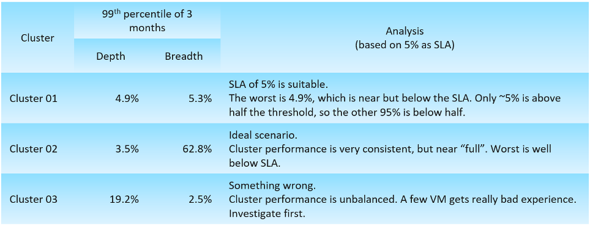
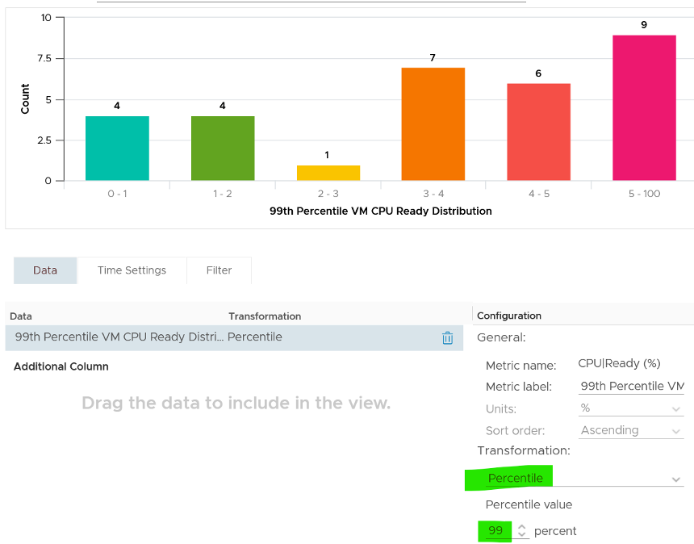

您如何分析您的環境以設置閾值？你如何確定什麼是可以接受的？最近幾個月的實際價值是多少？

以上所有問題都可以通過分析您的環境來回答。

假設您在 10 個集群中有 5000 個虛擬機。所有這些集群都提供相同級別的服務。您想證明 5% 的 CPU Ready for VM 是否是一個很好的閾值，或者您想知道這些 VM 在過去 3 個月內經歷的實際 CPU Ready。

您希望至少分析最近 3 個月的數據，以便不排除該期間內的任何峰值。由於 vRealize Operations 每 5 分鐘存儲一次此計數器，因此您一天將擁有 288 個數據點，3 個月內將擁有 26,298 個數據點。

#### 步 1

對於每個集群，您可以測量任何 VM 所經歷的最差 CPU Ready。

一個擁有 500 個虛擬機的集群將用任何在 5 分鐘間隔內遇到最高 CPU 就緒狀態的虛擬機來表示。因此，您每 5 分鐘分析 500 個指標並取最壞的結果。

#### 步 2

你做上述3個月。

由於 3 個月內有 26,298 個數據點，這意味著您分析了 13,149,000 個數據點

#### 步 3

在 13+ 百萬中取最差的可能會給你一個異常值。

為了解決這個問題，在比較第 100、99 和 95 的值後，取第 99 個百分位數。平均值不適用，因為您希望接近峰值。

您將此記錄為過去 3 個月內為該集群準備的最差 CPU。

#### 步 4

您對每個集群重複步驟 1 - 3。

------

以上為您提供了問題的深度。正如[以前](/operations-management/chapter-2-performance-management/1.2.4-contention-vs-utilization/)所涵蓋的那樣，您需要用問題的廣度來補充這一點。該步驟是類似的，除了在步驟 1 中計算虛擬機體驗 > 2.5% CPU 就緒的百分比。

為什麼是 2.5% 而不是 5%？

為了讓您獲得更好的可見性，因為 >5% 的數字可能太小了。

對所有集群執行上述操作後，您可能會得到這樣的結果。

如果您想查看最近 3 個月 VM CPU Ready 的實際分佈怎麼辦？您可以通過創建條形圖並指定分佈桶來實現。在下面的示例中，我指定 0% - 1%、1% - 2%，直到 5%，因為這些是我感興趣的範圍。

請注意，在這種情況下，我將值設置為第 99 個百分位數，因為取 Max 可能會給出異常值。

如果你想看更多的例子，我應用這個基線技術來計算 [CPU Context Switch](/zh-tw/metrics/chapter-2-cpu-metrics/2.2.1-guest-os/#guest-os-cpu-context-switch) 和[CPU 運行隊列](/zh-tw/metrics/chapter-2-cpu-metrics/2.2.1-guest-os/#guest-os-cpu-run-queue)。