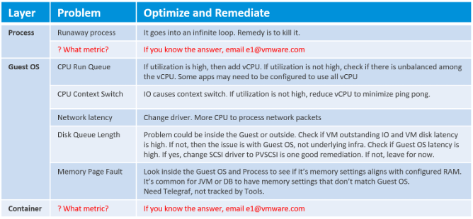
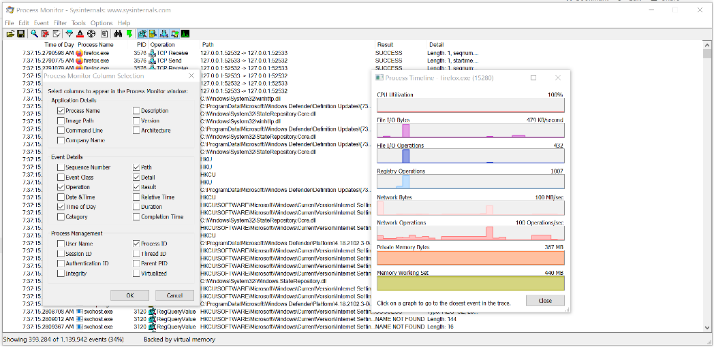
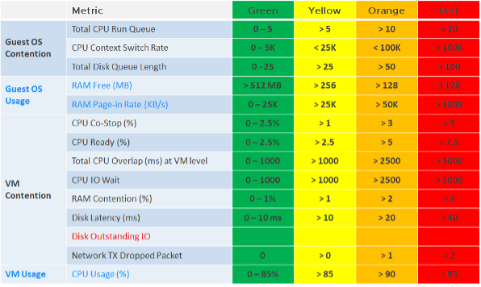

Optimized Performance is difficult because the best performance is achieved when utilization/throughput is at 100%. Running at that level requires a perfect level of mastery due to many dimensions of inter-dependencies. In addition, the majority of workloads have peaks so on average you could be well below 100%.

| Dependency | Description |
| --- | --- |
| **Vertical** | There are layers in the stack, and a problem in a lower layer can impact an upper layer.|
| **Horizontal** | The four elements of IaaS are not standalone. When CPU is paused, RAM & Disk will experience latency as time shifts as far as the Guest OS is concerned.|
| **Flow** | A problem in your NSX Edge VM on the NSX Edge Cluster can impact a business VM sitting on another cluster, because of the traffic flow. If you don't understand the flow, you can waste time troubleshooting at the wrong cluster.|
| **Version** | There are valid reasons behind "What Works With What". It's a known problem that not all versions of all components work well together. Drivers, Firmware, etc. can cause interoperability problem, which can manifest itself as performance.|

## Consumer Layer

The consumer layer consists of VM and Container (which often runs inside a VM). Guest OS lives inside this, and in turn provides a platform for processes to run. So if you are running containers, you are adding a new layer to monitor. As you can see [here](/metrics/chapter-1-overview/), adding a new layer alters the metrics in the adjacent layers. If you have expertise in container monitoring, drop me an email!

At the Process level, there seems to be limited useful information for troubleshooting. The following shows [Windows Sysinternal](https://docs.microsoft.com/en-us/sysinternals/), a great tool for Windows troubleshooting. As you can see, they are just utilization counters.

More on [CPU Context Switch](https://en.wikipedia.org/wiki/Context_switch) is covered [here](/metrics/chapter-2-cpu-metrics/2.2.1-guest-os/#guest-os-cpu-context-switch).

We have better visibility at vSphere VM level due to the various counters provided. The following table lists the metrics and associated actions you can perform to address the issue.

I do not put AWS EC2 or Azure VM here as the visibility is rather limited.

Let's now put together all the counters from Guest OS and VM. For completeness, I added the utilization counters too because the 5-minute average may be too long.

The KPI counters maybe too technical for some users, so vRealize Operations 8.2 includes a starting line to get them started. It sports a color coded dashboard. You adjust the threshold of the widgets of the dashboard if you think they do not meet your requirements. Only do so after you profile your environment, and not simply base on theory.

## Provider Layer

At any given moment, a running VM always resides on an ESXi Host. Due to DRS and HA, it's easier to monitor at cluster level. Since a cluster can have hundreds of VMs, you need consolidated metrics that can represent the experience of all the running VMs in the cluster. vRealize Operations 8.2 provides the following metrics:

A running VM also consumes datastore service or has [Raw Device Mapping (RDM)](https://docs.vmware.com/en/VMware-vSphere/7.0/com.vmware.vsphere.storage.doc/GUID-9E206B41-4B2D-48F0-85A3-B8715D78E846.html) disk.

Here is the list of potential problems at the provider layer:

