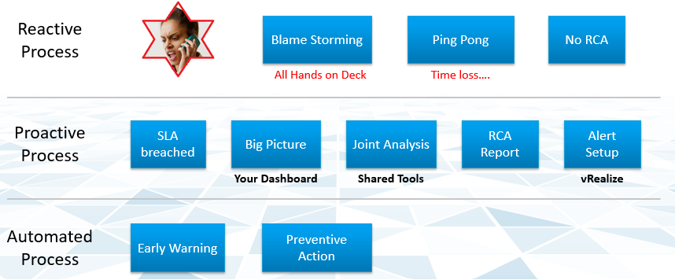
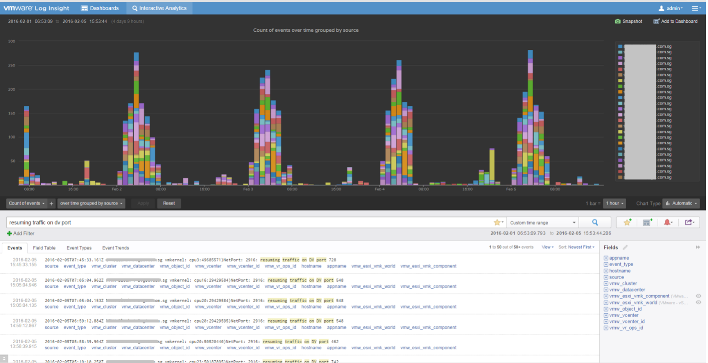

There are many things that can go wrong, especially in production and on the eve before you take a vacation. On the other hand, what settings you can change is relatively limited. 

I’m assuming you have followed the configuration best practice, as that’s a big topic on its own. You will need to review and apply Windows, Linux, vSphere, NSX, vSAN, server hardware, and network hardware performance best practices. If you use Horizon, then you will need to apply its best practice too, alongside the 3rd party technology used in your VDI architecture. In a large environment with multiple versions and vendors, it can be difficult to ensure the entire stack is compatible. It is a never-ending job as you need to keep up with the versions and product end of life.

Assuming you have done all the configuration check, then the remaining of what you can do is rather limited. For a performance problem, it basically boils down to capacity, either VM capacity or infrastructure capacity.

vMotion as a topic keeps coming up. If your application team has concerns, [this](https://blogs.vmware.com/vsphere/2019/07/the-vmotion-process-under-the-hood.html) article goes deep into how it works and [this](https://blogs.vmware.com/vsphere/2020/03/vsphere-7-vmotion-enhancements.html) covers the enhancement in vSphere 7.

[Root Cause Analysis](https://en.wikipedia.org/wiki/Root_cause_analysis) report varies among customers, even if the issue they are troubleshooting is essentially the same. What should be the #1 content in the report?

The main content of the report should be the alert that is set up to track just in case the problem happens again. Without this alert set up, you will not be able to detect the issue and can potentially lose valuable time.

There is a good chance that the root cause is different than the symptom. It may happen on a different object altogether and the error message could be seemingly unrelated. A root cause typically starts as a log message, meaning it has not bubbled up into the screen (UI) as formal alarm. When the vendor support team recommends you a specific log message to trap, how do you validate it is correct?

You need to ensure that the alert is valid. That means it should not result in false positive.

Let’s take an example. This was a [VDI](https://www.vmware.com/topics/glossary/content/virtual-desktop-infrastructure-vdi) mass disconnect issue, where >100 users had their sessions disconnected at the same time. The analysis concludes that the problem started with the “resuming traffic on DV port”, so we need to trap this message when it appears again.

The first thing you need to do is validate the above alert. Using tools like Log Insight, you cross check the message against your entire environment, especially the healthy (in this case, unaffected users). Ideally, you cross check for entire week, not just during the time the incident happen.

The following was the result when I cross checked against all the users in the last five working days. It happens more than 1000 times, meaning that “resuming traffic on DV port” is not the message that I should base my alert on. There are too many of them and there is a clear pattern following office hours.

