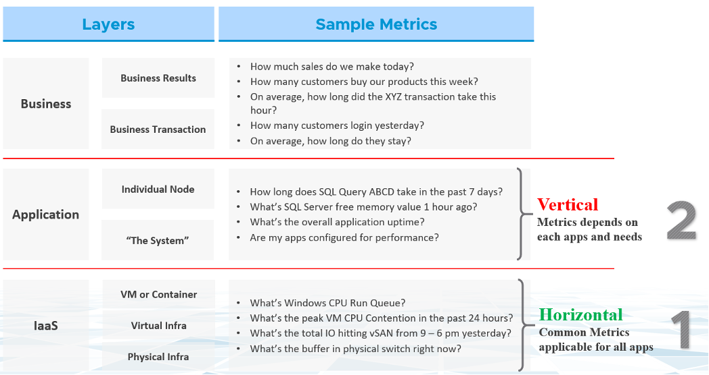
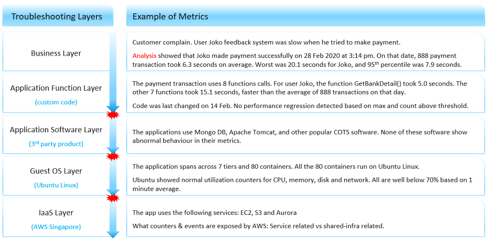

一般来说，企业应用程序有三个主要领域。每个领域都有自己的一组团队。每个团队都有一套独特的职责，因此需要技能。下图解释了三个领域，以及每个领域的典型层次和提出的问题。

性能故障排除在很大程度上是一种消除练习。此方法对每一层进行切片并确定该层是否导致性能问题。因此，必须有一个指示符来指示是否正在执行特定层。这个主要指标被恰当地命名为关键绩效指标。我们将在 
[这里](/zh/operations-management/chapter-2-performance-management/1.2.7-kpi-vs-sla/#internal-sla) 中介绍更多。

上层依赖于下层，因此基础设施层通常是争用的来源。因此，首先关注底层，因为它是上层的基础。好的部分是，该层通常是一个水平层，它提供一组通用的基础设施服务，而不管在其上运行什么业务应用程序。

现在，我们不知道当基础设施出现延迟时对 _application_ 的影响。这取决于应用程序。即使在相同的软件上，例如 SQL Server 2019，影响也可能不同，因为这取决于您如何使用该软件。即使在相同版本的软件上，业务工作负载的不同性质（如批处理和 OLTP）也会受到不同的影响。

根据应用程序和基础设施架构，可以有更多的堆栈或层。以下示例显示了 5 个图层。性能故障排除的挑战在于层可能不共享上下文。

U用上面的例子，我们可以证明缺乏可见性是如何使故障排除几乎不可能的。让我们来看看上面的内容。故事从抱怨开始，因为这更能引起共鸣。

在业务层，您可以看到每个业务交易的表现。您不仅知道哪个用户受到影响，还知道哪些交易受到影响，因为指标具有交易 ID。您可以在代码中跟踪它，因为您知道每个函数调用发生的时间，假设您记录每个事务。

当您超越代码并进入货架商业 (COTS) 软件时，问题就开始了。软件可能会显示它的队列是10000，比手册上说它可以处理的多5000。但是您不知道用户 Joko 事务是否在该队列中。 COTS 软件指标不再与用户相关，更不用说单个交易了。红色爆炸图标标记上下文丢失的位置。

从应用程序转移到基础设施导致了另一个上下文丢失。 Windows 或 Linux 不知道您正在运行什么应用程序。就操作系统而言，每个应用程序只是一个进程。它将报告每个进程的基本 CPU、内存、磁盘和网络利用率。更高级的计数器在操作系统级别、系统范围内报告。例如，您不知道您的进程是否经历过网络[丢包](https://en.wikipedia.org/wiki/Packet_loss)。数据包计数器丢失是一个系统范围的指标。

从单个 EC2 或 VM 迁移到共享基础架构会导致另一次上下文丢失。在公共云的情况下，您可能根本无法了解物理层。