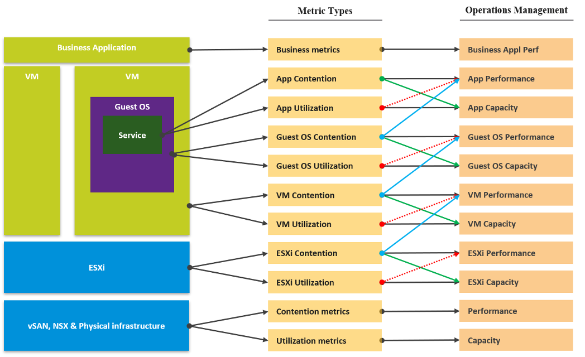

At the VM layer, we care whether a particular VM is being served well by the platform. Other VMs are irrelevant from the VM owner's point of view. So, the key counter here is VM contention. Infrastructure metrics are irrelevant. Only when we are satisfied that there is no contention can we proceed to check whether the VM is sized correctly or not. Most people check for utilization first because that is what they are used to monitoring in the physical infrastructure. In a virtual environment, we should check for contention first.

Most raw metrics can be categorized into 3 types:

- They measure something **bad** (e.g. contention, latency)
- They measure something **good** (e.g. utilization, consumption)
- They account for something (e.g. inventory, configuration)

Consumption, better known as utilization, is hence a family of metrics. It comes in many different names (IOPS, throughput, usage, demand, active, etc.). Its opposite is the contention type of metrics. Utilization is the main source for the capacity family of counters (Capacity Remaining, Time Remaining, VM Remaining, Recommended Size).

Contention is the primary counter family for performance, while utilization is the primary counter family for capacity. Performance & Capacity uses these two types of counters differently. Knowing the requirements of each is critical in optimizing both performance and capacity.

Most look at **utilization**, because they fear something wrong will happen if it’s high. That “something” is contention. Contention manifests in different forms. It can be queue, latency, loss, dropped, aborted, context switch. 

The following diagram shows three different scenarios

- What you think will happen. You theorize that contention will only happen when utilization is high, and the unused capacity acts as cushion to prevent unmet demand from happening. 
- What actually happens in most environment. Demand is unmet even though utilization is not high, due to suboptimal configuration or constraint.
- What could happen if your environment is optimized. You have very high utilization yet you keep unmet demand within the promised SLA. 
 
Do not confuse **“ultra-high”** utilization indicators as a performance problem. High utilization does not compromise performance, so long as there is no queue or contention. Just because an ESXi Host is experiencing ballooning, compression, and swapping does not mean your VM has memory performance problem. You measure the performance of the host by how well it serves its VMs. While it is related to ESXi utilization, the performance metric is not based on the utilization at all. It is based on contention metrics.

Utilization is not a counter for performance. It’s a counter for capacity. The higher the utilization, the more work gets done, and hence the better the performance. Utilization at 100% is in fact the best possible performance, so long there is no contention. Since we can track contention explicitly, the performance counter becomes secondary, supporting counter.

The following diagram shows all the layers in typical IaaS, focusing on the consumer side. 

Contention is placed above utilization as that’s what you should drive your operations. As Mark Achtemichuk said in this article, drive by contention. For each layer, you have a set of metrics. The black line shows that contention is the primary counter for performance, and utilization is the primary metric for capacity.

The green line shows that contention counters give valuable input to capacity by showing how much additional capacity is required. For example, the number of queues in the CPU should be used to determine the amount of CPU to add.

The blue line shows that contention in the underlying layer directly impacts the performance of the layer above. For example, if a Guest OS experiences disk latency, the application will feel the impact. That can result in a ripple effect to the top layer.

The red line is not solid, as it’s showing a misconception. If contention = 0, then utilization at 100% is in fact maximum performance. If we can’t measure the contention, then add the buffer (e.g. 90% utilization) as queue tends to develop at high utilization. On the other hand, you can have poor performance at low utilization. Many things can cause this. Here are just some.

