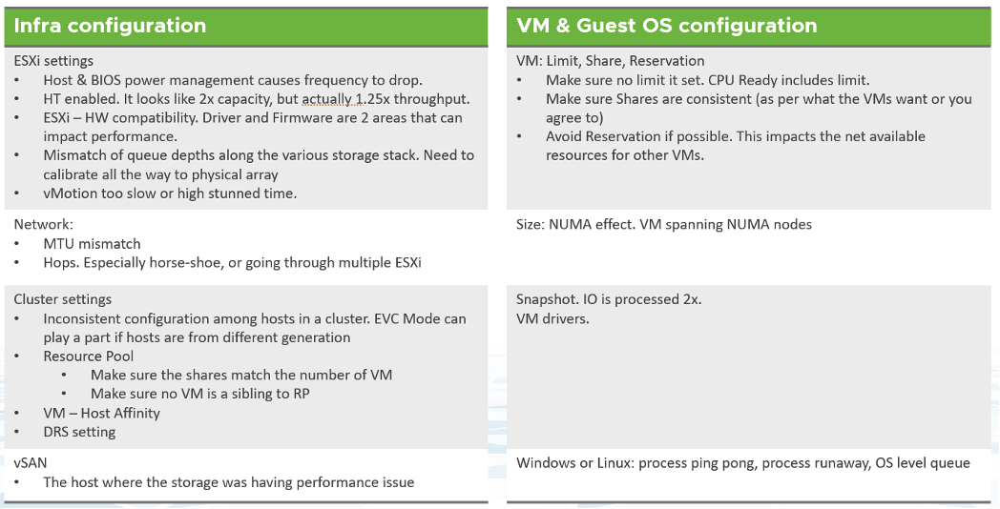

在 VM 層，我們關心特定的 VM 是否被平台很好地服務。從 VM 所有者的角度來看，其他 VM 無關緊要。因此，這裡的關鍵計數器是 VM 爭用。基礎設施指標無關緊要。只有當我們對沒有爭用感到滿意時，我們才能繼續檢查 VM 的大小是否正確。大多數人首先檢查利用率，因為他們習慣於在物理基礎設施中進行監控。在虛擬環境中，我們應該首先檢查爭用。

大多數原始指標可以分為 3 種類型：

- 他們衡量一些 **壞**（例如爭用、延遲）
- 他們衡量一些 **好的**（例如利用率、消費）
- 它們說明某些內容（例如庫存、配置）

因此，消費，也稱為利用率，是一系列指標。它有許多不同的名稱（IOPS、吞吐量、使用情況、需求、活動等）。它的對立面是爭用類型的指標。利用率是計數器容量系列（剩餘容量、剩餘時間、VM 剩餘、推薦大小）的主要來源。

競爭是性能的主要計數器系列，而利用率是容量的主要計數器系列。 Performance & Capacity 以不同的方式使用這兩種類型的計數器。了解每個需求對於優化性能和容量至關重要。

大多數人關注 **利用率**，因為他們擔心如果它很高，就會發生錯誤。那個“東西”就是爭論。爭用表現為不同的形式。它可以是隊列、延遲、丟失、丟棄、中止、上下文切換。

下圖顯示了三種不同的場景

- 你認為會發生什麼。您從理論上講，只有在利用率高時才會發生爭用，而未使用的容量充當緩衝以防止發生未滿足的需求。
- 在大多數環境中實際發生的情況。由於次優配置或限制，即使利用率不高，需求也未得到滿足。
- 如果您的環境得到優化，會發生什麼。您的利用率非常高，但仍將未滿足的需求保持在承諾的 SLA 內。

不要將 **“超高”** 利用率指標混淆為性能問題。只要沒有隊列或爭用，高利用率不會影響性能。僅僅因為 ESXi 主機正在經歷膨脹、壓縮和交換，並不意味著您的 VM 存在內存性能問題。您可以通過主機為其 VM 提供服務的程度來衡量主機的性能。雖然它與 ESXi 利用率有關，但性能指標根本不基於利用率。它基於爭用指標。

利用率不是性能的計數器。這是容量的計數器。利用率越高，完成的工作就越多，因此性能就越好。 100% 的利用率實際上是最好的性能，只要沒有爭用。由於我們可以明確地跟踪爭用，性能計數器成為次要的，支持計數器。

下圖顯示了典型 IaaS 中的所有層，重點是消費者端。

爭用高於利用率，因為這是您應該推動運營的因素。正如[Mark Achtemichuk](https://blogs.vmware.com/vsphere/author/mark_achtemichuk) 在[這篇文章](https://blogs.vmware.com/vsphere/2015/11/vcpu-to-pcpu -ratios-are-they-still-relevant.html)，由競爭驅動。對於每一層，您都有一組指標。黑線顯示爭用是性能的主要計數器，而利用率是容量的主要指標。

綠線顯示爭用計數器通過顯示需要多少額外容量來為容量提供有價值的輸入。例如，應該使用 CPU 中的隊列數來確定要添加的 CPU 數量。

藍線表示下層的競爭直接影響上層的性能。例如，如果來賓操作系統遇到磁盤延遲，應用程序將感受到影響。這可能會對頂層產生漣漪效應。

紅線不是實線，因為它顯示了一種誤解。如果爭用 = 0，那麼 100% 的利用率實際上是最高性能。如果我們無法衡量爭用情況，則添加緩衝區（例如 90% 的利用率），因為隊列往往會以高利用率發展。另一方面，在低利用率的情況下性能可能很差。很多事情都會導致這種情況。這裡只是一些。

