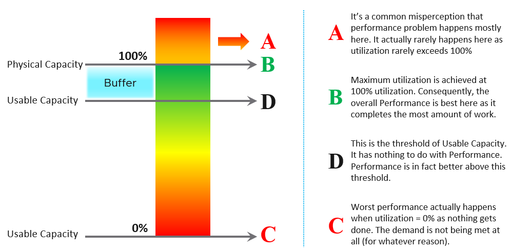
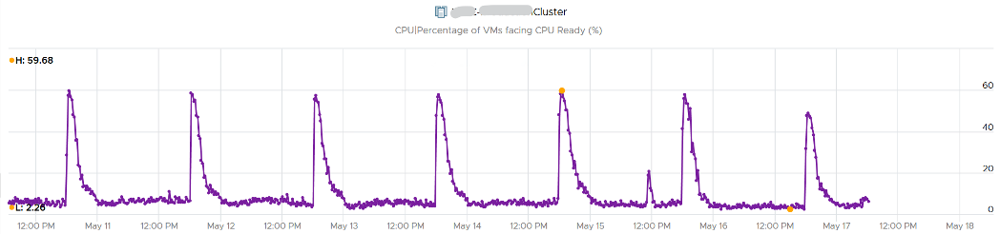

The relationship between capacity and performance varies depending on the object. Consumer objects (e.g. VM, K8S Pod) have different natures than provider objects (e.g. vSphere Cluster, vSAN Cluster). For provider objects, performance is always bottom up. You start with the VM running inside in the provider object, and then aggregate the metrics. Capacity is always top down. You look at the big picture first, then drill down. For example, you start with the vSphere cluster, then drill down to ESXi.

For an IaaS provider, the following tables explains how performance and capacity differ.

Capacity has HA, Buffer, Overhead and Reservation. None of these are relevant to performance monitoring. In Performance, you don’t care about them, as performance is about reality (what actually happens). They may cause performance problem, but they are not considered in the performance metric. 

The confusion on performance and capacity lies in utilization. They share the same raw counter but use it differently. Performance will be absolute (real value), Capacity will be relative (it depends on settings). The following table below shows how utilization is used differently.

Take for example, the ESXi Memory Consumed, which is the primary utilization counter for ESXi. 

- From performance monitoring, 100% consumed is not only good, it’s perfect. You are maximising your cache. So long as there is no ballooning and contention, this is exactly what you want. 
- From capacity monitoring, 100% consumed is not good, as that means there is no more remaining capacity left. You need to stop provisioning new loads and start the process of buying new hardware. Also, 100% is measured to usable capacity after deducting HA and buffer. It’s not measured against the absolute physical capacity. 

Let’s take an example to see how contention and utilization differs. The following is using a cluster object as the example. There are two counters, each expressed in percentage. 

You want your utilization to be as high as possible, as you’ve paid for the hardware already. So, you start from 0% but want to move up as far as possible. 
You want your performance to stay at 100%. You don’t want it to move down far. In fact, 10% degradation can be significant as that can mean 10% of the VM population is affected. In a large cluster with 2000 VMs, that can mean 200 VMs.

Performance depends on the class of service. A Gold cluster may have identical hardware with a Bronze cluster, but the VMs running on Gold cluster face less contention, hence they perform better.

Let’s see the above in real life. Here is a cluster experiencing regular high utilization in the last 7 days. You can clearly see the peak. The cluster has 14 ESXi Hosts.

A logical question here would be what’s the impact on VM performance? Are they getting the CPU they asked? The cluster has 550 running VM.

This is where the contention counters come in. One tracks the depth of the problem, the other the breadth of the problem. 

The counter Percentage of VMs facing CPU Ready > 1% shows a nearly identical pattern. We can see that a big percentage of the VM population is affected.

The second counter tracks the depth, giving the absolute worst CPU Ready value experienced by any VM in the cluster. 

