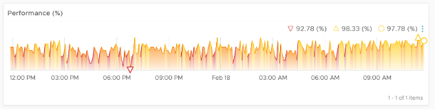
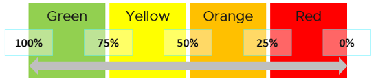
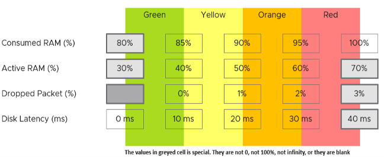
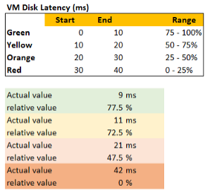
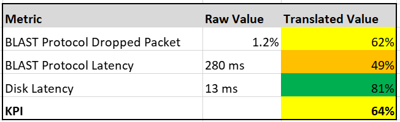

I agree that a set of metrics that determine the health of complex object such as VM or application will never be accurate in 100% of the case. This is normal, just like in real life. We take annual health check, performing all sort of tests, and the results will be a series of metrics (e.g. your bad cholesterol level). Are they 100% accurate for you from young until you are old? Are the results 100% accurate for everyone in your city? No, but they are good enough, and certainly much better than nothing. Beside the absolute value, the relative movement of the value over time is also able to give you insight. For example, if the KPI drops on a quiet Sunday morning when the environment is not supposed to have known activities, perhaps there is bad going on?

In this book, my definition for KPI is strictly on **performance**, because the word performance has a specific meaning. To me, KPI as a term does not apply to Availability management and Capacity management. We should call the key indicators that determine availability as **KAI**, and the key indicators that determine capacity as **KCI**[^1]. This will prevent confusion as implementation-level solution requires us to be non-ambiguous with terminology.

Broader definition of KPI that includes non-performance is not used in this book so we can be precise in the implementation. For an overall business KPI, [Norman Dee](https://blogs.vmware.com/services-education-insights/author/ndee) has written a series of blog post [here](https://blogs.vmware.com/services-education-insights/2020/05/getting-started-with-kpis-and-metrics-part-1-their-importance-and-value.html).

For KPI to support SLA, the thresholds that it uses must be the same that SLA uses.

Let's say you have three classes of service, with Gold being the highest and most expensive.

The Gold class should be performing better than Bronze. That's the expectation, so we need to reflect that in the reality in production. The Gold _absolute_ performance should be better as it was designed to be better. There's a reason why it's priced higher to begin with.

#### KPI

This absolute performance is measured in range of 0 - 100% so it's easy to understand, with 100% being the best. Mathematically, KPI is actually unitless. I could have chosen another range, such as 0 - 4, and it won't make any difference. Using percentage and 0 - 100 just makes it easier to remember.

**KPI** reports the raw performance as it is.

Majority of KPIs are internal. They are used as the starting point to troubleshoot.

For each type of object, aim to consolidate all the performance metrics into a single KPI. Say you have 1000 AWS EC2 to be monitored. You have a bunch of metrics and you considated them into 2 KPIs. How would you know which EC2 has issues? You need to show 2 sets of heat map or table. That means you need to manually corelated the first table with the second. It's not scalable.

The above also presents challenge as you roll up to higher level object.

#### SLA

While Gold should perform better than Silver, it may not be good enough for the Gold SLA. Gold can fail its own SLA even though it's faster than Bronze in the absolute term. Relative is measured in binary. Pass or Fail. Because it is a binary, it can't measure how good it passes or how bad it fails. This is one area where KPI complements it.

**SLA** is typically measured over one calendar month, meaning a one time failure of 5-minute does not constitute formal SLA failure.

SLA is external as it's written in the contract.

-----

The following table shows how KPI and SLA relate. Both takes the same metrics and threshold as input, but they analyze differently as their purpose is different.

All three Class of Services share the same set of KPIs, which are absolute. Fast is fast. It is a fact, regardless of what business labels you attach to it.

- To define your KPI, take each KPI metric and define exactly what fast is and break it into four zones. Each zone is given a quarter of the 100% for simplicity.
- Ideally, set Gold SLA in the highest range, which is the Green range of KPI.
- Ideally, set Silver SLA in the range below green, which is the Yellow range of KPI. If they are in the Green range, you have over delivered (or are over delivering). You should optimize your cost by selling more VMs or buying less expensive hardware.
- Expect Bronze to be in the Orange range. If they are in Green to Yellow range, you over delivering.
- None should in the Red range. This is where your critical alerts are triggered. Since the very purpose of KPI is to enable proactive operations, you want to minimize being in the red zone.

In the preceding example, the Silver range is given a wide band. While this is mathematically possible, operationally it creates unnecessary complexity. It's so much easier to map one color to each class of service. Also, having more than 3 class of service complicates your operation and increase your cost.

Let's look at an example to illustrate:

- The Gold SLA for VM Disk Latency is 8 ms, Bronze is 26 ms.
- A Gold VM 007 has 9 ms disk latency. A Bronze VM 747 has 25 ms disk latency. Gold class delivered better performance in absolute terms. However, in relative terms, Gold failed the SLA while Bronze class passed its SLA.

If you have a free Tier, where there is no SLA, then it's fine for them to be in the red zone. Commercial cloud providers provide free tier. They are intentionally designed to be slower and less reliable, because they want you to upgrade and pay.

## Internal SLA

For each SLA, there can be _many_ associated KPIs, because not all metrics should be in the contract, while almost all performance metrics need to be monitored.

vRealize Operations uses the following threshold for vSphere IaaS internal SLA. These numbers are fixed in the product.

The above is a stringent threshold. A high standard for performance is used because it is an internal KPI for Infrastructure team consumption. It is not an external, formal SLA. There needs to be a buffer between internal and external, to give the operations team room to react. The buffer is your margin of error.

Another reason for the high standard is it must work for mission critical environments. If the threshold is not good enough for such environments, you will not get an early warning.

A single threshold is used to keep the operations simple. This means the performance in production is expected to have a higher score than the development environment. Development environments will obviously perform worse than Production environments. A single threshold helps to educate the difference in QoS (Quality of Service) provided by the different class of service. You pay less, you get worse performance. You pay half price; you get half the performance.

The above four elements of IaaS (CPU, Memory, Disk, Network) are evaluated on every collection cycle. The default collection cycle is 5 minutes, which is an appropriate balance for SLA monitoring. An SLA that is based on a 1-minute collection cycle will be too tight and result in either a cost increase or a reduction in threshold.

The following example, taken on vRealize Operations 8.2, shows that this VM was served well by the IaaS. It's getting the four IaaS resources it asked for in the last 24 hours with only one exception. The chart counts each time a VM is not getting a resource. A VM that is not served on all four will register a value of 4 in the chart.

The following example shows the opposite. There are many instances where the VM is not getting at least one of the four IaaS resource, and one instance where it did not get two them. The chart also shows 7 days, so pattern or spike can be seen.

Now that we can measure for every single VM, we can roll up the metric at the ESXi Host or Cluster level. The following formula averages all the running VMs in the cluster. You expect to see a number near 100%, as the expectation is that the cluster is serving all the VMs well, and not just 99% of them. 99% in a cluster with 1000 VMs can mean 10 VMs aren't being served well. All it takes for a complaint can be just one VM!

The following example shows that the cluster is struggling to serve all its VMs.

## KPI

We shared earlier that SLA only accounts for pass or fail. It does not measure how good you pass or how bad you fail. This is where KPI complements SLA. KPI is implemented in VMware Horizon monitoring, so I will use it as the example.

KPI is defined as 0 - 100%. As we use 4 colors, we divide them equally. So Green is simply 75% - 100% and Red is simply 0% - 25%. If you create an unequal distribution, some bands will have to be narrower than others. With uneven bands, you also need to be extra careful when defining the threshold for each metric that make up the KPI.

The following KPI uses 4 metrics as its input. Each metric has a set of thresholds for green, yellow, orange and red.

Now that we have the threshold for each metric, we can convert each metric into Green - Red. Horizon adapter is also able to handle when the entire range is defined by a single number. This is useful when you want to define green = 0. That means a single packet loss will put the metric into the yellow range already.

How do we translate?

Let's use an example. Take the Disk Latency (%) metric . It has range from 0 to 40 ms, which maps into the 0 - 100% using the following mapping table.

With the above mapping, we can be precise in assigning the value. For examples:

- 9 millisecond disk latency translates into KPI value of 77.5%, which is green. The reason is green ranges from 75% to 100%, where 0 ms equals to 100% and 10 ms equals to 75%. So each millisecond is around 2.5%.
- 42 millisecond disk latency translates into 0%. It is above the upper threshold of 40 millisecond. Since we do not show negative, anything above the limit is shown as 0%

We repeat the calculation for each metric. The KPI is simply the average of the metrics.

In future, we can add _weighted average_, so you get a better leading indicator. The problem with a simple average is a single red can be outnumbered by many green, and the KPI will not show a problem.

[^1]: You see, I'm not opposed to jargons 😊 so long they are actually used in live operations. If it's just a goal, then no need to label with jargon, else we have to create jargon for every single type of goals.