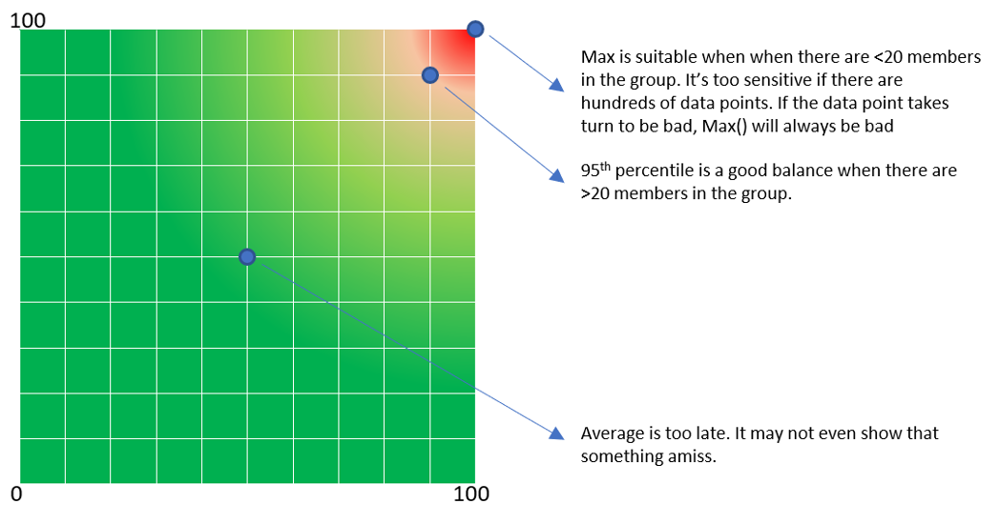
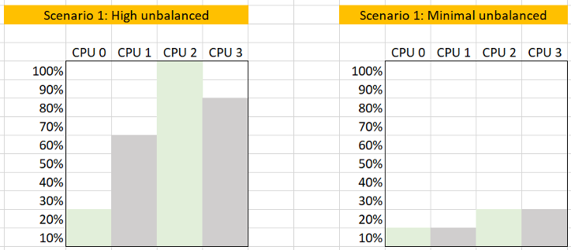

您希望能够在早期发现性能问题，此时只有一小部分用户或应用程序受到影响。为此，您需要一个领先指标。领先指标通过提供预警来补充滞后指标，让您有更多时间做出反应。

平均值是一个滞后指标。大组的平均值往往较低，因此需要用峰值进行补充。另一方面，绝对峰值可能过于极端，包含异常值。

下表显示了 Max() 找出极端（异常值）而平均值无法检测到问题的位置。这就是 95% 或 99% 更有意义的地方。

这些是对average() 和maximum() 进行补充的技术。根据情况，您应用适当的技术。

#### Worst()

这将返回组的最差值。它适用于成员数量较少的情况，例如集群中的 ESXi 主机。

如果要忽略异常值，请使用 Percentile 函数。

在某些情况下，您可能同时需要最差和百分位数以获得更好的可见性。

#### Percentile()

它类似于 Worst() 函数，但它在消除最坏的百分比后返回数字。例如，如果取第 99 个百分位数，则消除最差的第 1 个百分位数并取最高值。

成员数量必须支持百分位函数。如果只有 20 个成员，那么每个成员对应 5 个百分位。你不能做 99%，因为这需要至少 100 名成员。

您需要相应地调整 percentile() 带，考虑到数组中的成员数量。例如，如果您取 1 个月数据的第 99 个百分位数，您将消除最糟糕的 7.4 小时。另一方面，如果您取 1 天数据的第 95 个百分位，您将消除最糟糕的 1.2 小时。

#### Count()

这与 Worst() 或 Percentile() 不同，因为您需要先定义阈值。例如，如果您对性能不佳的 VM 进行计数，您需要定义什么是坏的。这就是为什么 Count() 要求您定义红色、橙色、黄色和绿色的波段。然后您可以跟踪红带上的对象数量，因为您预计该数字始终为 0。在某些情况下，等到对象到达红色区域可能为时已晚，因此请考虑用橙色区域中的成员计数来赞美它。

当成员数量非常大时，Count() 比 average() 效果更好。例如，在具有 100K 用户的 VDI 环境中，受影响的 5 个用户为 0.005%。使用计数更容易监控，因为您可以看到它如何转化为现实生活。

#### Disparity()

当成员穿制服并打算平均分担负载时，您还可以跟踪他们之间的差异。这揭示了当平均水平仍然良好时，该组的一部分何时遭受痛苦。

## 使用差异

您期望平衡的示例是：

- VM vCPU 之间的使用情况。如果 VM 有 32 个 vCPU，您不希望前 8 个受到影响，而后 16 个没有使用。
- 集群中 ESXi 之间的使用
- 场中 RDS 主机之间的使用
- 在 Pod 中的 Horizo​​n Connection Server 之间的使用
- vSAN 磁盘组中磁盘的使用情况

有两种计算不平衡的选项：

- 除以总数。这是一个固定数字，因为总数是一个常数。
- 除以最大值（最高）。这是一个动态数字，因为最大值在波动。不平衡是相对的，因为它取决于 Max 指标的值。

这两个用例都有其目的。由于以下原因，我们首先使用：

1. 这是最常见的。第二个用例用于低级应用程序分析或调整，而不是一般的 IaaS 操作。
1. 也更容易理解。
1. 不平衡绝对值低时，不会导致高数。请参阅下面的图表

以下计算表明，使用相对不平衡会导致较高的数字，这可能会产生误导，因为实际不平衡仅为 10%

