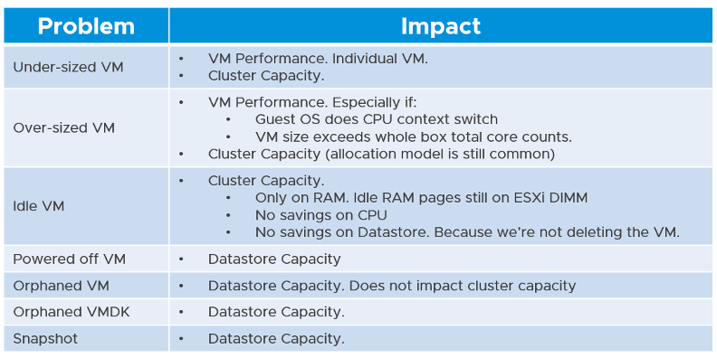
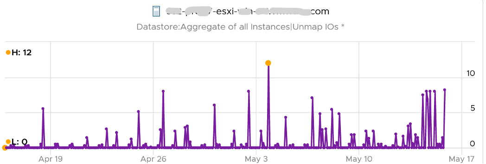
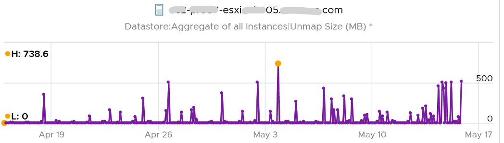
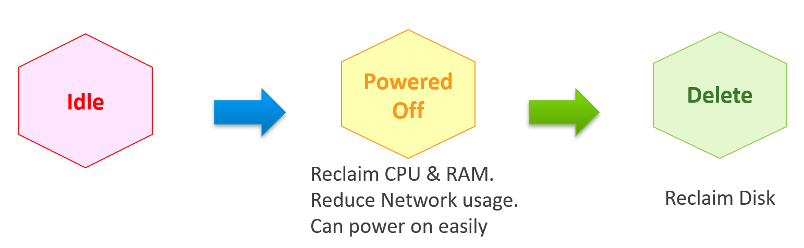
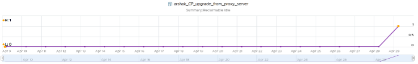
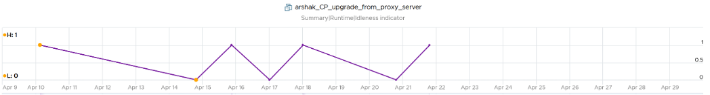

Reclamation delivers many benefits, and some of them are listed below



There are 6 areas of reclamation, from the easiest to the hardest. Naturally, the logic differs for each.


Non VM files are the easiest, because they are not owned by someone else. They are yours! Non VM objects, such as templates and ISOs should be kept in 1 Datastore per physical location. Naturally, you can only reclaim Disk, and not CPU & RAM.

An orphaned file is a file in the datastore that is no longer associated with any VM. Orphaned VMs and orphaned [VMDK’s](https://en.wikipedia.org/wiki/VMDK) are not even registered in vCenter. If they are, they may appear italicized, indicating something wrong. They may not have owners too. 

For orphaned RDM (raw device mapping), look from the storage array if there is any ESXi mounting it. 

Snapshots are not backups, and they do cause performance problems to the VM if kept for extended periods of time. Keep them only for the purpose of protection during change. Once the change is validated as successful, keeping the snapshot does a disservice to the VM. A Snapshot is easier to reclaim, hence vRealize Operations lists them separately.

## TRIM and Unmap

When Guest OS delete files or parts of it, it does not replace the value with 0 and just leave the block. This is more efficient and also enable recovery. But this cause the underlying VMDK to grow. The same thing happen at the array level. This is where [Trim and Unmap](https://en.wikipedia.org/wiki/Trim_(computing)) come in.

vRealize Operations tracks the unmap operations via 2 metrics at ESXi Host. The first one is Unmap IO, which tracks the number of unmap SCSI instructions. For example, if the value is 100, that means ESXi has sent 100 requests of unmap to its datastore. So think of it like IOPS, except the IO is not writing/reading actual block, but more of a request to delete (unmap) the block in the back end array. The value is the sum of 20 seconds since vSphere reports per 20 seconds, then averaged over 5 minutes. In the example below, you can see the host sends unmaps commands frequently in the last 30 days.



The second metric is Unmap Size, which tracks the total unmapped space from the operations above. The value is shown in MB.



You can track both operations on each datastore, but you can’t aggregate them per datastore. 

For further reading on TRIM and Unmap in vSAN, read [this detail article](http://www.patrickkremer.com/save-money-using-vsan-unmap-trim-in-vmware-cloud-on-aws/) by [Patrick Kremer](https://twitter.com/KremerPatrick). 

The problem only happens on thin provisioned disk. So if you want to check how much space you can reclaim, create a view that compare the value inside the Guest vs the value shown at VMDK level.

## Powered-Off VM

Powered Off VMs are harder, as there is now an owner of the VM. You need to deal with the VM Owner before you delete them. This is where tagging them with the owner email or Business unit would have been useful.



Why do cars have brakes?

So they can go faster!

Take advantage of Powered Off as the brakes for your Idle VMs. If you treat Idle and Powered off as 1 continuum, you can power off the Idle VMs earlier. You get the benefit of CPU and RAM reclamation. It’s a safer procedure too, as you can simply power it back on if you find that the VM is actually being used.

One major ***caveat*** if you do this, is the average utilization of the remaining VMs in the cluster becomes higher. As a result, you may not be able to achieve the overcommit ratio needed to break even.

## 2 Sides of Running VM

Just like there are two rightsizing formula (one for Guest OS, one for VM), there are two reclamation formula for running VM (idle or not). The formula is complex as it has 2 different stages:

##### Before

Determine ***if*** the VM falls under the category. For example, does the VM qualify as an Idle VM? This should look inside the VM, as that’s where the workload runs. Measuring at the ESXi level can yield incorrect results as that includes loads not generated by the VM.

##### After

Determine ***what*** can be reclaimed. Since what is being reclaimed is ESXi resources, the usage inside the Guest OS is irrelevant. The queue inside the Guest does not impact the hypervisor, so there is nothing to reclaim at the ESXi layer. All counters are from ESXi. Guest OS counters are not applicable as we’re not reclaiming from inside the Guest.

So you need to apply 2 different types of logic.

## Idle VM

Idle VM is a great target, as you can now claim CPU and RAM when you power them off. You cannot claim disk yet as you are not deleting them yet. Take note that you are not reclaiming real CPU cycle as it’s idle to begin with. Idle VM does not actually consume any ESXi CPU cycles. So reclaiming a 10 vCPU VM running only 1 vCPU does not give you 9 vCPU. You are reclaiming blank air. For memory, you will reclaim real ESXi memory as idle VMs tend to have its consumed memory remained on ESXi.

Let’s look at the first part of the formula, where we decide if a VM is idle or not. VM that is rarely used can appear idle, if you measure idleness over a long period of time. For example, if a VM is only productive (from business viewpoint) for 2 hours a week, that means the remaining 166 hours should be classified as idle. That’s 98.8% idle.

Take note that a longer time window would increase accuracy but also lengthen the time taken to move in and out the Idle VM definition.


You can apply the above logic by creating a List View. Take note of corner cases such as VMs that have month-end processing. Even if you set 99% for 1 month the logic can still wrongly mark an active VM as Idle. 1% active means it’s only active for a total of 8 hours (0.3 days) in 30 days. Notice it’s a total, not a continuous 8 hours. It’s cumulative within 30 days. Ideally, you want a daily check, meaning it has to be idle every single day.

A VM that is idle for 30 days straight, then active for 8 hours, will only need 8 hours to be marked as non-idle. A VM that does not accumulate 8 hours of CPU > 100 MHz, will obviously need more time. So the VM may be wrongly marked idle for days after it’s gone active.

The drawback of setting at 99% is we have to wait for the full 30 days before deciding. In some corner cases, the VM may never be marked as idle. Take a scenario:
- A VM was active and served its purpose for months. After 2 years, the application is being decommissioned as a new version is being released.
- As a result, the VM goes idle, as it is simply waiting to be deleted. But because we set at 99%, the logic will wait for the full 30 days before deciding.
- It’s consuming CPU/RAM during the period, as basic services like AV and OS Patches still run. If these non-app workloads add up to >8 hours in 30 days, the VM will never be marked as Idle.

Starting from vRealize Operations 7.5, Idle VM has a fixed threshold of 100 Mhz. This means 5% utilization in a single vCPU VM running on a 2 GHz ESXi. This also means 0.25% on a 20 vCPU on the same ESXi. The reason for static is idle by definition is absolute, not relative to the VM size. Oversized VM is relative.

While a VM uses CPU, RAM, Disk and Network, we only use CPU as a definition for Idle. There is no need to consider all 4, and require all 4 to be idle, because they are inter-related. It takes CPU cycles to process Network Packets and perform Disk activity. Data from the NIC and Disk must be copied to RAM also, and the copying effort requires CPU cycles.

Take note of a corner case limitation of VM with runaway CPU, where CPU is high but no meaningful memory access, network transmission (TX) and disk processing. Idle VM will fail to detect it. It’s a corner case, hence I think it’s not worth the complexity. Also, the CPU runaway typically happens on a process, which likely a single threaded. Use the CPU Usage Disparity (%) metrics to detect that. 

Idle has to be defined so it’s measurable and not subjective. Declare it as a formal policy so you don’t end up arguing with your customers.

Idleness has to consider how long has it been under that threshold.

A VM does not use CPU non-stop for months. It is normal that there are times when it’s idle. A month-end VM that processes payroll can be idle for 29 days.

By definition, idle means it’s not doing useful business workload. A VM that is doing only non-business workload (e.g. AV scan, Windows regular update) should be considered as idle.

vRealize Operations use the Reclaimable Idle metric to indicate if a VM is idle or not. The value is set to 1 (true) if the counter Idleness Indicator = 1 for N consecutive days (default value for N is 7 days). This is a daily counter, shown 1x a day as shown in the following example:



The Idleness Indicator is a property, so value only shown if it's changed. It’s rolling counter, calculated every 5 minutes but each value takes the last 24 hours. As you can see in the following example, its value is only stored if there is a change.



Idleness Indicator value = 1 if CPU Usage < 100 MHz continuously for 24 hours.

In some environment, it can take time before a newly provisioned VM is used. Check the creation date of the VM before powering it off.

## Oversized VM

Oversized VM has different logic than idle VM since the Idle VM definition does not depend on the size of the VM. The Idle VM definition simply measures if the VM is generating enough workload or not. 

Idle has an absolute definition (100 MHz in vRealize Operations 7.5). Oversized VM depends on the size of the VM. A 64 vCPU VM running 7 vCPU is oversized, while an 8 vCPU running 7 vCPU is not. 

Idle is defined in GHz, while Oversized in %. 

##### VM is undersized
Calculated based on CPU & RAM total capacity and recommended size values.

If for at least one of the containers (CPU or RAM) the recommended size > total

The lowest value for increasing the CPU is 1 vCPU and for memory is 1 GB

##### VM is oversized
The VM is oversized if it is possible to reclaim a CPU or Memory.

Calculated based on CPU & RAM total capacity and recommended size values.

##### VM Reclaimable CPU
Calculated based on socket counts and core counts of VM

```
= Minimum (( reclaimable Sockets * cores Per Socket + reclaimable Cores In Remaining Sockets), CPU Core Count - 2)
```

Will not suggest the reclamation if the CPU Reclaimable value < MHz Per Core value

##### VM Reclaimable Memory

```
= total Capacity – recommended Size
```

Must be ≥ 1 GB and the remaining capacity after reclamation should be ≥ 2 GB

## Reclaimation Approach

Active VM is politically the hardest, as they serve business workload. Focus on large VMs first. Take on CPU and RAM separately as they are easier to tackle when you split them. Divide and conquer. If you reduce both, and application team claim performance impact, you need to restore both. Claiming CPU and RAM from small VMs can be futile, regardless of idleness. An idle VM with one vCPU cannot be further reduced. Focus on the large VMs, for the reason covered here. 

When reducing oversized VM or powering off idle VMs, focus on large VMs. Let’s take an example for comparison:

- Reduce 20 large VM. Average reduction is 10 vCPU. 
- Reduce 100 small VM. Average reduction is 2 vCPU.

In both scenarios, you reclaim 200 vCPU. But the large VM option delivers more benefits and is easier to realize. Here is why:

- Every downsize is a battle because you are changing paradigm with “Less is More”. Plus, it requires downtime, which requires approval and change request process.
- Downsizing from 4 vCPU to 2 does not buy much nowadays with >20 core Xeon.
- No one likes to give up what they are given, especially if they are given little. By focusing on the large ones, you spend 20% effort to get 80% result.
- Large VMs are also bad for other VMs, not just for themselves. They can impact other VMs, large or small. ESXi VMkernel scheduler has to find available cores for all the vCPUs, even though they are idle. Other VMs may be migrated from core to core, or socket to socket, as a result. There is a counter in esxtop that tracks this migration.
- Large VMs tend to have slower performance. ESXi may not have all the available vCPU for them. Large VMs are slower as all their vCPU have to be scheduled. The counter CPU CoStop tracks this.
- Large VMs reduce consolidation ratio. You can pack more vCPU with smaller VMs than with big VMs.

## Unused VM

Unused VM is not idle, but they do not provide business value anymore. The application team may have stopped using it, but left the application running just in case they need in the future. The VM is not idle as it still generates CPU activity. The activity can be business workload, IT workload, or both. 

The IT workloads take many forms. Guest OS upgrade, updates and patches can be 3 different workloads with different patterns. VMware Tools patches, anti virus scan, intrusion detection scan n agent based back up are other common examples. In an environment with high security, there can be many security related agents running.

Business workloads can be batch jobs, reports or monitoring. No one is using the application anymore but the application continues running. This is harder to identify than the one running pure IT workload.

Unused VM is hard to detect as the infra team lack the business context, and the patterns vary widely. The owner verification is required before you power off the VM. This is why it’s important to have ability to relate a VM to a department or owner. We discussed the criticality of business-centric infrastructure in Part 1.