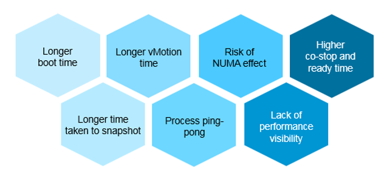
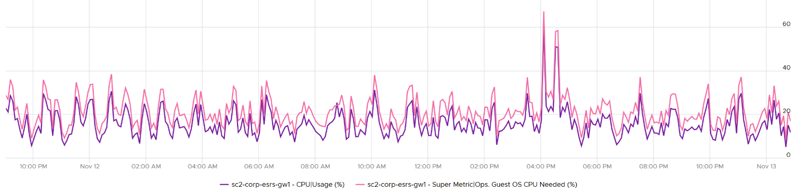

Over Provisioning is a common malpractice in real life SDDC for a variety of reasons. P2V is a common reason, as the VM was simply matched to the physical server size. Another reason is conservative sizing by the vendor, which was then further added by Application Team.

I’ve seen large enterprise customers try to do a mass adjustment, downsizing many VMs, only to have the effort backfire when the VM performance suffers.

Since performance is critical, you should address it from this angle. Take serious time and effort to educate the VM Owner that right sizing actually improves performance, despite the seemingly odd logic. A carrot is a lot more effective than a stick, especially for those with money. Saving money is a weak argument in most cases, as VM Owners have paid for the VMs.



Rightsizing is important for a VM, more so than for a physical server. Here are some benefits:

- The processes inside the Guest OS may experience less ping-pong. The Guest OS may not be aware of the [NUMA](https://en.wikipedia.org/wiki/Non-uniform_memory_access) nature of the physical motherboard, and think it has a uniform structure. It may move processes within its own CPUs, as it assumes it has no performance impact. If the vCPUs are spread into different NUMA node, example a 20 vCPU on a box with 2-socket and 20 cores, it can experience the ping-pong effect.
- Lower risk of NUMA effect. Lower risk that the RAM or CPU is spread over a single socket. Due to NUMA architecture, the performance will not be as good.
- Lower co-stop and ready time. Even if not all vCPU is used by the application, the Guest OS will still demand all the vCPU be provided by the hypervisor. 
- Faster snapshot time, especially if memory snapshot is included.
- Faster boot time. If a VM does not have a reservation, vSphere will create a swap file the size of the configured RAM. This can impact the boot time if the storage subsystem is slow.
- Faster vMotion. Windows and Linux use memory as cache. The more it has, the more it uses, all else being equal. 

## Severity of Over Provisioning

If you have thousands of large VMs, how do you communicate easily to your senior management that many of the large VMs do not use the CPU given to them in the last few months? 

You need to present a convincing chart, that shows the utilization of hundreds of large VMs (which you defined as having > 16 vCPU) every 5 minutes, so a short peak is not excluded in your presentation. 

The first thing you need is to create a dynamic group that captures all the large VMs. Create 1 group for CPU, and one for RAM. You then plot their utilization, every 5 minutes, in the last 3 months. 

In a perfect world, if all the large VMs are right sized, which scenario will you see?


That’s right. Scenario 2. Because the group has hundreds of members, there is a good chance that one of the large VMs is using the CPU given to it. On average, they should be hovering around 40 – 50%, as at any given 5-minute interval, some may be idle while others may be busy.

The technique we use for both CPU and RAM are the same. I’d use CPU as an example.

Once you create a group, the next step is to create two [super metrics](https://blogs.vmware.com/management/2020/09/my-top-15-vrealize-operations-super-metrics.html):

##### Maximum()

Maximum CPU Workload among these large VMs. 

You expect this number to be hovering around 80%, as it only takes 1 VM among all the large VMs for the line chart to spike.

If your Maximum line is constantly ~100% flat, you may have a runaway process. 

If you have many large VMs, one of them tends to have high utilization at any given time.

If this number is low, that means a severe wastage!

##### Minimum()

Average CPU Workload among these large VMs.

You expect this number to hovering around 40%, indicating sizing was done correctly.

If this chart is below <20% all the time for the entire month, then all the large VMs are oversized.

------

Why is it not needed to create the Minimum?

There is bound to be a VM who is idle at any given time.

The two line chart shows us the degree of over provisioning. Can you tell a limitation?

It lies in the counter itself. We cannot distinguish if the CPU usage is due to real demand or not. Real demand comes from the app. Non-real demands comes from the infra, such as:
- Guest OS reboot.
- AV full scan.
- Process runaway. This can potentially result in 100% CPU Demand if the application is multi-threaded. How to distinguish a runaway process from legitimate high workload is the challenge.

## 2 Sides of the Formula

VM right-sizing is a commonly misunderstood term because there are actually multiple use cases, with each use case having their own factors to consider. Different scenarios require different metrics. It is not a one size fits all, hence there are more than one formula. Here are some popular use cases:

- Your App Team asks for extra vCPU. In this case, the hypervisor overhead is irrelevant. When you size NSX edge vCPU, you do not need to add extra vCPU for the overhead. It’s done outside of Linux.
- You are migrating a VM to a new ESXi with CPUs that are 2x the speed. For example, from a 2 GHz ESXi to 4 GHz. All else being equal, you can cut down the VM size by 2. A 16 vCPU becomes 8. But You are worried about causing queue inside the Guest OS as the application may expect 16 slow threads vs 8 fast ones. 
- You are bulk migrating many VMs to another cluster, with no changes on their configuration. Consider 2 VMs. Both are running Windows Server 2019, have 64 vCPU. Both are running hot, but one of them is heavy on IO. It sends a lot of network packets and doing lots of disk IOPS. The 2nd VM has a very different footprint on the ESXi. It’s much more demanding. All those IO processing need to be processed by other physical cores. In this case, you need to consider the external footprint. The queue inside Guest OS is irrelevant. 
- Your boss asks you to properly charge customers, accounting for what they are actually demanding. Would you charge the two VMs above the same way? You might for practical reasons, quietly distribute the cost equally, but you know You are not being fair.
- You are planning a tech refresh for Cluster X. It has 24 ESXi and 1000 VM. You are hoping to reduce infrastructure to 12 ESXi, hence you increase the CPU Speed and add cores per socket. Do you consider individual VM, or you do see how they behave as a group? The answer is the latter, as 1000 VM will not peak at the same time. Do you consider what happens inside Windows or Linux, or do you see their footprint on your ESXi? The correct answer is the latter, as what happens inside is irrelevant.

From the above 5 use cases, we need at least two different formula:
- Guest OS Sizing. Excludes VM overhead, includes Guest OS Queue
- VM Sizing. Includes VM overhead, excludes Guest OS Queue

| Rule | Description |
| --- | --- | 
| It’s not just utilization | It needs to consider unmet demand. CPU wants to run, but it cannot. Memory has lots of page fault in Guest OS memory.|
| It’s not just demand | Size base on what the Guest OS needs to perform well, not just base on what it demands at present. Applicable for RAM, where Guest OS can’t operate optimally without buffer.<br />In capacity, we size not just for demand, but also for performance. While we can satisfy the demand for memory with just the In Use, it might come at the expense of performance. The only thing faster than memory is CPU. So make sure CPU is not waiting for data. This is done by caching as much as possible, as it's hard to predict what pieces of data is required by the program.|
| Includes peak | Consider the busy or peak period, because that’s when the VM needs to work the most |
| Consider big picture | A single 5-minute burst is too short a timeframe to determine the entire next 3 months. Consider long term pattern. This alone makes sizing an art, as you need to know the nature of the workload. | 
| Excludes IT load | Exclude the time when the Guest OS is not doing business workload. There are a few IT workloads that cause high utilization. Common ones are Guest OS reboot, Guest OS updates, anti-virus full scanning, agent-base full back up. So long as these tasks don’t prevent the Guest OS from doing useful work, you can exclude them. The exception is when your VM needs to run at these non-business hours too. So it depends on the VM.<br />This is the hard part, as it requires awareness of the footprint (read: process name)|

Sizing upwards and downwards should have identical formula. 
- The only difference is they have different boundaries. The lower boundary applies to downsizing, and the upper boundary applies to upsizing.
- For downsizing, Guest OS needs a minimum amount of RAM to operate. 
- For upsizing, consider the NUMA boundary. Also, a VM should not be larger than the total number of logical processors on the ESXi Host, else it won’t even boot. In fact, it should be smaller as you want to account for the VMkernel overhead. 

As you can see from above, sizing is complicated. And the above is just Guest OS. We have not considered other things that need sizing such as Containers and Business Applications. 

The art of sizing has 2 parts: time and metric. 
- First, we calculate the value for a given point in time. The correctness of the input value matters, else you have [GIGO](https://en.wikipedia.org/wiki/Garbage_in,_garbage_out) effect.
- Second, we plot thousands of these values over time, and project it over time. The projection has to consider the peak cycle, meaning it has to be geared towards conservative sizing. It also has to consider the business cycle. If you have annual sales, then consider annual data.

You’ll see below that CPU and RAM require different approach.

## Guest OS CPU Sizing

You exclude all the VM overhead, as it’s not used by the Guest OS. For example, all the IO overhead performed by the hypervisor should not be included when determining how much CPU Windows or Linux should be configured with. For disk sizing, the snapshot is not part of your VMDK sizing.

| Rule | Description |
| --- | --- |
| Exclude Hyper-Threading | The Guest OS is running, regardless of speed and throughput. With lower efficiency, it will simply run longer. Instead of 40% for 5 minutes, it may run 90%. If it exceeds 100%, then queue will develop inside the Guest OS.<br />The Demand and Usage counters are not suitable as their values are affected by CPU Frequency and HT|
| Exclude CPU Frequency | As above. The only exception here is the initial sizing, when the VM is not yet created. The application team may request 32 vCPU at 3 GHz. If what you have is 2 GHz, you need to provide more vCPU.|
| Exclude idle time | The CPU is not running. It does not matter whether it’s because the Guest OS CPU is waiting for Guest OS IO. The net result is the Guest OS is not running its CPU. While making the IO subsystem faster will result in higher CPU utilization, that’s a separate scope.|
| Exclude CPU Context Switch | It is not something you can control. Plus it is impossible to translate its value into the right sizing formula. In addition, a high context switch could be caused by too many vCPU or IO. Guest OS is simply balancing among its vCPUs.<br />The Utilization may be high, but if CPU is doing a lot of context switch, it’s less productive.|
| Include Co Stop & Ready | The Guest OS actually wants to run. Had there been no blockage, the CPU would have been utilized. Adding/Reducing CPU does not change the value of these waits, as this represents a bottleneck somewhere else. However, it does say that this is what the CPU needs, and we need to reflect that.<br />Guest OS number will be inaccurate because there is no “no data”, due to its time being frozen.|
| Include VM Wait, Swap Wait | Guest OS becomes idle as CPU is waiting for RAM or IO (disk or network). So this is the same case with Ready and CoStop.|
| Include Overlap | The Guest OS actually wants to run, but it’s interrupted by the VMkernel. Note that this is already a part of CPU Run, so mathematically is not required if we use CPU Run counter.| 
| Include Guest OS CPU Run Queue | This is the primary counter tracking if Windows or Linux is unable to cope with the demand. |
| Exclude hypervisor overhead | MKS, VMX, System. While it’s part of Demand, it’s not a demand coming from within the Guest.<br />The VM CPU Used, Demand, Usage counter include system time at VM level, hence they are not appropriate.|

Based on all the above, the formula to size the Guest OS is: 

```
Guest OS CPU Needed (vCPU) = (Run + CoStop + Ready + VM Wait + Swap Wait) / 20000 ) + CPU Run Queue factor
```

The result is in the number of vCPU. It is not in % or GHz. We are sizing the Guest OS, not the VM. 

We need to divide by 20000 because 20000 milliseconds represent 100% of a single vCPU. More about this unit is explained here. 

Guest OS CPU Run Queue metric needs some conversion before it can be used. Let’s take an example:

- VM has 8 vCPU. 
- CPU Run Queue = 28 for the entire VM.
- VM can handle 8 x 3 = 24 queues.
- There is a shortage of 28 – 24 = 4 queues.
- Each additional vCPU can handle 1 process + 3 queues. 
- Conclusion: we add 1 vCPU.

Compared with CPU Usage, Guest OS Needed without the CPU run queue factor tends to be within 10% difference. Usage is higher as it includes system time, and turbo boost. Usage would be lower in HT and CPU frequency clocked down case.

Here is an example where Usage is higher.


Here is an example where Usage is lower:



Once we know what the Guest OS needs, we can then calculate the recommended size. This is a projection, taking lots of value. Ideally, the recommendation is [NUMA aware](https://blogs.vmware.com/management/2019/09/26212.html). It is applied ***after*** the sizing is determined. You size, then adjust to account for NUMA. This adjustment depends on the ESXi Host. So it can vary from cluster to cluster, if your vSphere clusters are not identical.

```
Guest OS Recommended Size (vCPU) = round up NUMA (projection (Guest OS Needed (vCPU))
```

For basic NUMA compliant, use 1 socket many cores until you exceed the socket boundary. That means you use 2 vCore 1 vSocket instead of 2 vSockets with 1 vCore each.

With the release of Windows 2008, switching the Hardware Abstraction Layer (HAL) was handled automatically by the OS, and with the release of 64-bit Windows, there is no concept of a separate HAL for uni-processor and multi-processor machines. That means one vCPU is a valid configuration and you shouldn’t be making two vCPU as the minimum.

You should use the smallest NUMA node size across the entire cluster, if you have mixed ESXi with different NUMA node sizes in the cluster. For example, a 12-vCPU VM should be 2 socket x 6 cores and not 1 socket x 12 core as that fits better on both the dual socket 10 core and dual socket 12 core hosts. Take note that the amount of memory on the host and VM could change that recommendation, so this recommendation assumes memory is not a limiting factor in your scenario.

Notice the number is in vCPU, not GHz, not %. Reason is the adjustment is done at a whole vCPU. In fact in most case, it should be an even number, as odd numbers don’t work in NUMA when you cross the size of a CPU socket.

Note that when you change the VM configuration, application setting may need to change. This is especially on applications that manage its own memory (e.g. database and JVM), and schedule fixed number of threats.

You can enable Hot Add on VM, but take note of impact on NUMA.

Reference: [rightsizing](https://blogs.vmware.com/management/2020/01/rightsizing-vms-with-vrealize-operations.html) by Brandon Gordon.

## VM CPU Sizing

Sizing the VM is required for the migration use case or chargeback use case.

| Rule | Description |
| --- | --- | 
| Include Hyper-Threading | When a VM runs on a thread that has a peer thread running, it’s getting less CPU cycle. |
| Include CPU Frequency | |
| Include VM overhead | |
| Exclude Guest OS queue | |
| Include VM Queue | |

Based on all the above, the formula to size the VM is: 

```
VM CPU Needed (vCPU) = (Used + CoStop + Ready + VM Wait + Swap Wait) + System / 20000 )
```

The only time you need to convert into GHz is when you need to migrate into another ESXi with different clock speed. To convert into GHz, we multiply the number by the nominal, static clock speed. You can also enhance this by considering [CPU generation and speed](https://www.spec.org/cpu2017), although this can introduce a new problem if not done properly. An application may perform poorly after the reduction in vCPU if it works better with many slow threads vs a few fast threads.

Once we know what the VM needs, we need to project and recommend. We apply the same technique we did for Guest OS.

## Guest OS Memory Sizing

Accuracy of Guest OS memory has been a debate for a long time in virtualization world. Take a look at the following utilization diagram. It has two bars, shown as thin bar and thick bar. They show different thresholds. 

The thin bar is a generic guidance for all utilization metrics, such as CPU and memory. The thicker bar is specific to memory utilization.


When you spend your money on infrastructure, you want to maximize its use, ideally at 100%. After all, you pay for the whole box. In the case of memory, it even makes sense to use the whole hardware as the very purpose of memory is just a cache for disk.

The first bar above shows the utilization range (0% – 100%). The green range is where you want the utilization to fall. Below the 50% mark is shown in blue, symbolizing cold. The company is wasting money if the utilization is below 50%. So what lies beneath the green zone is not an even greener zone; it is a wastage zone. On the other hand, higher than 75% opens the risk that [performance](http://virtual-red-dot.info/vmware-performance-sla/) may be impacted. Hence I put a yellow and red threshold. The green zone is actually a relatively **narrow** band.

Now let’s apply the above concept to memory utilization.

In general, applications tend to work on a portion of its [Working Set](https://en.wikipedia.org/wiki/Working_set) at any given time. The process is not touching all its memory all the time. As a result, the rest becomes cache. This is why it’s fine to have active + cache beyond 95%. If your ESXi is showing 98%, do not panic. In fact, ESXi will wait until it passes 99% before it triggers ballooning process. Windows and Linux are doing this too. The modern-day OS is doing its job caching all those pages for you. So you want to keep the Free pages low.

| Rule | Description |
| --- | --- |
| Include cache | Guest OS uses RAM as cache. If you size the OS based on what it actually uses, it will have neither cache nor free memory. It will start paging out to make room for Cache and Free, which can cause performance problems. As a result, the name of this proposed counter should not be called Demand as it contains more than unmet demand. It is what the OS needs to operate without heavy paging. Hence the counter name to use is Memory Needed, not Memory Demand.|
| Exclude Page File | Including the pagefile will result in sizing that is too conservative as Windows and Linux already has cache even in their In Use counter.<br />Guest OS uses virtual RAM and physical RAM together. They page-in proactively, prefetching pages when there is no real demand due to memory mapped files. This makes determining unmet demand impossible. A page vault does not distinguish between real need versus proactive need.|
| Don’t fallback to VM metric | Since we are sizing the Guest OS, we use Guest OS only. No falling back to VM as it’s inaccurate.|
| Exclude latency | RAM contention measures latency, hence not applicable. We’re measuring the disk space, not latency. Space, not Speed. Utilization, not Performance.| 

Unlike CPU, there are more difference between Windows and Linux when it comes to memory.

For vRealize Operations specific implementation, review [this post](https://blogs.vmware.com/management/2020/01/rightsizing-vms-with-vrealize-operations.html) by [Brandon Gordon](https://blogs.vmware.com/management/author/brandon_gordon).
