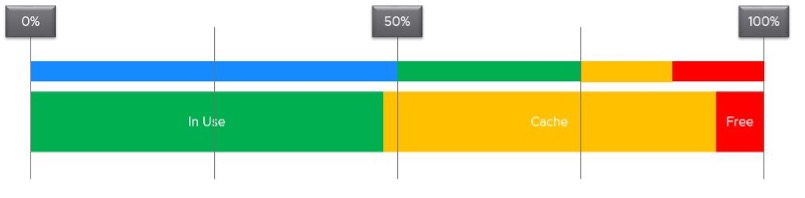

由於各種原因，過度配置是現實生活中 SDDC 中常見的不當做法。 P2V 是一個常見原因，因為 VM 剛好與物理服務器的大小相匹配。另一個原因是供應商的規模調整保守，然後由應用團隊進一步添加。

我見過大型企業客戶試圖進行大規模調整，以減少許多虛擬機的大小，但當虛擬機性能受到影響時卻適得其反。

由於性能至關重要，您應該從這個角度解決它。儘管邏輯看起來很奇怪，但要讓 VM 所有者知道正確調整大小實際上可以提高性能需要花費大量時間和精力。胡蘿蔔比大棒更有效，尤其是對有錢人。在大多數情況下，節省資金是一個弱論點，因為 VM 所有者已經為 VM 付費了。


調整大小對於 VM 很重要，比對物理服務器更重要。以下是一些好處：

- 來賓操作系統內的進程可能會遇到較少的乒乓問題。 Guest OS 可能不知道物理主板的 [NUMA](https://en.wikipedia.org/wiki/Non-uniform_memory_access) 性質，並認為它具有統一的結構。它可以在自己的 CPU 內移動進程，因為它假定它沒有性能影響。如果將 vCPU 分散到不同的 NUMA 節點，例如在具有 2 插槽和 20 核的盒子上安裝 20 個 vCPU，則可以體驗乒乓效應。
- 降低 NUMA 效應的風險。降低 RAM 或 CPU 分佈在單個插槽上的風險。由於 NUMA 架構，性能不會那麼好。
- 降低共同停車和準備時間。即使應用程序並未使用所有 vCPU，Guest OS 仍會要求管理程序提供所有 vCPU。
- 更快的快照時間，尤其是在包含內存快照的情況下。
- 更快的啟動時間。如果 VM 沒有預留空間，vSphere 將創建一個與配置的 RAM 大小相同的交換文件。如果存儲子系統很慢，這會影響啟動時間。
- 更快的 vMotion。 Windows 和 Linux 使用內存作為緩存。它擁有的越多，使用的就越多，其他條件都一樣。

## 過度配置的嚴重程度

如果您有數千個大型虛擬機，您如何輕鬆地向高級管理層傳達許多大型虛擬機沒有使用過去幾個月提供給他們的 CPU 的信息？

您需要展示一個令人信服的圖表，該圖表顯示每 5 分鐘數百個大型 VM（您定義為具有 > 16 個 vCPU）的利用率，因此您的演示文稿中不排除一個短峰值。

您需要做的第一件事是創建一個動態組來捕獲所有大型 VM。為 CPU 創建 1 組，為 RAM 創建一組。然後，您可以在過去 3 個月內每 5 分鐘繪製一次它們的利用率。

在完美的世界中，如果所有大型 VM 的大小都合適，您會看到哪種情況？


這是正確的。場景 2。由於該組有數百名成員，因此其中一個大型 VM 很可能正在使用為其提供的 CPU。平均而言，它們應該在 40 - 50% 左右徘徊，因為在任何給定的 5 分鐘間隔內，有些人可能空閒，而另一些人可能很忙。

我們用於 CPU 和 RAM 的技術是相同的。我會以 CPU 為例。

創建組後，下一步是創建兩個 [超級指標](https://blogs.vmware.com/management/2020/09/my-top-15-vrealize-operations-super-metrics.html):

#### 最大()

這些大型虛擬機之間的最大 CPU 工作負載。

您預計這個數字會徘徊在 80% 左右，因為所有大型虛擬機，只需要 1 個虛擬機就可以使折線圖達到峰值。

如果您的最大線始終為 ~100% 平坦，則您的過程可能會失控。

如果您有許多大型虛擬機，那麼在任何給定時間，其中一個往往會被高度利用。

如果這個數字很低，就意味著浪費嚴重！

#### 在最低限度()

這些大型虛擬機之間的平均 CPU 工作負載。

您希望這個數字徘徊在 40% 左右，這表明調整大小是正確的。

如果圖表在整個月內保持低於 20%，則所有大型 VM 都太大。

------

為什麼不需要創建最小值？

在任何給定時間都必須有一個空閒的虛擬機。

兩個折線圖向我們展示了過度配置的程度。你能說出一個限制嗎？

它位於櫃檯本身。我們無法區分 CPU 使用率是否是由實際需求引起的。真正的需求來自應用。虛幻的需求來自基礎設施，例如：

- 來賓操作系統重新啟動。
- AV 全掃描。
- 進程失控。如果應用程序是多線程的，這可能會導致 100% 的 CPU 需求。如何區分失控的進程和合法的高工作負載是一個挑戰。

## 公式的兩個方面

虛擬機大小是一個經常被誤解的術語，因為實際上有多個用例，每個用例都有自己需要考慮的因素。不同的場景需要不同的指標。它不是萬能的，所以有不止一種公式。以下是一些流行的用例：

- 您的應用團隊需要額外的 vCPU。在這種情況下，管理程序開銷無關緊要。調整 NSX Edge vCPU 的大小時，您無需為開銷添加額外的 vCPU。它是在 Linux 之外完成的。
- 您正在將 VM 遷移到 CPU 速度為 2 倍的新 ESXi。例如，從 2 GHz ESXi 到 4 GHz。在其他條件相同的情況下，您可以將 VM 大小減少 2。16 個 vCPU 變為 8 個。但是您擔心在來賓操作系統內造成隊列，因為應用程序可能需要 16 個慢線程與 8 個快速線程。
- 您正在將許多 VM 批量遷移到另一個集群，而沒有更改它們的配置。考慮 2 個 VM。兩者都運行 Windows Server 2019，具有 64 個 vCPU。兩者都運行得很熱，但其中之一的 IO 很重。它發送大量網絡數據包並執行大量磁盤 IOPS。第二個虛擬機在 ESXi 上的佔用空間大不相同。它的要求要高得多。所有這些 IO 處理都需要由其他物理內核處理。在這種情況下，您需要考慮外部佔用空間。來賓操作系統中的隊列無關緊要。
- 你的老闆要求你適當地向客戶收費，說明他們的實際要求。你會以同樣的方式為上面的兩個虛擬機充電嗎？你可能出於實際原因，悄悄地平均分配成本，但你知道你不公平。
- 您正在計劃對集群 X 進行技術更新。它有 24 個 ESXi 和 1000 個虛擬機。您希望將基礎架構減少到 12 個 ESXi，因此您可以提高 CPU 速度並為每個插槽添加內核。您是考慮單個 VM，還是確實看到它們作為一個組的行為？答案是後者，因為 1000 VM 不會同時達到峰值。您是否考慮過 Windows 或 Linux 內部發生的情況，或者您是否看到它們在 ESXi 上的足跡？正確答案是後者，因為內部發生的事情無關緊要。

從以上 5 個用例中，我們至少需要兩個不同的公式：

- 來賓操作系統大小調整。不包括 VM 開銷，包括來賓操作系統隊列
- 虛擬機大小調整。包括 VM 開銷，不包括來賓操作系統隊列

| 規則 | 描述 |
| --- | --- |
| 這不僅僅是利用率 | 它需要考慮未滿足的需求。 CPU想運行，但不能。內存在客戶操作系統內存中有很多頁面錯誤。 |
| 不僅僅是需求 | 大小基於來賓操作系統需要什麼才能正常運行，而不僅僅是基於它當前的需求。適用於 RAM，如果沒有緩衝區，Guest OS 無法以最佳方式運行。 <br />在容量方面，我們不僅根據需求進行調整，而且還根據性能進行調整。雖然我們可以僅使用 In Use 來滿足對內存的需求，但這可能會以犧牲性能為代價。唯一比內存更快的是CPU。因此請確保 CPU 不等待數據。這是通過盡可能多地緩存來完成的，因為很難預測程序需要哪些數據。 || 包括峰值 | 考慮繁忙或高峰期，因為那是 VM 最需要工作的時候 |
| 考慮大局| 一次 5 分鐘的突發時間太短，無法確定整個接下來的 3 個月。考慮長期模式。僅此一項就使確定尺寸成為一門藝術，因為您需要了解工作量的性質. |
| 不包括 IT 負載 | 排除來賓操作系統不執行業務工作負載的時間。有一些 IT 工作負載會導致高利用率。常見的有客戶操作系統重啟、客戶操作系統更新、防病毒完全掃描、基於代理的完整備份。只要這些任務不會阻止來賓操作系統執行有用的工作，您就可以排除它們。例外情況是您的 VM 也需要在這些非工作時間運行。所以它取決於虛擬機。 <br />這是困難的部分，因為它需要了解足跡（讀取：進程名稱）|

向上和向下調整大小應該有相同的公式。

- 唯一的區別是他們有不同的界限。下限適用於縮小規模，而上限適用於擴大規模。
- 為了縮小規模，Guest OS 需要最少的 RAM 才能運行。
- 對於擴大規模，請考慮 NUMA 邊界。此外，VM 不應大於 ESXi 主機上的邏輯處理器總數，否則它甚至無法啟動。事實上，它應該更小，因為您要考慮 VMkernel 開銷。

從上面可以看出，調整大小很複雜。以上只是來賓操作系統。我們還沒有考慮其他需要調整大小的東西，例如容器和業務應用程序。

調整大小的藝術有兩個部分：時間和度量。

- 首先，我們計算給定時間點的值。輸入值的正確性很重要，否則你有 [GIGO](https://en.wikipedia.org/wiki/Garbage_in,_garbage_out) 效果。
- 其次，我們隨時間繪製數千個這些值，並隨著時間的推移對其進行投影。預測必須考慮高峰週期，這意味著它必鬚麵向保守的規模。它還必須考慮商業周期。如果您有年度銷售額，請考慮年度數據。

您將在下面看到 CPU 和 RAM 需要不同的方法。

## 來賓操作系統 CPU 大小調整

您排除了所有 VM 開銷，因為來賓操作系統不使用它。例如，在確定 Windows 或 Linux 應配置多少 CPU 時，不應包括管理程序執行的所有 IO 開銷。對於磁盤大小調整，快照不是 VMDK 大小調整的一部分。

| 規則 | 描述 |
| --- | --- |
| 排除超線程 | 無論速度和吞吐量如何，來賓操作系統都在運行。效率較低，它只會運行更長時間。它可能會運行 90%，而不是 5 分鐘的 40%。如果超過 100%，那麼 Guest OS 內部會出現隊列。 <br />Demand 和 Usage 計數器不合適，因為它們的值受 CPU 頻率和 HT 的影響|
| 排除 CPU 頻率 | 如上。此處唯一的例外是初始大小調整，此時 VM 尚未創建。應用團隊可能需要 32 個 vCPU，頻率為 3 GHz。如果您擁有的是 2 GHz，則需要提供更多的 vCPU.|
| 排除空閒時間 | CPU 沒有運行。是否因為來賓 OS CPU 正在等待來賓 OS IO 無關緊要。最終結果是來賓操作系統沒有運行其 CPU。雖然使 IO 子系統更快會導致更高的 CPU 利用率，但這是一個單獨的範圍。 |
| 排除 CPU 上下文切換 | 這是你無法控制的。此外，無法將其值轉換為正確的大小公式。此外，過多的 vCPU 或 IO 可能會導致高上下文切換。來賓操作系統只是在其 vCPU 之間進行平衡。 <br />利用率可能高，但是如果CPU做大量上下文切換，效率就低.|
| 包括 Co Stop & Ready |來賓操作系統實際上想要運行。如果沒有阻塞，就會使用CPU。添加/減少 CPU 不會改變這些等待的值，因為它代表了其他地方的瓶頸。但是，它確實說這是 CPU 需要的，我們需要反映這一點。 <br />Guest OS 編號會不准確，因為它的時間被凍結，因此沒有“無數據”。 |
|包括 VM 等待、交換等待 |當 CPU 等待 RAM 或 IO（磁盤或網絡）時，來賓操作系統變為空閒。所以這和 Ready 和 CoStop 的情況是一樣的。
|包括重疊 |來賓操作系統實際上想要運行，但被 VMkernel 中斷。請注意，這已經是 CPU Run 的一部分，因此如果我們使用 CPU Run 計數器，則在數學上是不必要的。 ||包括客戶操作系統 CPU 運行隊列 |如果 Windows 或 Linux 不能滿足需求，這是主要的計數器跟踪。 |
|排除管理程序開銷| MKS、VMX、系統。雖然它是需求的一部分，但它不是來自客人內部的需求。 <br />VM CPU Used、Demand 和 Usage 計數器包括 VM 級別的系統時間，因此它們不合適。 |

基於以上所有內容，確定客戶操作系統大小的公式為：

```text
來賓操作系統所需 CPU (vCPU) = (Run + CoStop + Ready + VM Wait + Swap Wait) / 20000 ) + CPU 運行隊列因子
```

結果是 vCPU 的數量。它不是以 % 或 GHz 為單位的。我們正在調整客戶操作系統的大小，而不是虛擬機。

我們需要除以 20,000，因為 20,000 毫秒代表單個 vCPU 的 100%。 [此處](/metrics/chapter-1-overview/2.1.3-roll-up-vs-aggregation/) 解釋了有關此單元的更多信息。

來賓操作系統 CPU 運行隊列指標需要進行一些轉換才能使用。讓我們舉個例子：

- VM 有 8 個 vCPU。
- 整個 VM 的 CPU 運行隊列 = 28。
- VM 可以處理 8 x 3 = 24 個隊列。
- 缺少 28 - 24 = 4 個隊列。
- 每個額外的 vCPU 可以處理 1 個進程 + 3 個隊列。
- 結論：我們添加了 1 個 vCPU。

與 CPU Usage 相比，沒有 CPU 運行隊列因素的 Guest OS Needed 差異趨於 10% 以內。使用率更高，因為它包括系統時間和渦輪增壓。在 HT 和 CPU 頻率降低的情況下，使用率會更低。

這是一個使用率較高的示例。


以下是使用率較低的示例：


一旦我們知道客戶操作系統需要什麼，我們就可以計算推薦的大小。這是一個預測，需要很多價值。理想情況下，建議是 [NUMA 感知](https://blogs.vmware.com/management/2019/09/26212.html)。 ***在確定尺寸後*** 應用。您調整大小，然後調整以考慮 NUMA。此調整取決於 ESXi 主機。因此，如果您的 vSphere 集群不同，它可能因集群而異。

```text
來賓操作系統推薦大小 (vCPU) = 向上取整 NUMA（投影（需要來賓操作系統 (vCPU)）
```

對於基本的 NUMA 兼容，使用 1 個插槽多核，直到超出插槽邊界。這意味著您使用 2 個 vCore 1 vSocket，而不是 2 個 vSocket，每個 vSocket 有 1 個 vCore。

隨著 Windows 2008 的發布，切換硬件抽象層 (HAL) 由操作系統自動處理，並且隨著 64 位 Windows 的發布，單處理器和多處理器機器沒有單獨的 HAL 的概念。這意味著一個 vCPU 是一個有效的配置，您不應該將兩個 vCPU 設為最小值。

如果集群中混合了具有不同 NUMA 節點大小的 ESXi，則應在整個集群中使用最小的 NUMA 節點大小。例如，12-vCPU VM 應該是 2 插槽 x 6 核而不是 1 插槽 x 12 核，因為這更適合雙插槽 10 核和雙插槽 12 核主機。請注意，主機和 VM 上的內存量可能會更改該建議，因此該建議假設內存不是您的方案中的限制因素。

請注意，該數字以 vCPU 為單位，而不是 GHz，而不是 %。原因是調整是在整個 vCPU 上完成的。事實上，在大多數情況下，它應該是偶數，因為當您跨越 CPU 插槽的大小時，奇數在 NUMA 中不起作用。

請注意，當您更改 VM 配置時，可能需要更改應用程序設置。這尤其適用於管理自身內存（例如數據庫和 JVM）並安排固定數量威脅的應用程序。

您可以在 VM 上啟用熱添加，但請注意對 NUMA 的影響。

參考: [調整大小](https://blogs.vmware.com/management/2020/01/rightsizing-vms-with-vrealize-operations.html) by Brandon Gordon.

## 虛擬機 CPU 大小調整

需要針對遷移用例或退款用例調整 VM 大小。

|規則 |說明 |
| --- | --- |
|包括超線程|當 VM 在運行對等線程的線程上運行時，其 CPU 週期會減少。 |
|包括CPU頻率| |
|包括VM開銷| |
|排除來賓操作系統隊列 | |
|包括VM隊列| |

基於上述所有內容，確定 VM 大小的公式為：

```text
所需的 VM CPU (vCPU) = (已使用 + CoStop + 就緒 + VM 等待 + 交換等待) + 系統 / 20000 )
```

唯一需要轉換為 GHz 的時候是需要遷移到另一個時鐘速度不同的 ESXi 時。為了轉換為 GHz，我們將數字乘以標稱的靜態時鐘速度。您還可以通過考慮 [CPU 生成和速度](https://www.spec.org/cpu2017) 來增強這一點，儘管如果處理不當，這可能會帶來新問題。如果應用程序在使用許多慢線程而不是少數快速線程時運行得更好，則在 vCPU 減少後，它可能會表現不佳。

一旦我們知道 VM 需要什麼，我們就需要進行項目和推薦。我們應用與客戶操作系統相同的技術。

## 來賓操作系統內存大小

來賓操作系統內存的準確性在虛擬化世界中一直是爭論的焦點。看看下面的使用圖。它有兩個條，顯示為細條和粗條。它們顯示不同的閾值。

細條是所有利用率指標（例如 CPU 和內存）的通用指南。較粗的條特定於內存利用率。



當您將資金花在基礎設施上時，您希望最大限度地利用它，最好是 100%。畢竟，您需要為整個盒子付費。在內存的情況下，使用整個硬件甚至是有意義的，因為內存的真正目的只是磁盤緩存。

上面的第一條顯示利用率範圍 (0% - 100%)。綠色範圍是您希望利用率下降的地方。低於 50% 標記以藍色顯示，象徵寒冷。如果利用率低於 50%，公司就是在浪費錢。因此，位於綠色區域下方的並不是更綠色的區域；這是一個浪費區。另一方面，高於 75% 會帶來 [性能](http://virtual-red-dot.info/vmware-performance-sla/) 可能受到影響的風險。因此我設置了一個黃色和紅色的閾值。綠色區域實際上是一個相對 **窄的** 帶。

現在讓我們將上述概念應用於內存利用率。

一般來說，應用程序傾向於在任何給定時間處理其 [工作集](https://en.wikipedia.org/wiki/Working_set) 的一部分。該過程並非一直都在觸及其所有內存。結果，剩下的就變成了緩存。這就是為什麼活動 + 緩存超過 95% 是可以的。如果您的 ESXi 顯示為 98%，請不要驚慌。事實上，ESXi 會等到它通過 99% 才會觸發 [氣球](/metrics/chapter-3-memory-metrics/2.3.5-esxi-host/) 進程。 Windows 和 Linux 也在這樣做。現代操作系統正在為您緩存所有這些頁面。因此，您希望將免費頁面保持在低位。

|規則 |說明 |
| --- | --- |
|包括高速緩存 |來賓操作系統使用 RAM 作為高速緩存。如果根據實際使用情況調整操作系統的大小，它將既沒有緩存也沒有空閒內存。它將開始分頁為 Cache 和 Free 騰出空間，這可能會導致性能問題。因此，這個提議的計數器的名稱不應稱為需求，因為它包含的不僅僅是未滿足的需求。這是操作系統在沒有大量分頁的情況下運行所需要的。因此，要使用的計數器的名稱是 Memory Needed，而不是 Memory Demand。 |
|不包括頁面文件|包含頁面文件會導致大小過於保守，因為 Windows 和 Linux 甚至在它們的 In Use 計數器中都有緩存。 <br />Guest OS 使用虛擬 RAM 和物理 RAM。當由於內存映射文件沒有真正的需求時，它們會主動分頁和預取頁。這使得無法確定未滿足的需求。 Page Vault 不區分真實需求和活躍需求。 |
|不要回到VM指標|因為我們正在調整客戶操作系統的大小，所以我們只使用客戶操作系統。沒有回退到 VM，因為它不准確。 |
|排除延遲 | RAM 爭用衡量延遲，因此不適用。我們測量的是磁盤空間，而不是延遲。空間，而不是速度。利用率，而不是性能。 |

與 CPU 不同，Windows 和 Linux 在內存方面有更多不同。

對於 vRealize Operations 的特定實施，請查看 [這篇文章](https://blogs.vmware.com/management/2020/01/rightsizing-vms-with-vrealize-operations.html) by [Brandon Gordon](https://blogs.vmware.com/management/author/brandon_gordon).